# ДомСигнал

**Проблемы дома — из домового чата в работу управляющей компании, а закрывает их житель.**

[Бот в MAX](https://max.ru/t480_hakaton_max_bot) ·
[Сайт](https://domsignal.176-108-244-168.sslip.io) ·
[Гид для проверяющих](JURY_GUIDE.md) ·
[API](#api-и-data-apiyaml)

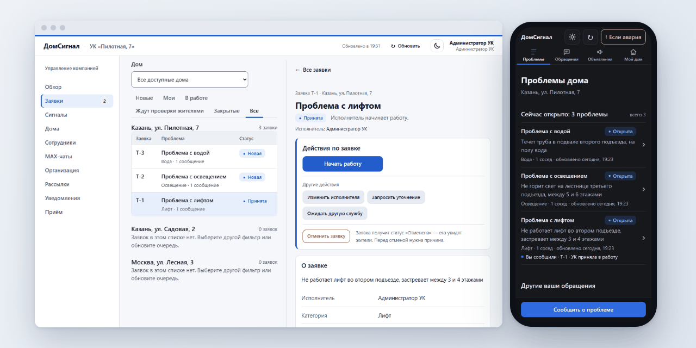

Трек «Умный город», хакатон MAX. Презентация — в комплекте сдачи.

## Содержание

1. [Назначение](#назначение) — [для кого и зачем](#для-кого-и-зачем),
   [почему это нужно](#почему-это-нужно), [как работает](#как-работает), [экраны](#экраны)
2. [Основной пользовательский сценарий](#основной-пользовательский-сценарий) —
   [ролевая модель](#ролевая-модель)
3. [Состав и архитектура](#состав-и-архитектура)
4. [Запуск одной командой](#запуск-одной-командой)
5. [Необходимые параметры окружения](#необходимые-параметры-окружения)
6. [Переменные окружения](#переменные-окружения)
7. [Порты](#порты)
8. [Зависимости](#зависимости)
9. [Внешние сервисы и интеграции](#внешние-сервисы-и-интеграции)
10. [Работа с данными](#работа-с-данными)
11. [Порядок работы с тестовыми данными](#порядок-работы-с-тестовыми-данными)
12. [Пошаговый сценарий проверки](#пошаговый-сценарий-проверки)
13. [Примеры ожидаемого поведения](#примеры-ожидаемого-поведения)
14. [Известные ограничения](#известные-ограничения)
15. [Остановка и повторный запуск](#остановка-и-повторный-запуск)
16. [Внешние сервисы вне Docker: назначение и условия проверки](#внешние-сервисы-вне-docker-назначение-и-условия-проверки)

Ещё: [API и `DATA-API.yaml`](#api-и-data-apiyaml) ·
[как проверить версию](#как-проверить-версию) · [ML-модуль](#ml-модуль) ·
[структура репозитория](#структура-репозитория) · [документы](#документы)

## Назначение

ДомСигнал — чат-бот и мини-приложение в MAX для жителей многоквартирных домов и
управляющих компаний (УК). Бот с согласия УК читает домовой чат, замечает
сообщения о поломках, собирает повторы от соседей в одну проблему и передаёт её
в кабинет той УК, которая отвечает за дом. Статус заявки обновляется в том же
посте чата, а закрывает заявку житель — кнопкой «Исправлено». Если проблема не
к УК, бот показывает официальный канал региона и готовит текст обращения.

### Для кого и зачем

**Приоритетный сегмент** — диспетчер или оператор УК, у которой десятки домовых
чатов, и житель многоквартирного дома, который пишет о проблеме в чат дома.

| Кто | Проблема |
|---|---|
| Диспетчер УК | **в ситуации**, когда о поломках пишут в десятки домовых чатов, **хочет** видеть каждую проблему в одной очереди и вовремя брать её в работу, **но** сообщения из чатов сами никуда не попадают и разбираются вручную, **из-за чего** проблемы теряются в переписке, а жители не получают ответа |
| Житель МКД | **в ситуации**, когда в доме сломался лифт или погас свет, **хочет**, чтобы проблему исправили, **но** не знает, дошло ли сообщение из чата до УК и куда идти, если это не УК, **из-за чего** пишет снова и снова, а результат не видит |

**Ожидаемый эффект** — меньше потерянных проблем и быстрее реакция УК; жители
видят статус и сами подтверждают результат. Целевые показатели пилота:

| Показатель пилота | Где считается сейчас |
|---|---|
| время от создания заявки до принятия в работу | кабинет УК → «Обзор»: «Медиана до принятия» по каждому дому |
| доля заявок, подтверждённых жителями | «Обзор»: «Подтверждено» и «Закрыто» по каждому дому |
| возвраты «Проблема осталась» | «Обзор»: «Возвращено» по каждому дому |
| доля проблем из чата, дошедших до заявки | «Обзор»: «Сигналы» и заявки по каждому дому; долю считаем в пилоте |

### Почему это нужно

Интервью с руководителем УК (28.09.2026):

> «Если она приходит в общий чат, то особой реакции может не быть.»
>
> «У меня эти процессы на уровне CRM не автоматизированы. Они проходят вручную,
> в том числе по телефону.»
>
> «Мне было бы удобно, чтобы все обращения куда-то стекались в одно место.»
>
> — руководитель УК, интервью 28.09.2026

УК предложила площадку для пилота.

| Факт | Источник |
|---|---|
| более 17,7 млн пользователей в домовых чатах MAX | Минстрой России, [«Татар-информ», 09.09.2026](https://www.tatar-inform.ru/news/bolee-177-mln-celovek-prisoedinilis-k-domovym-catam-v-makse-6040766) |
| ≈ 24 тыс. жалоб в Госжилинспекцию Татарстана за 01.01–20.09.2026, +40 % к 2025 году | руководитель ГЖИ РТ, [«Бизнес Online», 23.09.2026](https://www.business-gazeta.ru/news/711935) |
| каждое пятое обращение в ГЖИ РТ — повторное | руководитель ГЖИ РТ, [ProKazan, 23.09.2026](https://prokazan.ru/novosti-tatarstana/view/tatarstancy-stali-na-40-case-obrasatsa-v-goszilinspekciu) |
| 37 % жителей многоквартирных домов не знают свою УК | [ВЦИОМ-Спутник, 15.06.2025](https://wciom.ru/analytical-reviews/analiticheskii-obzor/tarify-i-kachestvo-uslug-zhkkh), n = 1 600 |

**Почему заявку закрывает житель.** Видимый результат возвращает людей: если
первую проблему устранили, вероятность второго сообщения выше на 57 % (18,2 %
против 11,6 %; [FixMyStreet, Public Administration Review, 2017](https://www.oidp.net/docs/repo/doc381.pdf)).
А «закрыто» не значит «решено»: проверка ямочного ремонта по заявкам 311 в
Новом Орлеане показала, что из закрытых заявок реально решены 40 %
([Office of Inspector General, 2022](https://nolaoig.gov/wp-content/uploads/2022/12/Inspection-of-NOLA-311-Pothole-Repairs.pdf)).

### Как работает

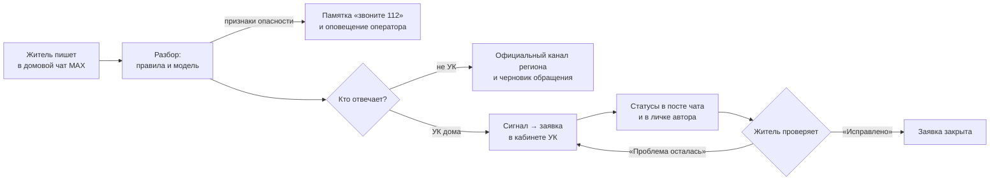

1. Бот читает только чаты, которые подключила УК: администратор группы добавляет
   бота, УК подтверждает подключение в кабинете.
2. Реплики о поломках разбирают правила и языковая модель; сообщения соседей об
   одной проблеме собираются в один сигнал. Признаки опасности правила находят
   без модели.
3. Кто отвечает, определяет справочник регионов с источниками: проблема к УК —
   сигнал или заявка в кабинете; не к УК — официальный канал и готовый текст
   обращения.
4. Оператор ведёт заявку, статусы обновляются в посте чата и в личке автора.
5. Заявку закрывает житель: «Исправлено» — закрыта; «Проблема осталась» — та же
   заявка возвращается в работу.

### Экраны

Мини-приложение жителя в MAX (390 px), демо-дом «Казань, ул. Пилотная, 7»:

| «Проблемы дома» | «Проверьте, что мы поняли» | Опасность: первым — 112 |
|---|---|---|
| 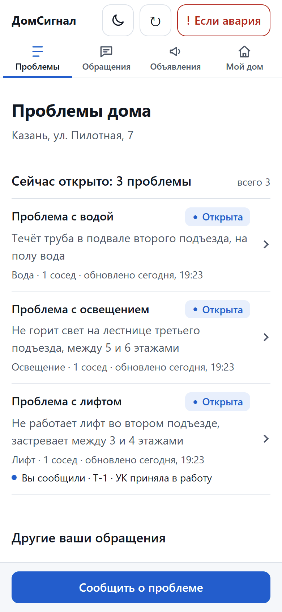 | 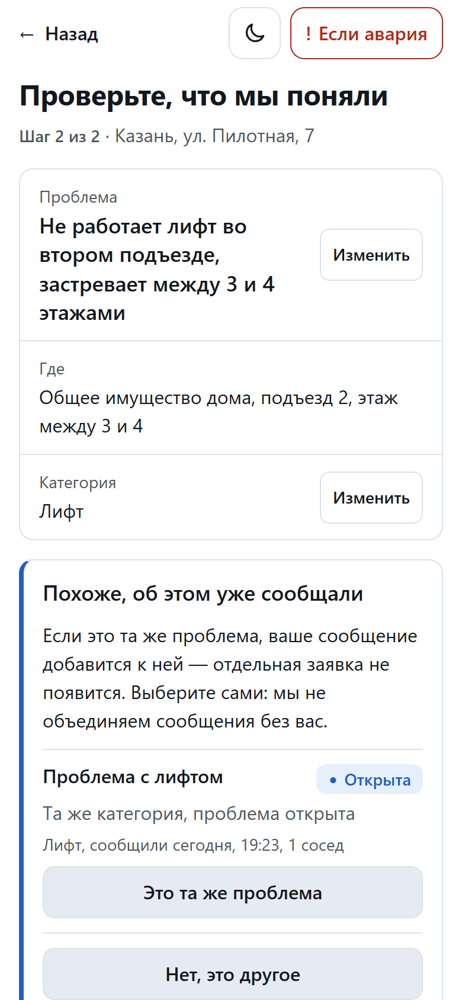 | 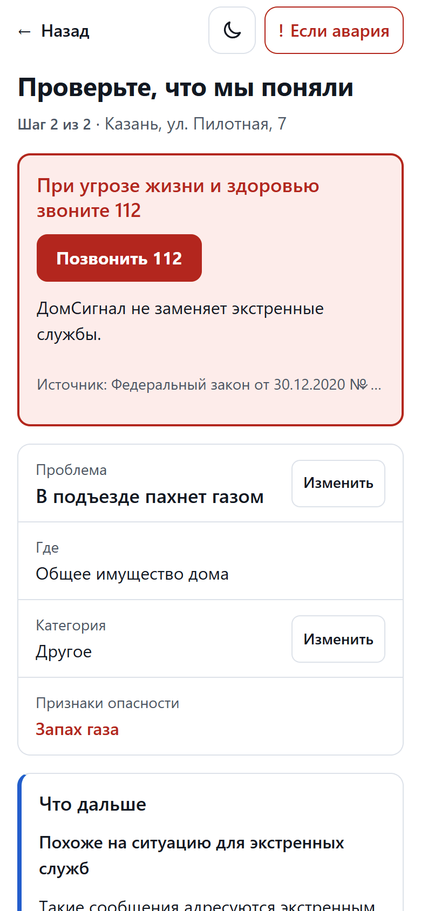 |
| **«Мой дом», тёмная тема** | **Не к УК: куда отправить, источник и дата проверки** | **«Проблемы дома», тёмная тема** |
| 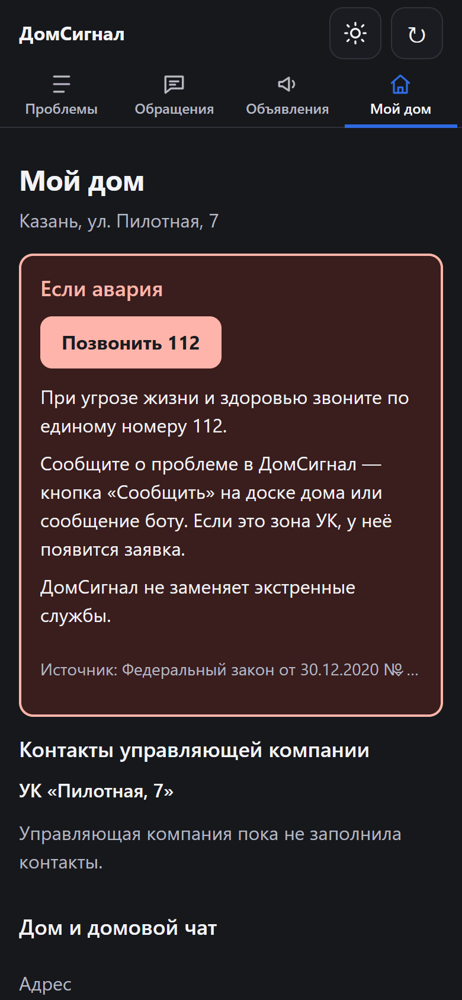 | 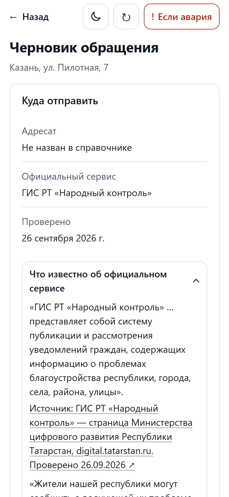 | 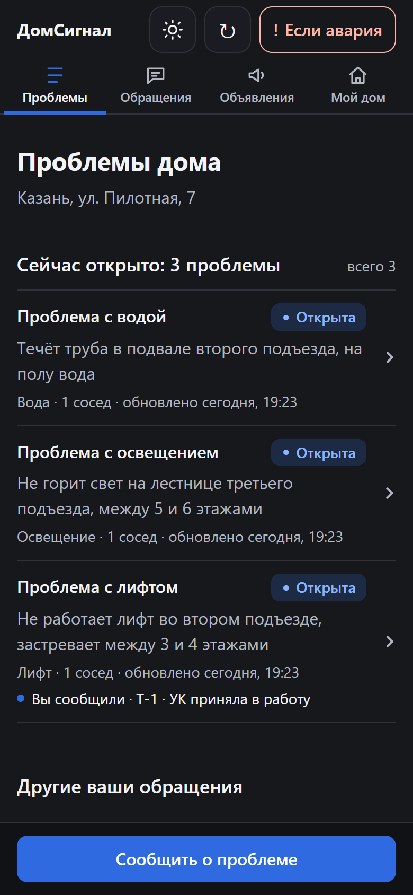 |

Кабинет УК (1 280 px):

| «Заявки» | «Сигналы» | «MAX-чаты», тёмная тема |
|---|---|---|
| 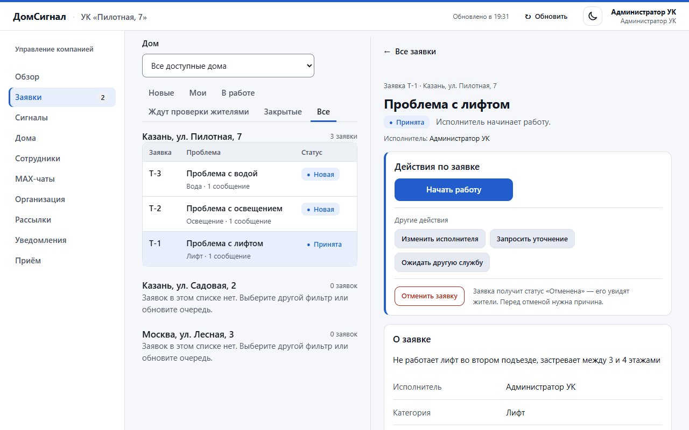 | 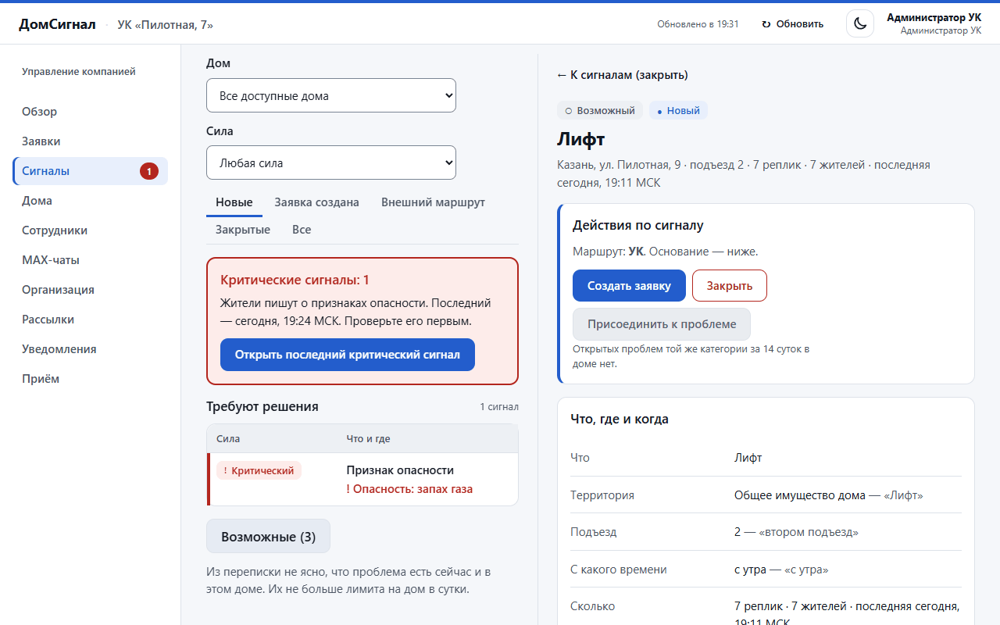 | 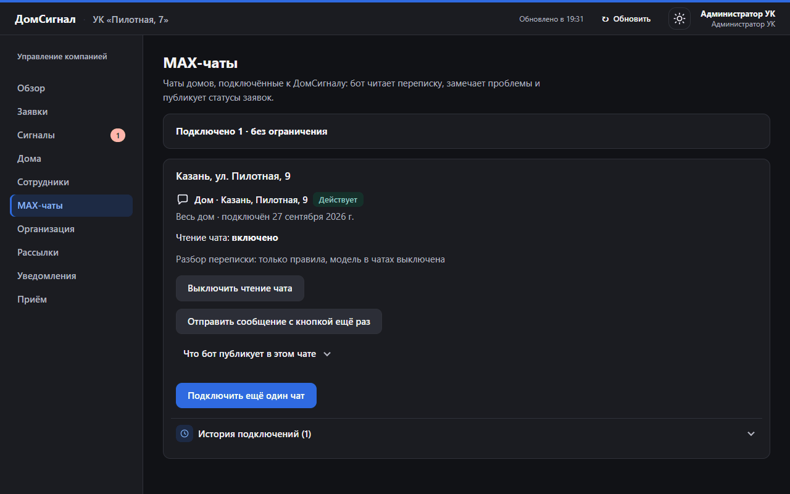 |

Тема переключается кнопкой луна/солнце в шапке. Остальные снимки обеих тем —
[`docs/images/`](docs/images/).

## Основной пользовательский сценарий

Переписка соседей о поломке → сигнал в кабинете УК → заявка → статусы в том же
посте чата → житель подтверждает «Исправлено» → проблема «Решена». Житель может
сообщить о проблеме и сам: командой `/report` в чате, в личке бота или в
мини-приложении.

Пошагово — [ниже](#пошаговый-сценарий-проверки) и в [`JURY_GUIDE.md`](JURY_GUIDE.md)
(11 сценариев); нестандартные ситуации — [`docs/SCENARIOS.md`](docs/SCENARIOS.md).

### Ролевая модель

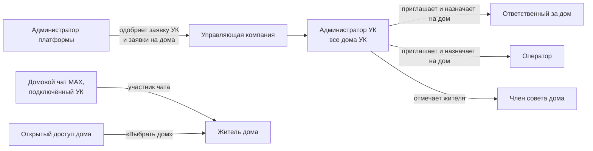

| Роль | Интерфейс | Как получает роль | Видит | Может |
|---|---|---|---|---|
| Житель | бот и мини-приложение в MAX; вход по подписанным данным запуска MAX | участник подключённого домового чата или выбор дома с открытым доступом | проблемы, объявления и опросы своих домов | сообщить о проблеме, «Меня тоже касается», «Исправлено» / «Проблема осталась», голосовать, «Предложить вопрос», подготовить обращение во внешний сервис |
| Член совета дома | мини-приложение | житель, которого отметил администратор УК | то же и предложения жителей своего дома | объявления и опросы от совета в своём доме, предложение жителя — в опрос |
| Оператор | кабинет `/admin/`; пароль + TOTP | сотрудник УК, назначенный на дом оператором | заявки и сигналы назначенных домов, «Обзор» по ним | взять заявку в работу, начать работу, сообщить о выполнении; решить сигнал: создать заявку, присоединить к проблеме, закрыть |
| Ответственный за дом | кабинет `/admin/`; пароль + TOTP | сотрудник УК, назначенный на дом ответственным | как оператор | как оператор, а также назначить исполнителя и отменить заявку, подключить чат MAX, рассылки и опросы жителям дома |
| Администратор УК | кабинет `/admin/`; пароль + TOTP | первый — из одобренной заявки УК, следующих приглашает администратор | все дома своей УК | как ответственный на всех домах, а также дома, сотрудники и назначения, открытый доступ, совет дома, приём жителей, организация, выгрузка CSV |
| Администратор платформы | кабинет `/platform-admin/`; пароль + TOTP | выдаётся на платформе | организации, заявки УК и заявки на дома, состояние системы, аудит | одобрить УК и дома, квоты чатов, приостановить организацию; тексты жителей и заявки не видит |

Права проверяются на сервере при каждом запросе — по действующему управлению домом и
назначению сотрудника: чужой дом — 404, чужой раздел кабинета — «Раздел недоступен».
Права платформы не открывают данные жителей. У проверочных учёток `jury.*` те же роли;
действия, которые изменили бы общую витрину «Пилотная, 7», для них отключены.

## Состав и архитектура

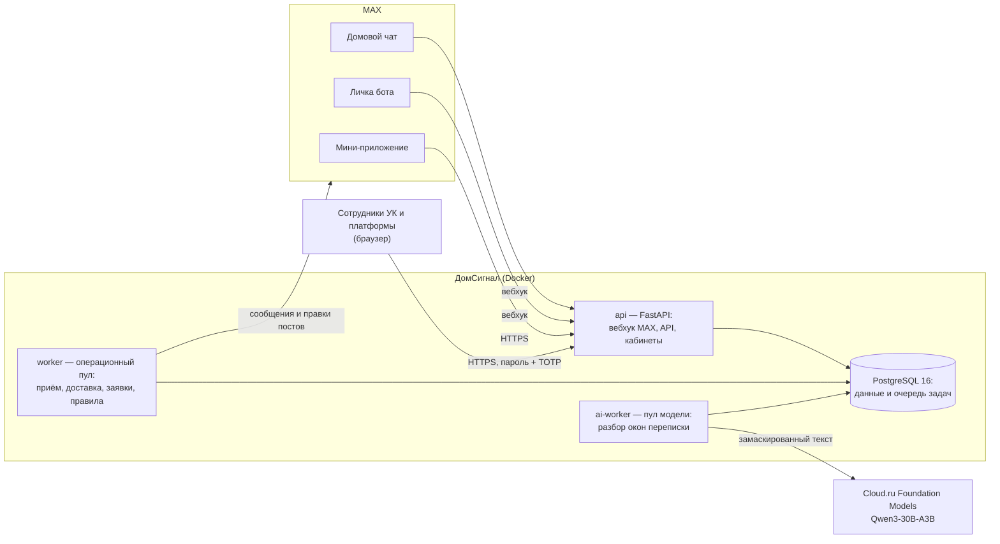

Модульный монолит: один образ, три процесса. `api` принимает вебхук MAX и
отдаёт кабинеты и мини-приложение; `worker` (`--pool operational`) — приём
реплик, правила опасности, заявки, доставку в MAX; `ai-worker` (`--pool ai`) —
только обращения к модели. Задачи и их повторы — в PostgreSQL, отдельного
брокера нет. Остановленный `ai-worker` не задерживает уведомления и заявки:
разбор уходит правилам.

| Часть | Технологии |
|---|---|
| backend | Python 3.12, FastAPI, SQLAlchemy, Alembic, PostgreSQL 16 |
| фронтенд | React 19, Vite, MAX UI — мини-приложение, кабинеты УК и платформы, сайт |
| разбор переписки | правила + открытая модель Qwen3-30B-A3B (Apache 2.0) через Cloud.ru Foundation Models |
| production | Docker Compose, Caddy (HTTPS) |

Подробно — [`docs/ARCHITECTURE.md`](docs/ARCHITECTURE.md), масштаб —
[`docs/SCALING.md`](docs/SCALING.md).

## Запуск одной командой

```bash
git clone https://github.com/Qward1/MAX_hack.git && cd MAX_hack
docker compose up --build
```

Поднимутся PostgreSQL, миграции, демо-данные (`seed`), `api`, `worker` и
`ai-worker`. Готовность — <http://localhost:8000/ready> отвечает
`{"status":"ready"}`.

| Что | Адрес | Как войти |
|---|---|---|
| Мини-приложение жителя | <http://localhost:8000/> | локальный тестовый вход: житель `demo` демо-дома «Казань, ул. Пилотная, 7». Сосед: `?test_actor=demo-neighbour`, посторонний: `?test_actor=outsider` |
| Сайт | <http://localhost:8000/site> | без входа |
| Заявка УК | <http://localhost:8000/company/apply> | без входа |
| Кабинеты сотрудников | <http://localhost:8000/login> | пароль + TOTP, см. ниже |
| Политика данных | <http://localhost:8000/privacy> | без входа |

**Первый администратор платформы** (TOTP-приложение на телефоне: Яндекс Ключ,
Google Authenticator или любое другое):

```bash
docker compose exec api python -m domsignal.tools.employee_auth bootstrap-platform --login-name admin.local
```

Команда печатает временный пароль. Откройте <http://localhost:8000/login>,
войдите `admin.local` с ним, задайте свой пароль (от 12 символов), отсканируйте
QR-код, введите код из приложения, сохраните 10 кодов восстановления —
откроется кабинет платформы.

**Кабинет УК** — путь «своя УК с нуля»: <http://localhost:8000/company/apply> →
заявка (сохраните ссылку на страницу статуса) → кабинет платформы, «Заявки УК» →
«Одобрить УК» → на странице статуса «Создать аккаунт администратора» → свой
пароль и TOTP. Адреса из заявки станут заявками на дома: «Заявки на дома» →
регион → «Одобрить выбранные». На локальном стенде ключ шифрования TOTP
подставляет `compose.yaml`; production этот ключ отвергает.

## Необходимые параметры окружения

- **Проверка:** Docker Engine 24+ с Compose v2, 4 ГБ свободной памяти, свободный
  порт 8000. Ключи и токены для локального запуска не нужны.
- **Разработка:** Python 3.12, [`uv`](https://docs.astral.sh/uv/) 0.12,
  Node.js 24 LTS, PostgreSQL 16.

## Переменные окружения

Для `docker compose up` задавать ничего не нужно: `compose.yaml` подставляет
локальные значения. Полный список с пояснениями — [`.env.example`](.env.example)
(без секретов).

| Переменная | Обязательна | По умолчанию (локально) | Что делает |
|---|---|---|---|
| `DATABASE_URL` | да | PostgreSQL из Compose | база данных и очередь задач |
| `SESSION_SECRET` | да | `local-only-change-me` | подпись сессий; production требует свой |
| `AUTH_MFA_ENCRYPTION_KEY` | да | локальный ключ Compose | шифрование секретов TOTP сотрудников |
| `APP_ENV` | нет | `local` | `production` включает строгие проверки настроек |
| `ALLOW_TEST_SESSION`, `DEMO_SEED` | нет | `true` | тестовый вход и демо-данные; production их запрещает |
| `MAX_TRANSPORT` | нет | `off` | `off` — без MAX, `record` — эмулятор, `webhook` — настоящий бот |
| `MAX_BOT_TOKEN`, `MAX_WEBHOOK_SECRET`, `MAX_BOT_USERNAME` | для MAX | локальные значения эмулятора | бот MAX (токен выдают организаторы) |
| `LLM_PROVIDER` | нет | `rules` | `rules` — разбор правилами без модели; `openai_compatible` — модель |
| `LLM_API_KEY`, `LLM_MODEL`, `LLM_BASE_URL` | для модели | — | ключ и модель Cloud.ru (`Qwen/Qwen3-30B-A3B`) |
| `LLM_DAILY_CALL_BUDGET`, `LLM_TOKENS_PER_MINUTE` | нет | 1000 / 80 000 | дневной бюджет вызовов и токены в минуту |
| `PASSIVE_CAPTURE_ENABLED` | нет | `false` | чтение подключённых чатов |
| `PUBLIC_BASE_URL` | нет | `http://localhost:8000` | адрес для ссылок и проверки `Origin` |
| `API_PORT` | нет | `8000` | порт `api` на 127.0.0.1 |
| `SHOWCASE_CHECK_TOKEN` | нет | — | токен самопроверки витрины |

**Без ключа модели** продукт работает полностью: окна переписки и сообщения
разбирают правила (`LLM_PROVIDER=rules`), опасность правила находят всегда.

## Порты

| Порт | Что |
|---|---|
| 8000 | `api` на 127.0.0.1 (меняется `API_PORT`) |
| 5173 | Vite при разработке мини-приложения |
| 5432 | PostgreSQL — только внутри сети Compose |
| 80, 443 | Caddy в production (`compose.prod.yaml`) |

## Зависимости

- Python: [`pyproject.toml`](pyproject.toml) + [`uv.lock`](uv.lock);
  фронтенд: [`miniapp/package.json`](miniapp/package.json) +
  [`miniapp/package-lock.json`](miniapp/package-lock.json).
- Базовые образы зафиксированы: `node:24.21.0-bookworm-slim`,
  `python:3.12.11-slim-bookworm`, `postgres:16.10-bookworm`, в production —
  `caddy:2.10.2-alpine`.
- В образ продукта попадают только `src/`, `migrations/`, `regions/`, собранный
  фронтенд и эмулятор MAX; `.dockerignore` не пускает в контекст сборки `.env*`,
  данные, тесты и `ml/`.
- **Время сборки** `docker compose build --no-cache` с чистого клона — около
  50 секунд (29.09.2026, Windows 11, Docker Desktop, базовые образы уже
  скачаны — ТЗ их загрузку не учитывает); от `up -d` до `ready` — около 20 секунд.
  Первая загрузка базовых образов — около 300 МБ.
- Лицензии зависимостей и модели — [`docs/LICENSES.md`](docs/LICENSES.md).

## Внешние сервисы и интеграции

| Сервис | Зачем | Как подключён |
|---|---|---|
| MAX | бот, домовые чаты, мини-приложение | вебхук `/max/webhook` с секретом `X-Max-Bot-Api-Secret`; токен бота выдают организаторы. Без MAX — [эмулятор](#без-max-эмулятор-на-локальном-стенде) |
| Cloud.ru Foundation Models | разбор переписки моделью `Qwen/Qwen3-30B-A3B` | OpenAI-совместимый API. Без ключа — правила; при отказе, таймауте или лимите запросов окно разбирают правила, серия отказов открывает предохранитель ([пробы](evaluation/reports/2026-09-29-llm-probes.md)) |
| Официальные сервисы: «Госуслуги. Решаем вместе», «Народный контроль» (Татарстан), «Наш город» (Москва) и другие | куда обратиться, если проблема не к УК | ссылки из справочника [`regions/`](regions/): жителю — только проверенные, с источником и датой проверки. Обращение житель отправляет сам по готовому черновику; интеграция через API этих систем — после MVP, при доступе к ним |

## Работа с данными

- **Что храним:** сообщения домового чата — не дольше 72 часов; в сигнале — до
  трёх начал сообщений с псевдонимом автора; заявки, опросы, черновики
  обращений — в базе сервиса; журналы — без текста сообщений и без полных
  IP-адресов. Полностью — <http://localhost:8000/privacy>.
- **Что уходит в модель:** текст окна переписки или сообщения боту. Перед
  отправкой заменяются телефоны, почта, ссылки, номера карт и квартир, госномера
  и длинные номера; авторы — псевдонимы «Житель A»; идентификаторы людей, чатов
  и домов не передаются. По документации Cloud.ru модель Qwen3-30B-A3B —
  внешняя: запросы обрабатываются вне инфраструктуры Cloud.ru.
- **Откуда ответы «кто отвечает» и «куда обращаться»:** справочник
  [`regions/`](regions/). Жителю показываются только проверенные записи — с
  источником и датой проверки; непроверенные скрыты. Схемы справочника проверяет
  `scripts/validate_region_pack.py`.
- **Изоляция УК:** каждый запрос сотрудника проверяется по действующему
  управлению домом и назначению; чужой дом — 404, чужой раздел — «Раздел
  недоступен».
- **Вход сотрудников:** пароль (от 12 символов) + TOTP, коды восстановления,
  защита от повтора кода, пауза после серии попыток входа; сессия — 30 минут
  простоя и 8 часов всего.

## Порядок работы с тестовыми данными

**Демо-УК, демо-дом и демо-чат — тестовые данные**, не реальная УК и не
реальный дом.

| Где | Тестовые данные |
|---|---|
| локальный стенд | `seed` создаёт демо-УК, дома «Казань, ул. Пилотная, 7», «Казань, ул. Садовая, 2», «Москва, ул. Лесная, 3» и жителей `demo`, `demo-neighbour`, `demo-third`, `outsider` (вход — `?test_actor=…`) |
| production | демо-УК «Пилотная, 7», дом «Казань, ул. Пилотная, 7», демо-чат «Дом · Казань, Пилотная, 7» и проверочные учётки `jury.*`; разрушающие действия над витриной для проверочных учёток отключены |
| API | [`docs/api/test_data.json`](docs/api/test_data.json) — демо-УК, дом, чужая УК, примеры сообщений |
| оценка разбора | синтетические наборы в [`datasets/`](datasets/) и отчёты в [`evaluation/`](evaluation/); тексты реальных переписок в репозиторий не входят |

Повторно загрузить демо-данные — `docker compose run --rm seed`; начать с
чистой базы — `docker compose down -v`, затем `docker compose up --build`.

## Пошаговый сценарий проверки

### На production, в MAX

Логины, пароли, TOTP и ссылка-приглашение в демо-чат — на служебном слайде
презентации; в репозитории секретов нет.

| Шаг | Где | Что сделать | Что должно получиться |
|---|---|---|---|
| 1 | MAX | Откройте [бота](https://max.ru/t480_hakaton_max_bot) → «Начать» | Приветствие «Здравствуйте! Я ДомСигнал…», кнопки «Попробовать…» (только пример ответа), «Открыть ДомСигнал», «Выбрать дом» |
| 2 | MAX | Вступите в демо-чат по ссылке со слайда (или в личке бота «Выбрать дом» → «Казань, ул. Пилотная, 7») | Вы — житель демо-дома; «Открыть ДомСигнал» показывает «Проблемы дома» |
| 3 | Демо-чат | Напишите `/report во втором подъезде не работает лифт` | В течение минуты пост «Заявка T-N · Проблема с лифтом» с кнопками «Меня тоже касается» и «Открыть» |
| 4 | Браузер, [кабинет](https://domsignal.176-108-244-168.sslip.io/login) | Войдите `jury.operator` (пароль и TOTP со слайда) → «Заявки» | Та же заявка в очереди со статусом «Новая» |
| 5 | Кабинет | «Взять в работу» → «Начать работу» → «Сообщить о выполнении» | Пост в чате: «УК приняла в работу» → «В работе» → «Исполнитель сообщил о выполнении»; автору в личку — «Проверьте, устранена ли проблема» |
| 6 | MAX, личка бота | «Исправлено» (или «Проблема осталась» — заявка вернётся в работу) | Пост — «Статус: Закрыта»; в мини-приложении проблема в «Решённые за 30 дней» |

Остальные сценарии (опасность, проблема не к УК, сигнал из разговора, дубль,
своя группа MAX, своя УК с нуля) — [`JURY_GUIDE.md`](JURY_GUIDE.md).

### Без MAX: эмулятор на локальном стенде

Бот принимает события в вебхук с локальным секретом, а всё, что он «отправил бы»
в MAX, пишет в файл. Production этот режим отвергает при старте. Для подключения
чата нужен кабинет УК — путь «своя УК с нуля» [выше](#запуск-одной-командой):
пока чат не подключён, бот ответит жителю «Пока не вижу вашего дома…». Команды —
для bash; в PowerShell переменные задаются так:
`$env:MAX_TRANSPORT="record"; $env:PASSIVE_CAPTURE_ENABLED="true"; docker compose up --build -d`.

```bash
MAX_TRANSPORT=record PASSIVE_CAPTURE_ENABLED=true docker compose up --build -d
# группа дома: владелец и администратор 1001, житель 1002
docker compose exec api python scripts/max_emulator.py chat --chat-id -1001 --title "Дом · Казань, Пилотная, 7" --admin 1001 --member 1002
```

1. Кабинет УК → «MAX-чаты» → «Подключить чат» → «Скопировать команду» — в ней
   код после `/start `.
2. Администратор группы открывает бота с кодом и добавляет его в группу:
   ```bash
   docker compose exec api python scripts/max_emulator.py start --user 1001 --payload <код>
   docker compose exec api python scripts/max_emulator.py bot-added --chat-id -1001 --by 1001
   ```
   В кабинете отметятся два шага и появится «Подтвердить подключение»; затем
   «Включить чтение чата».
3. Житель пишет в группу и боту:
   ```bash
   docker compose exec api python scripts/max_emulator.py message --chat-id -1001 --user 1002 --text "/report во втором подъезде не работает лифт"
   docker compose exec api python scripts/max_emulator.py dm --user 1002 --text "В третьем подъезде не работает домофон"
   ```
4. Что ответил бот: `docker compose exec api python scripts/max_emulator.py outbox`.

Ещё: `user-added` / `user-removed` (житель вступил в группу или вышел),
`callback` (нажатие кнопки), `webapp` (вход в мини-приложение с подписанными
данными MAX). Этим же эмулятором ходит приёмочный тест «своя УК с нуля» —
[`tests/acceptance/test_jury_path.py`](tests/acceptance/test_jury_path.py).

### Автоматические проверки

| Что | Команда |
|---|---|
| unit, контракты, фронтенд | `uv run python scripts/check.py --scope all` (`--scope integration` — с PostgreSQL в `DATABASE_URL`) |
| браузерные сценарии | `npm --prefix=miniapp run test:browser` |
| сборка и запуск в Docker | `uv run python scripts/docker_smoke.py` |
| приёмка по матрице | `uv run python scripts/acceptance_run.py --target local` ([`docs/qa/`](docs/qa/)) |
| API по `DATA-API.yaml` | `uv run python scripts/data_api_check.py` |

## Примеры ожидаемого поведения

| Сообщение жителя | Что делает ДомСигнал |
|---|---|
| «Во втором подъезде лифт не работает» | заявка в УК дома, статусы в том же посте чата |
| «На улице у дома не горят фонари» | «Проблема, вероятно, относится не к вашей УК»: официальный канал региона, источник, черновик обращения, «Я отправил(а) обращение» |
| «В подъезде пахнет газом» | первым — «При угрозе жизни и здоровью звоните 112», памятка в чат, оповещение оператора; дубли не предлагаются |
| «В доме напротив горит квартира», «накурили в подъезде» | памятки в чат нет |
| Тот же лифт от соседа | «Похоже, об этом уже сообщали»: «Это та же проблема» / «Нет, это другое» |
| «Проблема осталась» после отчёта исполнителя | та же заявка возвращается в работу, номер не меняется |
| «Исправлено» | заявка закрыта, проблема «Решена» |

## Известные ограничения

- Обращения во внешние сервисы («Госуслуги. Решаем вместе», «Народный контроль»,
  «Наш город») житель отправляет сам по готовому черновику: ДомСигнал не
  регистрирует обращение за жителя.
- Житель входит только из MAX, по подписанным данным запуска; отдельного входа
  жителя по паролю нет.

## Остановка и повторный запуск

```bash
docker compose down            # остановить, данные сохраняются в томе
docker compose up -d           # запустить снова с прежними данными
docker compose down -v         # сбросить локальный стенд: удалить свой том с данными
```

`down -v` — только для своего локального стенда. Второй стенд рядом — другое
имя проекта и порт: `API_PORT=8001 docker compose -p domsignal-2 up --build`.

## Внешние сервисы вне Docker: назначение и условия проверки

| Сервис | Назначение | Условия проверки |
|---|---|---|
| MAX (бот, чаты, мини-приложение в клиенте) | вход жителя, сообщения, посты | живой бот — [t480_hakaton_max_bot](https://max.ru/t480_hakaton_max_bot) на production; локально — эмулятор MAX (`MAX_TRANSPORT=record`) |
| Cloud.ru Foundation Models | разбор переписки моделью | ключ `LLM_API_KEY`; без ключа (`LLM_PROVIDER=rules`) все сценарии работают на правилах |

## API и `DATA-API.yaml`

| | |
|---|---|
| Адрес | `https://domsignal.176-108-244-168.sslip.io` (методы `/api/v1/…`) |
| OpenAPI 3.1 | [`/openapi.json`](https://domsignal.176-108-244-168.sslip.io/openapi.json) работающего сервиса = [`docs/openapi.json`](docs/openapi.json); интерактивно — `/docs` |
| Проверки | [`DATA-API.yaml`](DATA-API.yaml) — 24 проверки: служебные методы, отказы без входа, роли оператора, администратора УК и платформы, изоляция УК |
| Учётные записи | `jury.operator`, `jury.admin`, `jury.platform` (+ `.reserve`) — пароли и TOTP на служебном слайде. `jury.platform` нужен только для пути «своя УК с нуля»: одобрить заявку УК и заявку на дом |
| Тестовые данные | [`docs/api/test_data.json`](docs/api/test_data.json) |
| Описание | [`docs/API.md`](docs/API.md) — вход, роли, жизненный цикл заявки, идемпотентность, ошибки RFC 7807 |

Житель входит только из MAX (подписанные данные запуска), поэтому его методы
проверяются в клиенте MAX, а в `DATA-API.yaml` — отказ поддельной подписи.

**Проверки с TOTP.** 12 из 24 проверок `DATA-API.yaml` (роли `operator`,
`company_admin`, `platform_admin`, поле `requires_totp: true`) требуют входа
сотрудника с TOTP (RFC 6238, 30 с, 6 цифр). Если платформа оценки не
поддерживает TOTP, они будут показаны непройденными. Запасной путь 1 — раннер
`uv run python scripts/data_api_check.py --accounts <файл>`: формат файла —
шаблон [`docs/api/accounts.example.json`](docs/api/accounts.example.json),
значения — со служебного слайда; без `--accounts` раннер выполняет только
проверки без входа. Итог — две строки: «без входа: X из 12» и «с входом по TOTP:
X из 12». Запасной путь 2 — вручную по [`JURY_GUIDE.md`](JURY_GUIDE.md#api):
вход в браузере и те же разделы кабинетов.

## Как проверить версию

<https://domsignal.176-108-244-168.sslip.io/version> возвращает `commit` — тот
же, что на служебном слайде и под тегом `online-submission-final`:
`git rev-parse online-submission-final^{commit}` (тег аннотированный: без
`^{commit}` git вернёт объект тега, а не коммит). Короткий вид — первые 7
символов. Бот тоже отвечает на `/version`. Локальный стенд показывает `dev`, если
не задан `BUILD_COMMIT`.

## ML-модуль

[`ml/`](ml/README.md) — самостоятельный модуль разбора сообщений домового чата:
по сообщению определяет, есть ли проблема, её класс, тип реплики, срочность,
подъезд и этаж; по ленте чата объединяет сообщения об одной проблеме в
предварительную заявку. Работает офлайн, без ключей и внешних API. В Docker-образ
продукта не входит; план подключения третьим способом разбора рядом с правилами
и внешней моделью — [`docs/FINAL_PLAN.md`](docs/FINAL_PLAN.md). Проверить без
закрытых данных — юнит-тесты и смоук-запуск цепочки на синтетических
примерах: [`ml/README.md`](ml/README.md).

## Структура репозитория

```text
src/domsignal/     backend: api/ (FastAPI), bot/ (MAX), core/ (правила домена),
                   services/, ai/ (маскирование, модель, правила), worker/, db/, tools/
miniapp/           фронтенд: мини-приложение, кабинеты УК и платформы, сайт (React, Vite)
migrations/        миграции Alembic
regions/           справочник регионов: каналы и правила с источниками
ml/                самостоятельный ML-модуль (не входит в образ продукта)
datasets/, evaluation/   наборы и отчёты оценки разбора
tests/             unit, contract, integration (PostgreSQL), acceptance (эмулятор MAX)
scripts/           проверки, приёмка, эмулятор MAX, DATA-API, выпуск, копии базы
deploy/            production: Caddy, runbook, systemd
docs/              архитектура, API, сценарии, развёртывание, тестирование, решения
compose.yaml, compose.prod.yaml, Dockerfile, pyproject.toml + uv.lock
```

## Документы

| Документ | Что внутри |
|---|---|
| [`JURY_GUIDE.md`](JURY_GUIDE.md) | гид для проверяющих: входы, учётки, 11 сценариев, если что-то пошло не так |
| [`DATA-API.yaml`](DATA-API.yaml), [`docs/API.md`](docs/API.md) | проверки API и его описание |
| [`docs/SCENARIOS.md`](docs/SCENARIOS.md) | сценарии и нестандартные ситуации |
| [`docs/ARCHITECTURE.md`](docs/ARCHITECTURE.md) | компоненты, транзакции, надёжность |
| [`docs/SCALING.md`](docs/SCALING.md) | масштаб, регионы, стоимость |
| [`docs/DEPLOYMENT.md`](docs/DEPLOYMENT.md), [`deploy/README.md`](deploy/README.md) | запуск и выкладка на сервер |
| [`docs/OPERATIONS.md`](docs/OPERATIONS.md), [`docs/RELEASE.md`](docs/RELEASE.md) | эксплуатация, выпуск, витрина |
| [`docs/TESTING.md`](docs/TESTING.md), [`docs/qa/`](docs/qa/) | проверки, тест-кейсы, матрица приёмки |
| [`docs/UX.md`](docs/UX.md) | единый язык и правила интерфейса |
| [`docs/FINAL_PLAN.md`](docs/FINAL_PLAN.md), [`ml/README.md`](ml/README.md) | план финала; ML-модуль |
| [`docs/decisions.md`](docs/decisions.md) | решения с датами |
| [`docs/LICENSES.md`](docs/LICENSES.md) | лицензии зависимостей и модели |
