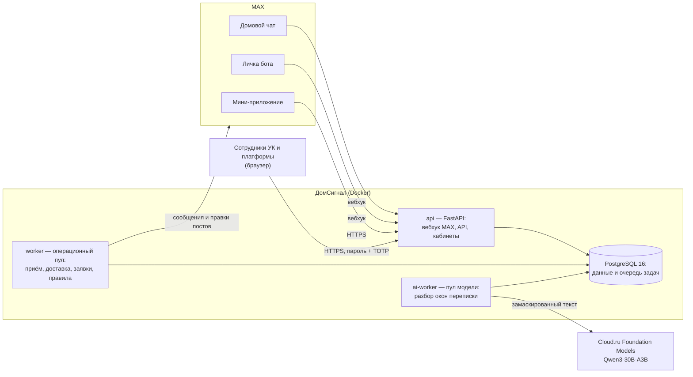

# ДомСигнал

**Проблемы дома — из домового чата в работу.** Бот в MAX читает домовой чат
(с согласия управляющей компании), замечает сообщения о поломках, собирает
повторы в одну проблему и передаёт её той управляющей компании (УК), которая
отвечает за дом. Если проблема не к УК — подсказывает официальный канал
региона и готовит текст обращения. Житель видит статус и сам подтверждает,
что исправлено.

- **Для кого:** жители многоквартирных домов, диспетчеры и администраторы УК.
- **Трек:** «Умный город», хакатон MAX.
- **Бот:** <https://max.ru/t480_hakaton_max_bot> · **сайт:**
  <https://domsignal.176-108-244-168.sslip.io>
- **Проверка решения:** [`JURY_GUIDE.md`](JURY_GUIDE.md) — входы, учётки, сценарии
  за 1–2 минуты; комплект сдачи — [`SUBMISSION_CHECKLIST.md`](SUBMISSION_CHECKLIST.md).
- **API:** `https://domsignal.176-108-244-168.sslip.io/api/v1`, OpenAPI 3.1 —
  [`/openapi.json`](https://domsignal.176-108-244-168.sslip.io/openapi.json),
  проверки — [`DATA-API.yaml`](DATA-API.yaml).
- **ML-фундамент:** [`ml/`](ml/README.md) — локальный классификатор и группировка
  сообщений; в репозитории, в рабочую систему пока не подключён.

## Содержание

1. [Проверка за 5 минут](#проверка-за-5-минут)
2. [Сценарии и роли](#сценарии-и-роли)
3. [Состав и архитектура](#состав-и-архитектура)
4. [Запуск одной командой](#запуск-одной-командой)
5. [Проверить бота без MAX](#проверить-бота-без-max)
6. [Что нужно заранее](#что-нужно-заранее)
7. [Переменные окружения](#переменные-окружения)
8. [Порты](#порты)
9. [Зависимости и сборка](#зависимости-и-сборка)
10. [Внешние сервисы](#внешние-сервисы)
11. [Работа с данными](#работа-с-данными)
12. [Тестовые данные](#тестовые-данные)
13. [Пошаговая проверка и ожидаемое поведение](#пошаговая-проверка-и-ожидаемое-поведение)
14. [Известные ограничения](#известные-ограничения)
15. [Остановка, повторный запуск, сброс](#остановка-повторный-запуск-сброс)
16. [Что не входит в Docker](#что-не-входит-в-docker)
17. [API](#api), [версия](#как-проверить-версию),
    [ML/NLP](#mlnlp-локальная-модель-в-ml),
    [что реально, что тестовое, что в плане](#что-реально-что-тестовое-что-в-плане),
    [структура репозитория](#структура-репозитория),
    [как мы использовали ИИ-агентов](#как-мы-использовали-ии-агентов),
    [документы](#документы)

## Проверка за 5 минут

Логины, пароли, коды TOTP и ссылка-приглашение в демо-чат — **на служебном
слайде**; в репозитории секретов нет. Все организации и дома на стенде —
тестовые данные.

| Шаг | Где | Что сделать | Что должно получиться |
|---|---|---|---|
| 1 | MAX | Откройте бота по ссылке выше → «Начать» | Приветствие «Здравствуйте! Я ДомСигнал…», кнопки «Попробовать…», «Открыть ДомСигнал», «Выбрать дом», ссылка на политику данных |
| 2 | MAX | Вступите в демо-чат по ссылке со слайда (житель = участник чата) или откройте демо-дом «Казань, ул. Пилотная, 7» по ссылке открытого доступа | В мини-приложении — доска дома «Проблемы дома · Казань, ул. Пилотная, 7» |
| 3 | Демо-чат | Напишите `/report во втором подъезде не работает лифт` | В течение минуты в чате пост «Заявка T-N · Проблема с лифтом…» с кнопками «Меня тоже касается» и «Открыть» |
| 4 | Браузер, <https://domsignal.176-108-244-168.sslip.io/login> | Войдите как оператор демо-УК (логин и TOTP со слайда) → «Заявки» | Та же заявка T-N в очереди со статусом «Новая» |
| 5 | Кабинет | «Взять в работу» → «Начать работу» → «Сообщить о выполнении» | Пост в чате правится: «Статус: УК приняла в работу» → «В работе» → «Исполнитель сообщил о выполнении»; автору в личку — «Проверьте, устранена ли проблема» с кнопками |
| 6 | MAX, личка бота | Нажмите «Исправлено» (или «Проблема осталась» — заявка вернётся в работу) | Пост — «Статус: Закрыта»; в мини-приложении проблема в «Решённые за 30 дней» с пометкой «Решена <дата>» |

Путь «своя УК с нуля» — заявка на сайте, одобрение платформой, свой
администратор с TOTP, дом, своя группа MAX — в
[`docs/JURY_GUIDE.md`](docs/JURY_GUIDE.md#своя-ук-с-нуля).

## Сценарии и роли

| Роль | Интерфейс | Главное, что делает |
|---|---|---|
| Житель | бот и мини-приложение в MAX | пишет в домовой чат или боту, видит доску дома, подтверждает результат, получает подсказку «куда обратиться», голосует в опросах |
| Член совета дома | мини-приложение | публикует объявления и опросы от совета, выносит предложения жителей на опрос |
| Оператор и ответственный за дом | кабинет `/admin/` | очередь заявок и сигналов из чата, работа по заявке до подтверждения жителем, чаты домов и рассылки (ответственный) |
| Администратор УК | кабинет `/admin/` | дома, сотрудники и их доступ, подключение чатов MAX, открытый доступ к дому, рассылки, опросы, приём жителей, обзор и выгрузка |
| Администратор платформы | кабинет `/platform-admin/` | заявки УК и домов, квоты чатов, приостановка организаций, открытый доступ, состояние системы, аудит |

Основной сценарий: переписка соседей о поломке → сигнал в кабинете УК →
заявка → статусы в том же посте чата → житель подтверждает «Исправлено» →
проблема «Решена». Полный набор — 99 тест-кейсов
[`docs/qa/TEST_CASES.md`](docs/qa/TEST_CASES.md), прогон на production с тремя
аккаунтами MAX — [`docs/qa/TEST_CASES_PROD_MAX.md`](docs/qa/TEST_CASES_PROD_MAX.md),
матрица автоматизации — [`docs/qa/ACCEPTANCE_MATRIX.md`](docs/qa/ACCEPTANCE_MATRIX.md).

## Состав и архитектура



Модульный монолит: один образ, три процесса. `api` принимает вебхук MAX и
отдаёт кабинеты и мини-приложение; `worker` (`--pool operational`) — приём
реплик, правила опасности, заявки, доставку в MAX; `ai-worker` (`--pool ai`) —
только обращения к модели. Задачи и их повторы — в PostgreSQL, отдельного
брокера нет. Остановленный `ai-worker` не задерживает уведомления и заявки:
разбор уходит правилам. Подробно — [`docs/ARCHITECTURE.md`](docs/ARCHITECTURE.md),
масштаб — [`docs/SCALING.md`](docs/SCALING.md).

Модель: **разбор переписки — открытая модель Qwen3-30B-A3B (Alibaba, Apache
2.0) через Cloud.ru Foundation Models. По документации Cloud.ru это внешняя
модель: данные обрабатываются вне инфраструктуры Cloud.ru. Перед моделью текст
маскируется; идентификаторы людей, чатов и домов не передаются. Опасность
распознают правила без модели. Для реального пилота — модель внутри РФ, это
решение перед пилотом.**

## Запуск одной командой

```bash
git clone https://github.com/Qward1/MAX_hack.git && cd MAX_hack
docker compose up --build
```

Поднимутся PostgreSQL, миграции, демо-данные (`seed`), `api`, `worker` и
`ai-worker`. Готовность — <http://localhost:8000/ready> отвечает
`{"status":"ready"}`. Первая сборка на машине проверки — см.
[«Зависимости и сборка»](#зависимости-и-сборка).

| Что | Адрес | Как войти |
|---|---|---|
| Мини-приложение жителя | <http://localhost:8000/> | локальный тестовый вход: житель `demo` демо-дома «Казань, ул. Пилотная, 7». Соседи: `?test_actor=demo-neighbour`, посторонний: `?test_actor=outsider` |
| Лендинг | <http://localhost:8000/site> | без входа |
| Заявка УК | <http://localhost:8000/company/apply> | без входа |
| Кабинеты сотрудников | <http://localhost:8000/login> | пароль + TOTP, см. ниже |
| Политика данных | <http://localhost:8000/privacy> | без входа |

**Первый администратор платформы** (TOTP-приложение на телефоне: Яндекс Ключ,
Google Authenticator или любое другое):

```bash
docker compose exec api python -m domsignal.tools.employee_auth bootstrap-platform --login-name admin.local
```

Команда печатает временный пароль. Откройте <http://localhost:8000/login>,
войдите `admin.local` с ним, задайте свой пароль (от 12 символов), отсканируйте
QR-код, введите код из приложения, сохраните 10 кодов восстановления —
откроется кабинет платформы.

**Кабинет УК** — путь «своя УК с нуля»: <http://localhost:8000/company/apply> →
заявка (сохраните ссылку на страницу статуса) → кабинет платформы, «Заявки УК» →
«Одобрить УК» → на странице статуса «Создать аккаунт администратора» → свой
пароль и TOTP. Адреса из заявки станут заявками на дома: «Заявки на дома» →
регион → «Одобрить выбранные». На локальном стенде ключ шифрования TOTP
подставляет `compose.yaml`; production этот ключ отвергает.

## Проверить бота без MAX

Локальный стенд умеет режим эмулятора MAX: бот принимает события в вебхук с
локальным секретом, а всё, что он «отправил бы» в MAX, пишет в файл. Production
этот режим отвергает при старте.

```bash
MAX_TRANSPORT=record PASSIVE_CAPTURE_ENABLED=true docker compose up --build -d
# группа дома: владелец и администратор 1001, житель 1002
docker compose exec api python scripts/max_emulator.py chat --chat-id -1001 --title "Дом · Казань, Пилотная, 7" --admin 1001 --member 1002
```

1. Кабинет УК → «MAX-чаты» → «Подключить чат» → «Скопировать команду» — в ней код после `/start `.
2. Администратор группы открывает бота с кодом и добавляет его в группу:
   ```bash
   docker compose exec api python scripts/max_emulator.py start --user 1001 --payload <код>
   docker compose exec api python scripts/max_emulator.py bot-added --chat-id -1001 --by 1001
   ```
   В кабинете отметятся два шага и появится «Подтвердить подключение»; затем
   «Включить чтение чата».
3. Житель пишет в группу и боту:
   ```bash
   docker compose exec api python scripts/max_emulator.py message --chat-id -1001 --user 1002 --text "/report во втором подъезде не работает лифт"
   docker compose exec api python scripts/max_emulator.py dm --user 1002 --text "В третьем подъезде не работает домофон"
   ```
4. Что ответил бот: `docker compose exec api python scripts/max_emulator.py outbox`.

Ещё: `user-added` / `user-removed` (житель вступил в группу или вышел),
`callback` (нажатие кнопки), `webapp` (вход в мини-приложение с подписанными
данными MAX и `start_param`). Этим же эмулятором ходит приёмочный тест «своя
УК с нуля» — [`tests/acceptance/test_jury_path.py`](tests/acceptance/test_jury_path.py).

## Что нужно заранее

- **Проверка:** Docker Engine 24+ с Compose v2 (проверено: Docker 28.3, Compose 2.39),
  4 ГБ свободной памяти, свободный порт 8000.
- **Разработка:** Python 3.12, [`uv`](https://docs.astral.sh/uv/) 0.12,
  Node.js 24 LTS, PostgreSQL 16.

## Переменные окружения

Полный список с пояснениями — [`.env.example`](.env.example). Для
`docker compose up` ничего задавать не нужно: `compose.yaml` подставляет
локальные значения.

| Переменная | Обязательна | По умолчанию (локально) | Что делает |
|---|---|---|---|
| `DATABASE_URL` | да | PostgreSQL из Compose | база данных и очередь задач |
| `SESSION_SECRET` | да | `local-only-change-me` | подпись сессий; production требует свой |
| `AUTH_MFA_ENCRYPTION_KEY` | да | локальный ключ Compose | шифрование секретов TOTP сотрудников |
| `APP_ENV` | нет | `local` | `production` включает строгие проверки настроек |
| `ALLOW_TEST_SESSION`, `DEMO_SEED` | нет | `true` | тестовый вход и демо-данные; production их запрещает |
| `MAX_TRANSPORT` | нет | `off` | `off` — без MAX, `record` — эмулятор, `webhook` — настоящий бот |
| `MAX_BOT_TOKEN`, `MAX_WEBHOOK_SECRET`, `MAX_BOT_USERNAME` | для MAX | локальные значения эмулятора | бот MAX (токен выдают организаторы) |
| `LLM_PROVIDER` | нет | `rules` | `rules` — разбор правилами без модели; `openai_compatible` — модель |
| `LLM_API_KEY`, `LLM_MODEL`, `LLM_BASE_URL` | для модели | — | ключ и модель Cloud.ru (`Qwen/Qwen3-30B-A3B`) |
| `LLM_DAILY_CALL_BUDGET`, `LLM_TOKENS_PER_MINUTE` | нет | 1000 / 80 000 | дневной бюджет вызовов и токены в минуту |
| `PASSIVE_CAPTURE_ENABLED` | нет | `false` | чтение подключённых чатов |
| `PUBLIC_BASE_URL` | нет | `http://localhost:8000` | адрес для ссылок и проверки `Origin` |
| `SHOWCASE_CHECK_TOKEN` | нет | — | токен самопроверки витрины для жюри |

**Без ключа модели** продукт работает полностью: окна переписки и сообщения
разбирают правила (`LLM_PROVIDER=rules`), опасность правила находят всегда.

## Порты

| Порт | Что |
|---|---|
| 8000 | `api` на 127.0.0.1 (меняется `API_PORT`) |
| 5173 | Vite при разработке мини-приложения |
| 5432 | PostgreSQL — только внутри сети Compose |
| 80, 443 | Caddy в production (`compose.prod.yaml`) |

## Зависимости и сборка

- Python: [`pyproject.toml`](pyproject.toml) + [`uv.lock`](uv.lock);
  фронтенд: [`miniapp/package.json`](miniapp/package.json) +
  [`miniapp/package-lock.json`](miniapp/package-lock.json).
- Базовые образы зафиксированы: `node:24.21.0-bookworm-slim`,
  `python:3.12.11-slim-bookworm`, `postgres:16.10-bookworm`, в production —
  `caddy:2.10.2-alpine`.
- Лицензии зависимостей и модели — [`docs/LICENSES.md`](docs/LICENSES.md).
- **Время сборки** `docker compose build --no-cache` с заранее скачанными
  базовыми образами — **28 секунд** (28.09.2026: Windows 11, 12 логических ядер,
  Docker Desktop 28.3 с 16 ГБ; кэш npm и uv очищен — `npm ci` и `uv sync`
  заново скачали 133 и 43 пакета); повтор на чистом клоне финальной ветки — 34 с,
  от `up -d` до `ready` — 20 с. На медленной сети дольше; лимит задания —
  5 минут.
- `.dockerignore` не пускает в образ `.env*`, `data/`, `Claude outputs/`,
  `output/`, тесты.

## Внешние сервисы

- **MAX.** Бот работает через вебхук (`/max/webhook` с секретом
  `X-Max-Bot-Api-Secret`); токен бота выдают организаторы. Без MAX — режим
  эмулятора ([выше](#проверить-бота-без-max)).
- **Cloud.ru Foundation Models** — модель `Qwen/Qwen3-30B-A3B`. Без ключа —
  правила. При отказе, таймауте (20 с) или лимите запросов окно разбирают
  правила, серия отказов открывает предохранитель; проверено —
  [`evaluation/reports/2026-09-29-llm-probes.md`](evaluation/reports/2026-09-29-llm-probes.md).
- **Официальные каналы** (Госуслуги «Решаем вместе», «Народный контроль» РТ,
  «Наш город» Москвы и др.) — только ссылки из проверенного справочника
  [`regions/`](regions/); интеграций и автоматической отправки нет.

## Работа с данными

- **Что храним и сколько:** сообщения домового чата — не дольше 72 часов;
  цитаты сигнала — до трёх начал сообщений с псевдонимом автора; заявки,
  опросы, черновики обращений — в базе сервиса; журналы — без текста сообщений
  и без полных IP-адресов. Полностью — <http://localhost:8000/privacy>.
- **Что уходит в модель:** текст окна переписки (на production до 6 сообщений и
  до 5 предыдущих как контекст) или сообщение боту. Перед отправкой
  заменяются телефоны, почта, ссылки, номера карт и квартир, госномера и
  длинные номера; авторы — псевдонимы «Житель A».
- **Изоляция УК:** каждый запрос сотрудника проверяется по действующему
  управлению домом и назначению; чужой дом — 404, чужой раздел — «Раздел
  недоступен».
- **Вход сотрудников:** пароль (от 12 символов) + TOTP, коды восстановления,
  защита от повтора кода, пауза 5 минут после серии попыток входа (production — 30
  за 5 минут на логин и на новые входы с адреса, локально — 10),
  сессия — 30 минут простоя и 8 часов всего.

## Тестовые данные

Всё синтетическое. Локально `seed` создаёт демо-УК и дома «Казань, ул.
Пилотная, 7», «Казань, ул. Садовая, 2», «Москва, ул. Лесная, 3» и жителей
`demo`, `demo-neighbour`, `demo-third`, `outsider`. На production — демо-УК
«Пилотная, 7» и демо-чат для жюри. Наборы оценки модели
([`datasets/`](datasets/), [`evaluation/`](evaluation/)) — синтетика; реальные
чаты использовались только как локальные агрегаты (числа), модели не
отправлялись. Повторно загрузить демо-данные:
`docker compose run --rm seed`; сбросить — [ниже](#остановка-повторный-запуск-сброс).

## Пошаговая проверка и ожидаемое поведение

| Сообщение жителя | Что делает ДомСигнал |
|---|---|
| «Во втором подъезде лифт не работает» | заявка в УК дома, статусы в том же посте чата |
| «На улице у дома не горят фонари» | «Проблема, вероятно, относится не к вашей УК»: официальный канал региона первым, черновик обращения, «Я отправил(а) обращение» |
| «В подъезде пахнет газом» | первым — «При угрозе жизни и здоровью звоните 112», памятка в чат, оповещение оператора; дубли не предлагаются |
| «В доме напротив горит квартира», «накурили в подъезде» | памятки в чат нет |
| Тот же лифт от соседа | «Похоже, об этом уже сообщали»: «Это та же проблема» / «Нет, это другое» |
| «Проблема осталась» после отчёта исполнителя | та же заявка возвращается в работу, номер не меняется |
| «Исправлено» | заявка закрыта, проблема «Решена» |

Автоматические проверки: `uv run python scripts/check.py --scope all`
(unit, контракты, фронтенд; `--scope integration` — с PostgreSQL в
`DATABASE_URL`), браузерные сценарии — `npm --prefix=miniapp run test:browser`,
приёмка по матрице — `scripts/acceptance_run.py --target local | prod-readonly`
([`docs/qa/`](docs/qa/)).

## Известные ограничения

- Модель внешняя (данные вне инфраструктуры Cloud.ru); для пилота нужна модель
  внутри РФ. Опасность находят правила без модели.
- Кастдева с жителями и УК не было; качество модели измерено на синтетических
  наборах одного автора.
- Масштаб до 5 000 чатов — расчёт по прогонам с моделью-заглушкой, не
  нагрузка на production ([`docs/SCALING.md`](docs/SCALING.md)).
- Нормативные сроки не ведутся; сроки заявки есть в API, но не в кабинете.
- Официальные каналы — ссылки, отправки обращений за жителя нет.
- Отзыв привязки чата — только приостановкой (удалением бота).
- Живые проверки в клиенте MAX частично ручные: список —
  [`docs/qa/ACCEPTANCE_MATRIX.md`](docs/qa/ACCEPTANCE_MATRIX.md) (способ `human-MAX`).

## Остановка, повторный запуск, сброс

```bash
docker compose down            # остановить, данные сохраняются в томе
docker compose up -d           # запустить снова с прежними данными
docker compose down -v         # сбросить локальный стенд: удалить свой том с данными
```

`down -v` — только для своего локального стенда. Несколько стендов рядом —
разные имена проекта: `docker compose -p domsignal-2 up --build`.

## Что не входит в Docker

| Сервис | Зачем | Как проверить без него |
|---|---|---|
| MAX (бот, чаты, мини-приложение в клиенте) | вход жителя, сообщения, посты | эмулятор MAX локально; живой бот — на production |
| Cloud.ru Foundation Models | разбор переписки моделью | `LLM_PROVIDER=rules` — всё работает на правилах |

## API

API решения заявлен для проверки:

| | |
|---|---|
| Адрес | `https://domsignal.176-108-244-168.sslip.io` (методы `/api/v1/…`) |
| OpenAPI 3.1 | [`/openapi.json`](https://domsignal.176-108-244-168.sslip.io/openapi.json) работающего сервиса = [`docs/openapi.json`](docs/openapi.json); интерактивно — `/docs` |
| Проверки | [`DATA-API.yaml`](DATA-API.yaml) — 24 проверки: служебные методы, отказы без входа, роли оператора, администратора УК и платформы, изоляция УК; прогон — `uv run python scripts/data_api_check.py --accounts <файл учёток>` |
| Учётные записи | `jury.operator`, `jury.admin`, `jury.platform` (+ `.reserve`) — пароли и TOTP на закрытом служебном слайде |
| Тестовые данные | [`docs/api/test_data.json`](docs/api/test_data.json) — демо-УК, дом, чужая УК, примеры сообщений |
| Описание | [`docs/API.md`](docs/API.md) — вход, роли, жизненный цикл заявки, идемпотентность, ошибки RFC 7807 |

Житель входит только из MAX (подписанные данные запуска), поэтому его методы
проверяются в клиенте MAX, а в `DATA-API.yaml` — отказ поддельной подписи.

## Как проверить версию

<https://domsignal.176-108-244-168.sslip.io/version> возвращает `commit` —
тот же, что на служебном слайде и в последней записи
[`docs/RELEASE.md`](docs/RELEASE.md). Бот отвечает на `/version`.

## ML/NLP: локальная модель в `ml/`

Самостоятельный модуль второго разработчика (DEV-A) — [`ml/README.md`](ml/README.md):
по сообщению домового чата определяет, есть ли проблема, её класс (33 класса),
тип реплики, срочность, подъезд и этаж; по ленте чата — объединяет сообщения
об одной проблеме в предварительную заявку. Работает офлайн, без ключей и API:
лёгкий вариант TF-IDF ≈ 8 мс на сообщение, усиленный — E5 + ruBERT.

- **Измерено** на отложенной части набора из двух реальных чатов (обезличен,
  разметка ИИ-агентом, людьми не проверена): нахождение проблемы AP 0,900 / 0,829,
  вся цепочка macro-F1 0,669 / 0,571, объединение F1 0,354 при точности 0,928;
  срочность — полнота 0,507, для самостоятельной тревоги недостаточно.
- **Статус:** код, эксперименты и отчёты — в репозитории; **в рабочую систему не
  подключён** (Docker-образ продукта папку `ml/` не копирует). Набор данных и веса
  не публикуются: это производные реальных переписок.
- **Проверить без закрытых данных:** 7 юнит-тестов и смоук-запуск всей цепочки на
  синтетике — [`ml/README.md`](ml/README.md#запуск-в-чистом-клоне-без-закрытых-данных).
- **Как войдёт в продукт:** третий провайдер разбора `local_ml` рядом с правилами и
  внешней моделью, сначала в режиме тени — [`docs/FINAL_PLAN.md`](docs/FINAL_PLAN.md).

## Что реально, что тестовое, что в плане

| Реально работает | ML-фундамент (в репозитории, не в работе) | Тестовое | В плане финала |
|---|---|---|---|
| Бот в MAX, чтение чата, сигналы, заявки, статусы в посте, подтверждение жителем, опасность, внешние каналы, кабинеты УК и платформы, вход с TOTP, квоты, рассылки и опросы, совет дома, приём жителей, API с проверками `DATA-API.yaml` | локальный классификатор, срочность и группировка сообщений `ml/` | Демо-УК «Пилотная, 7», демо-чат, тестовые УК на стенде; наборы оценки модели; масштаб 5 000 — расчёт | `local_ml` в режиме тени, решения операторов как разметка, модель внутри РФ, пилот с УК, сроки в кабинете — [`docs/FINAL_PLAN.md`](docs/FINAL_PLAN.md) |

## Структура репозитория

```text
src/domsignal/     backend: api/ (FastAPI), bot/ (MAX), core/ (правила домена),
                   services/, ai/ (маскирование, модель, правила), worker/, db/, tools/
miniapp/           фронтенд: мини-приложение, кабинеты УК и платформы, сайт (React, Vite)
migrations/        миграции Alembic
regions/           справочник регионов: каналы и правила с источниками
ml/                самостоятельный ML-модуль (не в рабочей системе)
datasets/, evaluation/   синтетические наборы и отчёты оценки модели
tests/             unit, contract, integration (PostgreSQL), acceptance (эмулятор MAX)
scripts/           проверки, приёмка, эмулятор MAX, DATA-API, выпуск, копии базы
deploy/            production: Caddy, runbook, systemd
docs/              архитектура, API, сценарии, развёртывание, тестирование, решения
compose.yaml, compose.prod.yaml, Dockerfile, pyproject.toml + uv.lock
```

## Как мы использовали ИИ-агентов

Код, тесты и документы писали ИИ-агенты (Claude Code) по срезам: владелец
проекта ставил задачу среза, принимал решения по продукту и безопасности и
проверял живые шаги в клиенте MAX. Агент не принимал изменения без проверок:
unit- и интеграционные тесты на PostgreSQL, браузерные сценарии Playwright,
приёмочные тесты на локальном стенде с эмулятором MAX, проверка вёрстки и
текстов, оценка модели на синтетических наборах с решениями, записанными до
прогона ([`docs/decisions.md`](docs/decisions.md)). Что проверяли люди вживую —
[`docs/MAX_LIVE_SMOKE.md`](docs/MAX_LIVE_SMOKE.md).

## Документы

| Документ | Что внутри |
|---|---|
| [`JURY_GUIDE.md`](JURY_GUIDE.md) | проверка за 1–2 минуты: входы, учётки, сценарии, если не получается войти |
| [`SUBMISSION_CHECKLIST.md`](SUBMISSION_CHECKLIST.md) | комплект сдачи и матрица критериев с доказательствами |
| [`FINAL_JURY_READINESS_REPORT.md`](FINAL_JURY_READINESS_REPORT.md) | что проверено перед сдачей, риски |
| [`DATA-API.yaml`](DATA-API.yaml), [`docs/API.md`](docs/API.md) | проверки API и его описание |
| [`docs/JURY_GUIDE.md`](docs/JURY_GUIDE.md) | подробный гид по ролям |
| [`docs/SCENARIOS.md`](docs/SCENARIOS.md) | сценарии и нестандартные ситуации |
| [`docs/DEPLOYMENT.md`](docs/DEPLOYMENT.md), [`docs/TESTING.md`](docs/TESTING.md) | запуск и выкладка; проверки и их результаты |
| [`ml/README.md`](ml/README.md), [`docs/FINAL_PLAN.md`](docs/FINAL_PLAN.md) | ML-модуль; план финала |
| [`docs/ARCHITECTURE.md`](docs/ARCHITECTURE.md) | компоненты, транзакции, надёжность |
| [`docs/SCALING.md`](docs/SCALING.md) | масштаб, стоимость, регионы |
| [`docs/UX.md`](docs/UX.md) | единый язык интерфейса |
| [`docs/qa/`](docs/qa/) | тест-кейсы, матрица приёмки, журнал прогона |
| [`docs/decisions.md`](docs/decisions.md) | решения с датами |
| [`docs/RELEASE.md`](docs/RELEASE.md) | выкладка, проверка, восстановление витрины |
| [`docs/OPERATIONS.md`](docs/OPERATIONS.md), [`deploy/README.md`](deploy/README.md) | эксплуатация и выкладка на сервер |
| [`docs/LICENSES.md`](docs/LICENSES.md) | лицензии зависимостей и модели |
