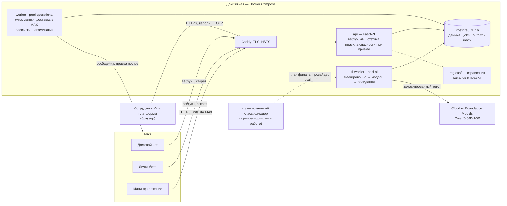

# ДомСигнал — архитектура

## Кратко

Модульный монолит: **один образ, три процесса, PostgreSQL как данные и очередь**.
Ниже — картина целиком; раздел «Шесть блоков и ручки масштаба» — где что
упирается; дальше — устройство отдельных частей.



| Компонент | Отвечает за | Не делает |
|---|---|---|
| `api` | вебхук MAX (секрет, дедупликация по id события), API мини-приложения и кабинетов, вход сотрудников, проверка прав на каждый запрос, правила опасности в транзакции приёма, отдача собранного фронтенда | не зовёт модель, не пишет в MAX напрямую |
| `worker` (operational) | окна переписки и сторож правил, заявки и их жизненный цикл, доставка в MAX через outbox (темп 2/с на чат, 10/с на рассылки), рассылки, напоминания, сводки, очистка | не зовёт модель |
| `ai-worker` | один вызов модели на окно: маскирование → запрос → проверка схемы и цитат; при отказе, таймауте, 429 — результат правил, предохранитель | не принимает решений об ответственности и не пишет в чат |
| PostgreSQL | единственный владелец данных: организации, дома, управление, назначения, чаты, реплики (≤ 72 ч), сигналы, заявки, события, рассылки; очередь `jobs` (claim `SKIP LOCKED` + аренда), `outbox`, `inbox_receipts`, бюджет модели | — |
| Фронтенд (`miniapp/`) | один Vite-проект: житель в MAX, `/admin` (УК), `/platform-admin`, `/site`, `/company/apply` | бизнес-правил не дублирует: разрешённые действия приходят из API |
| Справочник `regions/` | кто отвечает за проблему в регионе, с источником и датой проверки; пояс времени региона | — |
| `ml/` | самостоятельный офлайн-модуль: классы проблем, срочность, группировка | **не входит в образ и в рабочую систему** — план подключения в [`FINAL_PLAN.md`](FINAL_PLAN.md) |

**Брокер.** Отдельного брокера нет: задачи, повторы и исходящие сообщения — таблицы
PostgreSQL в той же транзакции, что и бизнес-изменение (transactional outbox). Отказ
процесса не теряет задачу: аренда истекает — задачу берёт другой. Повтор события MAX
отбрасывается по id. Пулы изолированы: остановленный `ai-worker` не задерживает
заявки, уведомления и опасность.

**Внешние сервисы.** MAX Bot API (вебхук, сообщения, правка постов, сведения о чате
и правах бота); Cloud.ru Foundation Models (только из `ai-worker`, только
замаскированный текст); Let's Encrypt через Caddy. Госуслуги и региональные сервисы —
только ссылки из справочника, без интеграции.

**Изоляция УК (tenant).** Каждый запрос сотрудника проходит организация → действующее
управление домом → назначение → действие (`core/access.py`); чужой объект — 404.
Платформа видит организации и состояние системы, но не тексты жителей и не заявки.

**Наблюдаемость.** `/health`, `/ready`, `/version`; журнал `http_request` с `request_id`
(= `trace_id` в ответе с ошибкой, заголовок `X-Request-ID`), без текстов жителей и
полных IP; кабинет платформы — очередь по пулам, возраст старейшей задачи, доставка
MAX, доля окон у правил, расход модели в ₽; внешний `uptime.yml` и самопроверка
витрины жюри; ежедневная копия базы.

**Масштаб — от одной УК к регионам.**

| Масштаб | Что меняется | Опора |
|---|---|---|
| 1 УК, десятки чатов | ничего: один VPS, по одному процессу | production сейчас |
| 10 УК, сотни чатов | квоты чатов, приглашения сотрудников; процессы те же | УК подключается сама — заявка, одобрение, TOTP, дома пачкой |
| 100 УК, 1 000–5 000 чатов | `--scale ai-worker=N`, циклы в процессе, несколько процессов `api` за Caddy, PgBouncer; ключи модели или локальная модель | 1 000 чатов — нагрузочный прогон на сервере production с имитацией ответов модели (≈ 0,3 ядра), 5 000 — расчёт: [`SCALING.md`](SCALING.md) |
| Несколько регионов | новый пакет `regions/RU-XX` — данные, не код; пояс времени дома | 4 региона + федеральный слой; тест по всем пакетам |

Все процессы без состояния в памяти (сессии и очередь — в PostgreSQL), поэтому
растут числом копий. Первым упирается бюджет и лимит внешней модели — это настройка,
после неё окна разбирают правила.

## Шесть блоков и ручки масштаба

Модульный монолит: один образ, один код, роли процессов задаёт команда запуска.

```
 MAX (webhook, личка, группы)           Браузер жителя / сотрудника
          │                                        │
          ▼                                        ▼
 ┌──────────────────────────┐        ┌───────────────────────────────┐
 │ 1. API + webhook         │◄──────►│ 5. Mini app и кабинеты        │
 │ FastAPI, приём реплик,   │  HTTP  │ житель: доска, карточка,      │
 │ правила опасности в      │        │ черновик; УК и платформа:     │
 │ транзакции приёма        │        │ очередь, заявки, обзоры       │
 └────────────┬─────────────┘        └───────────────────────────────┘
              │ jobs / outbox (та же транзакция)
              ▼
 ┌──────────────────────────────────────────────────────────────────┐
 │ 4. PostgreSQL 16 — данные и очередь задач (jobs, outbox,         │
 │    доставки, бюджет модели, шлюзы адресатов MAX)                  │
 └──────────┬──────────────────────────────────────┬────────────────┘
            │ claim SKIP LOCKED + аренда            │
            ▼                                       ▼
 ┌─────────────────────────────┐      ┌──────────────────────────────┐
 │ 2. operational-воркер       │      │ 3. AI-воркер                 │
 │ окна, сторож правил,        │      │ один вызов модели на окно,   │
 │ оповещения, доставка в MAX, │      │ маскирование, валидация;     │
 │ рассылки, сводки, очистка   │      │ отказ → результат правил     │
 └─────────────────────────────┘      └───────────────┬──────────────┘
                                                      ▼
                          провайдер модели (Cloud.ru, Qwen3-30B-A3B), бюджет
 ┌──────────────────────────────────────────────────────────────────┐
 │ 6. Справочник регионов `regions/` — слои данных: федеральный,    │
 │    RU-TA, RU-MOW, RU-PSK, RU-PRI; роутер ответственности и пояс   │
 └──────────────────────────────────────────────────────────────────┘
```

| Блок | Что делает | Ручка масштаба | Где упирается |
|---|---|---|---|
| 1. API + webhook | принимает вебхук MAX, пишет реплику, окно и задачи, отвечает за десятки мс; правила опасности — в той же транзакции | процессы uvicorn за Caddy; `DB_POOL_SIZE`/`DB_MAX_OVERFLOW` | соединения PostgreSQL |
| 2. operational-воркер | тик и закрытие окна, сторож правил (90 с), оповещения, памятки, доставка в MAX (шлюз адресата 2 сообщения/с на чат, рассылки 10/с на всё), рассылки, сводки, `jobs.cleanup` | `OPERATIONAL_WORKER_CONCURRENCY`, число процессов | темп MAX API |
| 3. AI-воркер | окно → один вызов модели вне транзакции; семафор на процесс, бюджет в PostgreSQL | `AI_WORKER_CONCURRENCY` (≤ `LLM_MAX_CONCURRENCY`), процессы `ai-worker` | потолок провайдера, дневной бюджет |
| 4. PostgreSQL | данные, очередь (`jobs` с частичным индексом пула), outbox, бюджет | вертикально; PgBouncer, когда процессы × пул > `max_connections` | соединения, рост таблиц (сроки хранения — [SCALING.md](SCALING.md)) |
| 5. Mini app и кабинеты | один Vite-проект: житель в MAX, `/admin`, `/company`, `/platform-admin`, `/site` | статика из образа | — |
| 6. Справочник регионов | каналы и правила с источниками, пояс региона; `region_pack new` — каркас нового региона | данные: новый каталог `regions/RU-XX` | проверка источников людьми |

Порядок при перегрузке: приём и опасность не ждут модель; окно, не
разобранное моделью за 90 с, разбирают правила; оповещения и личные
уведомления впереди рассылок. Числа — [SCALING.md, «До 5 000 чатов»](SCALING.md#до-5-000-чатов).

## Код и зависимости

```text
src/domsignal/
  core/          чистые правила: доступ, переходы заявок, сигналы, справочник и маршрут, тихие часы
  contracts/     Pydantic-модели API
  services/      сценарии: приём, окна, сигналы, заявки, доставка, подключения, кабинеты
  ai/            маскирование, окна, правила, провайдеры модели, проверка ответа
  db/            модели SQLAlchemy, репозитории, фабрика сессий
  api/           зависимости, ошибки RFC 7807, проверка initData, маршруты
  bot/           вебхук MAX, типизированные события, клиент MAX API
  worker/        пулы, claim/lease-исполнитель, обработчики задач
  tools/         CLI: демо-данные, профиль дома, предпросмотр маршрута, пакет региона
  bootstrap.py   сборка зависимостей без DI-фреймворка
  main.py        create_app, lifespan, подключение маршрутов
miniapp/         React/Vite: мини-приложение, кабинеты, сайт, заявка УК
migrations/      Alembic, аддитивные миграции
regions/         JSON Schema и слои справочника ответственности
deploy/          Caddyfile, инструкции выкладки и базы
scripts/         проверки, экспорт OpenAPI, валидатор регионов, нагрузка, эмулятор MAX
```

Направление вызовов: `api/bot/worker → services → core`. SQLAlchemy-запросы —
только в `db/repositories`; фронтенд и приём вебхука не содержат правил
ответственности. PostgreSQL 16 + asyncpg — единственное хранилище во всех
окружениях, включая тесты: настройки отвергают SQLite и другие диалекты. Redis,
брокеров, Kubernetes и внутренних HTTP-микросервисов нет.

## Доступ и управление домом

- УК — tenant. `HouseManagement` хранит УК, дом и период управления
  `[valid_from, valid_to)`; пересечение активных периодов одного дома запрещает
  ограничение исключения PostgreSQL (`btree_gist`), в том числе при параллельных
  вставках. Смена УК сохраняет старые заявки за прежним управлением; новая УК
  старую историю автоматически не получает.
- Права сотрудника: членство в организации (`company_admin` / `operator`) и
  назначение на дом. Права жителя — `ResidentMembership` на дом с источником и
  сроком. Каждый запрос заново проверяет текущие основания
  (`core/access.py`, `services/membership.py`), кэша ролей в сессии нет.
- Чужой или отсутствующий объект — одинаковый 404; нет права на действие в
  своём объекте — 403. Роль и tenant из тела или адреса запроса не источник прав.

## Вход сотрудников

- Вход сотрудника отделён от initData MAX: логин и пароль (Argon2id), затем TOTP
  по RFC 6238 с защитой от повторного кода. Секреты TOTP зашифрованы Fernet
  (`AUTH_MFA_ENCRYPTION_KEY`); десять одноразовых кодов восстановления хранятся
  как HMAC-SHA256.
- Сессия — непрозрачная cookie `__Host-…` (Secure, HttpOnly, SameSite=Lax),
  30 минут простоя и 8 часов всего; каждое изменяющее действие требует точный
  `Origin` и CSRF-токен, привязанный к сессии. Токен сотрудника не принимается
  как Bearer.
- Ограничение попыток по адресу и логину хранится в PostgreSQL и проверяется
  до дорогой проверки пароля; в журнал безопасности попадают тип события и ID
  пользователя, но не введённые данные.

## Подключение чатов

- Запрос подключения хранит SHA-256 случайного токена (срок по умолчанию —
  15 минут); сам токен показывается один раз. Жизненный цикл: `created` →
  `connector_claimed` → `chat_detected` → `max_verified` → (`awaiting_approval`)
  → `completed`; `expired`, `cancelled`, `rejected` — конечные
  (`core/chat_connections.py`).
- Привязка чата к дому — состояния `pending`, `active`, `suspended`, `revoked`; у одного
  чата MAX не больше одной активной привязки (частичный уникальный индекс).
  Бот проверяет свои права в чате через MAX API; название чата и его участники
  дом и права не определяют.
- Вебхук `/max/webhook` проверяет секрет до разбора тела; событие
  дедуплицируется по идентификатору в `inbox_receipts`, изменения и задачи
  фиксируются до ответа 200. Удаление бота из чата приостанавливает привязку.

## Заявки и транзакционные границы

- Заявка, её история, попытки исполнителя (`WorkAttempt`), наблюдения жителей
  (`ResultObservation`) и намерение уведомить пишутся в одной транзакции через
  transactional outbox. Центральные переходы — `core/tickets.py`, проверка прав,
  идемпотентность и проекции — `services/tickets.py`.
- Порядок блокировок: дом (SHARE) → проблема (FOR UPDATE) → заявка и попытка.
  `expected_version` сотрудника проверяется под блокировкой; наблюдения жителей
  получают серверную ревизию и не теряются при параллельных изменениях.
- Приём вебхука: запись события и задачи — одна короткая транзакция, ответ
  `accepted` — только после неё. Воркер забирает задачу `FOR UPDATE SKIP
  LOCKED`, фиксирует аренду и завершает транзакцию до вызова сети; завершить
  задачу можно только текущим `lease_token`, истёкшую аренду берёт другой
  процесс. Повтор входящего события безопасен по ключу `inbound:<event_id>`.
  Доставка во внешнюю систему «ровно один раз» не обещается.

## Личная доставка в MAX

Уведомление о заявке превращается в строки `NotificationDelivery` на каждого
адресата; состояния доставки (`pending`, `processing`, `accepted`,
`retry_wait`, `unknown`, `failed`, `superseded`, `skipped`) отделены от
статусов заявки. Перед отправкой заново проверяются доступ адресата и
действующее управление домом. Сеть вызывается вне блокировок и транзакций.
Общий шлюз адресата в PostgreSQL выдерживает паузу между отправками в один
диалог или чат (не больше 2 сообщений в секунду). Неясный исход отправки
становится `unknown` и не повторяется вслепую; 429 и ошибки соединения
повторяются с растущей паузой.

## Справочник ответственности

Справочник — данные, а не код: `regions/_federal/responsibility.yaml` →
`regions/<REGION>/responsibility.yaml` → муниципальная секция → профиль дома.
Нижний слой уточняет верхний по `id` записи; `regions/_federal/safety.yaml`
держит проверенные памятки безопасности. `core/responsibility.py` собирает слои
под дом, `core/routing.py` детерминированно выбирает маршрут,
`services/action_cards.py` собирает карточку следующего шага. Невалидный
справочник не роняет приложение: маршруты становятся `unknown`. Модель в этом
слое не участвует.

## Граница ИИ и ядра

ИИ-разбор — логическая граница внутри того же пакета, не отдельный сервис:

1. Ядро принимает сообщение, проверяет личность, доступ и допустимый объём
   текста.
2. ИИ получает только замаскированный текст и возвращает типизированный
   результат: категорию, подтип, место, роли реплик, неопределённость.
3. Ядро проверяет результат по схеме, применяет правила опасности и
   справочник, принимает решение и выполняет транзакцию.

ИИ может предложить похожие проблемы, признаки риска или формулировку, но
объединение, доступ к данным, сохранение и история решаются ядром. Опасность
определяют правила до модели. Модель не определяет юридическую
ответственность, нормативный срок, внешнюю регистрацию или факт устранения.

## Подключение УК и администрирование

- Заявка УК → ручная проверка платформой → активная УК и первое приглашение
  администратора. Ссылки приглашений хранятся только как HMAC, показываются
  один раз и по умолчанию истекают через 48 часов.
- Заявка на управление домом доступа не даёт: платформа явно выбирает
  существующий дом или создаёт новый; сопоставление адреса только предлагает
  кандидатов.
- Редкие административные изменения (например, отзыв сотрудника) берут
  исключительную advisory-блокировку PostgreSQL, рабочие действия — разделяемую;
  отзыв сотрудника снимает его назначения, но не удаляет историю работ.
  Последнего администратора УК отозвать нельзя.
- API платформы требует вход сотрудника с TOTP и роль платформы; ответы
  содержат метаданные организаций, домов и привязок и сводки состояния, но не
  тексты жителей, наблюдения и описания работ.

## Окружения

Режимы `local`, `test`, `production`. Тестовый вход выдаётся только отдельным
адресом в `local`/`test`. Проверка настроек production запрещает демо-данные и
тестовые учётные данные, тестовый вход, записывающий транспорт MAX, HTTP-адрес
сервиса, CORS `*` и стандартный секрет сессии. initData MAX проверяется на
сервере: HMAC-SHA256 по алгоритму `WebAppData`, сравнение за постоянное время,
возраст данных; после проверки выдаётся короткая непрозрачная сессия, хранится
только HMAC её токена.
