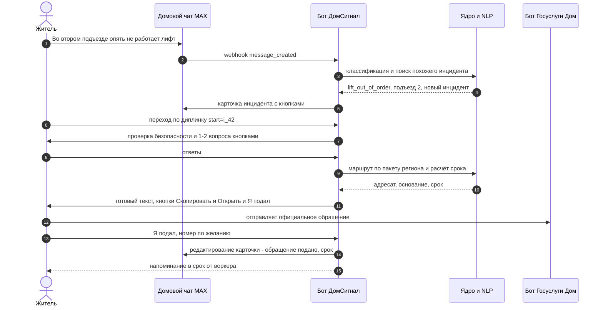
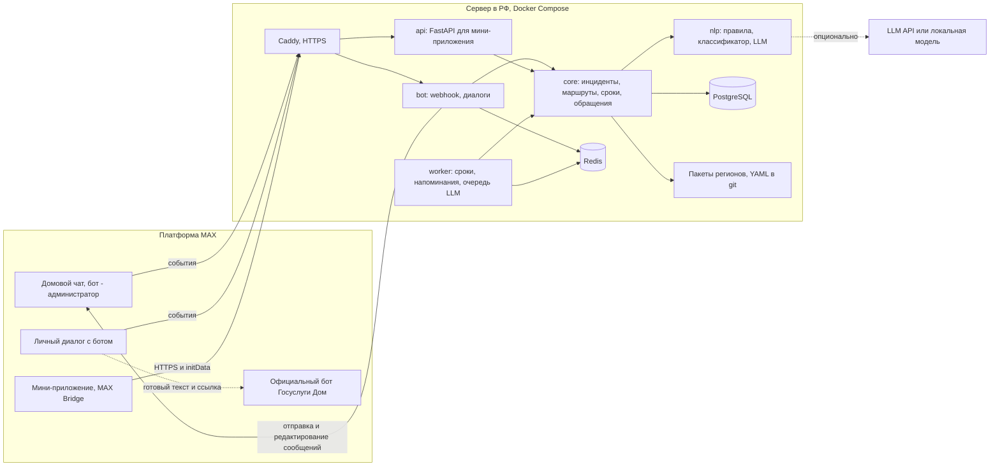
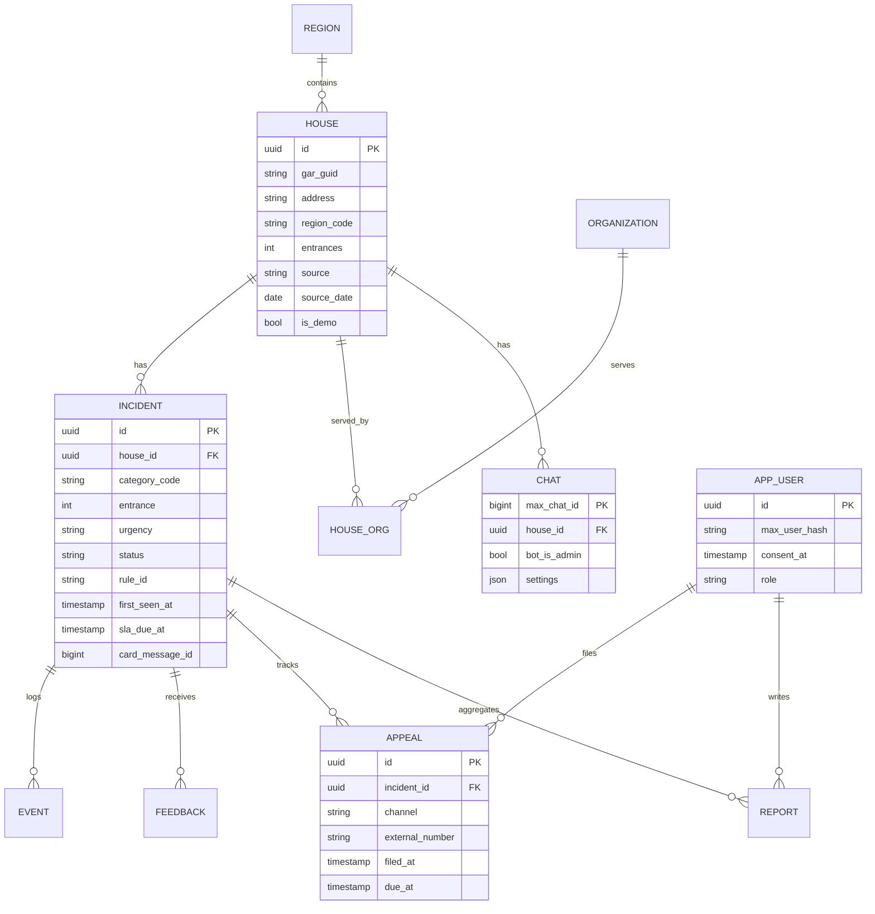
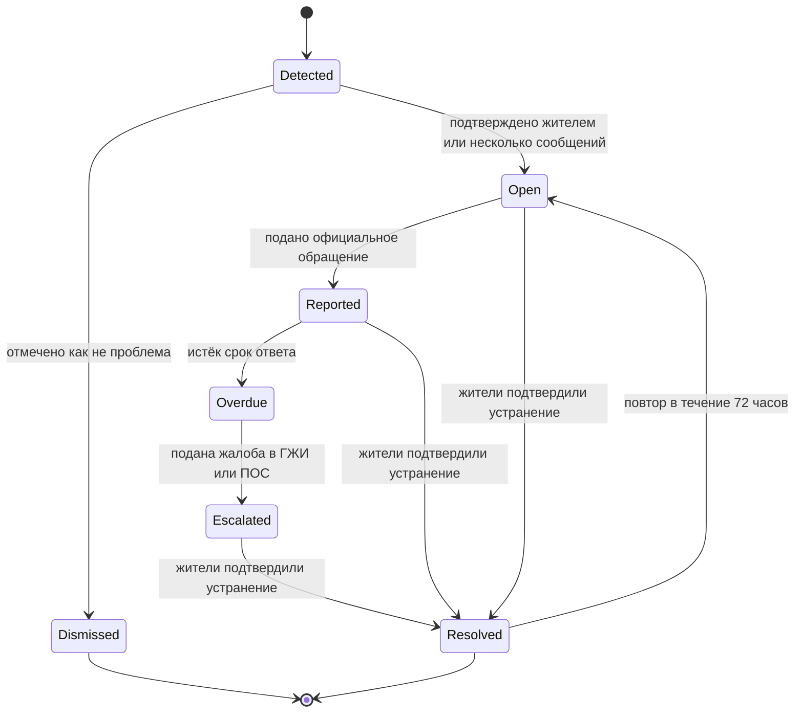
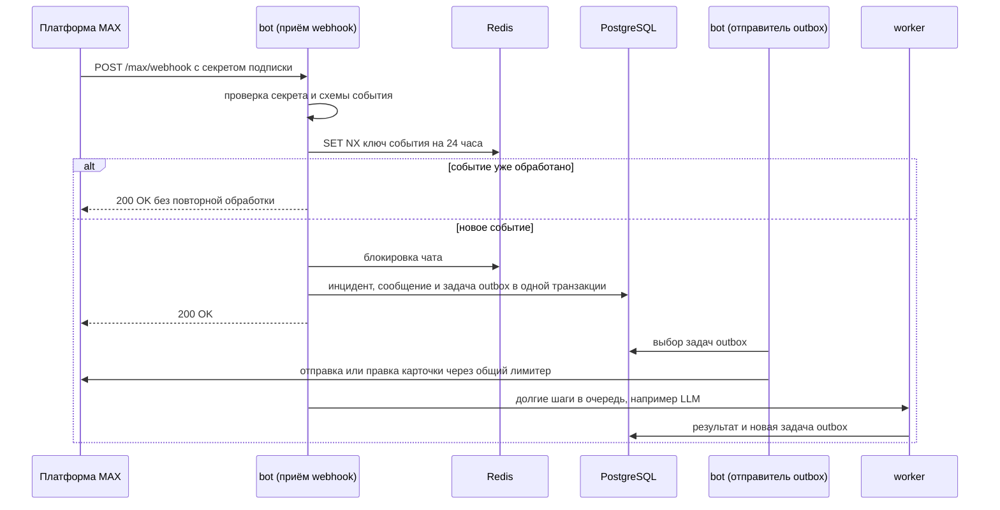
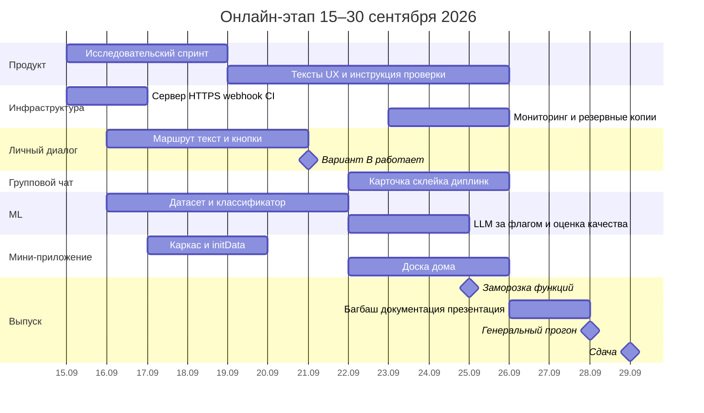
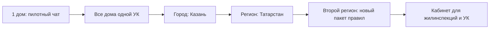

# «ДомСигнал»: разбор кейса, исследование, стратегия и архитектура

**Трек «Умный город» · Хакатон MAX × Минобрнауки России · онлайн-этап 15–30.09.2026**

> Рабочий документ команды. Составлен 15–16.09.2026, в первые дни онлайн-этапа.
> Факты сопровождаются ссылками `[n]` на источники из раздела 17. Всё без ссылки — наши выводы, а проверяемые предположения явно помечены словом **«Гипотеза»**.
> Юридические выводы здесь справочные. Каждое правило, которое попадёт в продукт, сверяем с первоисточником и храним с датой проверки.

---

## Содержание

0. [Главное на одной странице](#0-главное-на-одной-странице)
1. [Что на самом деле требует кейс](#1-что-на-самом-деле-требует-кейс)
2. [Математика баллов: куда вкладывать усилия](#2-математика-баллов-куда-вкладывать-усилия)
3. [Исследование контекста](#3-исследование-контекста)
4. [Идеи и выбор](#4-идеи-и-выбор)
5. [Рекомендуемый продукт «ДомСигнал»](#5-рекомендуемый-продукт-домсигнал)
6. [Архитектура](#6-архитектура)
7. [Платформенный бонус +0,15](#7-платформенный-бонус-015)
8. [План работ на онлайн-этап](#8-план-работ-на-онлайн-этап)
9. [Масштабирование](#9-масштабирование)
10. [Пилот: Казань](#10-пилот-казань)
11. [Презентация: структура слайдов](#11-презентация-структура-слайдов)
12. [Риски и их снижение](#12-риски-и-их-снижение)
13. [Подготовка к финалу и вопросы жюри](#13-подготовка-к-финалу-и-вопросы-жюри)
14. [Вопросы организаторам — задать сегодня](#14-вопросы-организаторам--задать-сегодня)
15. [Запасной план, если бот не сможет работать в групповом чате](#15-запасной-план-если-бот-не-сможет-работать-в-групповом-чате)
16. [Чек-лист сдачи](#16-чек-лист-сдачи)
17. [Источники](#17-источники)

---

## 0. Главное на одной странице

**Контекст, который меняет постановку.** К сентябрю 2026 года ЖКХ внутри MAX — уже не пустое поле, а сложившаяся система из трёх каналов: домовой чат, канал организации и чат-бот ГИС ЖКХ; через бот обращение уходит в ГИС ЖКХ и получает дату, регистрационный номер и статус [8]. С 1 апреля в домовых чатах работает официальный бот «Госуслуги Дом» для показаний счётчиков и обращений [15]. Минстрой разъяснил, что официальное взаимодействие возможно только через чат-бот ГИС ЖКХ, а сообщения в общем домовом чате официальными обращениями не считаются [6]. При этом домовыми чатами в MAX пользуются уже 16,5 млн человек [14].

**Главный вывод.** Делать «ещё одного бота для заявок в УК» — значит соревноваться с государственным продуктом, у которого есть интеграция с ГИС ЖКХ. Сильная и незанятая позиция находится в разрыве между местом, где люди *реально пишут о проблемах* (домовой чат), и местом, где проблемы *официально решаются* (обращение правильному адресату в установленном порядке). Этот разрыв кейс прямо называет: «неформальное обсуждение в домовом чате не приводит к понятному дальнейшему действию» и «непонятно, кто отвечает за решение вопроса» [1].

**Что строим.** «ДомСигнал» (рабочее название) — бот-участник домового чата MAX с личным диалогом и мини-приложением. Он замечает в чате сообщения о бытовых проблемах, склеивает дубли в один «инцидент» и один раз показывает соседям карточку: что случилось, кто по правилам отвечает, подано ли уже официальное обращение. По кнопке житель переходит в личный диалог, где за одну-две минуты получает маршрут (срочно ли это, кто отвечает, основание, срок), готовый текст обращения и передачу в официальный канал. После отметки «подал(а)» карточка в чате обновляется, соседи видят статус и срок, а бот напоминает о сроке и подсказывает эскалацию.

**Почему это выигрывает по критериям.** Потенциал масштабирования — самый тяжёлый продуктовый критерий (14% итогового балла онлайн-этапа, раздел 2) — заложен в архитектуру: ядро одинаково для любого дома, а региональная специфика вынесена в «пакет региона» (YAML с правилами, контактами и нормативными основаниями), поэтому перенос в новый регион показывается на демо заменой файла, без изменения кода. ML/LLM здесь не самоцель: распознать проблему в разговорной реплике и понять, что десять сообщений про один лифт — это один инцидент, без модели нельзя, а вот ответственность и сроки определяют детерминированные правила со ссылкой на норму, как и советует кейс [1].

**Пилот — Казань.** Финал пройдёт в Казани [2]. За январь–август 2026 года ГЖИ Татарстана получила 21,9 тыс. жалоб на коммунальные услуги (+38,7% к прошлому году), из них 12,8 тыс. — из Казани; с 1 октября в республике ожидается повышение тарифов [17]. Каналы подачи жалоб в регионе раздроблены: соцсети, «Народный контроль», «Решаем вместе» [18].

**Что сделать немедленно.** Написать организаторам три вопроса из раздела 14 (разрешено ли добавлять выданного бота в групповые чаты, допустимы ли внешние LLM API, что считается «собственным API»). Поднять VPS с доменом и HTTPS и получить первое сообщение от MAX через webhook. Запустить трёхдневный исследовательский спринт (раздел 3.7), чтобы к 18.09 подтвердить или опровергнуть ключевые гипотезы и не строить продукт вслепую.

---

## 1. Что на самом деле требует кейс

### 1.1 Условия, которые легко пропустить, и что они значат для нас

| Требование кейса [1] | Практическое следствие |
|---|---|
| Основной сценарий должен проверяться в MAX и работать и в мобильной, и в веб-версии | Ключевые шаги не строим на возможностях MAX Bridge, которые не поддерживаются веб-клиентом: `DeviceStorage`, `SecureStorage`, `HapticFeedback`, `shareContent`, биометрия [24]. Тестируем на iOS, Android и web до сдачи |
| Мини-приложение подключается к боту и не живёт отдельно | Мини-приложение открывается кнопкой `open_app` из бота и работает с теми же данными |
| Собственный API не обязателен и баллов сам по себе не даёт; если он есть — OpenAPI, DATA-API.yaml, тестовые учётки и обязательные проверки | Заявлять API — осознанное решение с рисками; разбор в разделе 6.7 |
| Нельзя использовать закрытые библиотеки, частные API и чужой код без свободной лицензии | Автоматическая проверка лицензий зависимостей (`pip-licenses`, `license-checker`). Про внешние LLM API — вопрос организаторам |
| Рабочие токены и ключи нельзя класть в репозиторий, но их нужно указать на первом слайде | `.env.example` без значений + `gitleaks` в pre-commit; реальные значения — только на служебном слайде |
| Смоделированные данные должны быть явно помечены | У каждой записи поля `source`, `source_date`, `is_demo`; в интерфейсе плашка «тестовые данные» |
| Ник чат-бота после создания менять нельзя | Выбираем нейтральный ник без привязки к городу (например, `domsignal_bot`) до создания; уточняем у организаторов, кто создаёт бота |
| После дедлайна переданная версия кода не меняется | Задеплоенная версия должна совпадать со сданным commit hash: эндпоинт `/health` и команда бота `/version` возвращают hash |
| Одна команда запуска всех локальных компонентов через Docker | `docker compose up --build`, без обязательной ручной подготовки (см. 6.10) |
| Сборка Docker не дольше 5 минут без учёта загрузки базовых образов | Никаких `torch`/CUDA и скачивания моделей на этапе сборки; `uv` для установки зависимостей; время сборки проверяем в CI |
| README с полным списком разделов (назначение, сценарий, архитектура, порты, переменные, тестовые данные, порядок проверки, ограничения, остановка и перезапуск и др.) | Скелет README в разделе 6.10; пишем параллельно с кодом, а не в последний день |
| Первый слайд — служебный, не оценивается | Ссылка на бота, репозиторий и hash, адрес API, тестовые учётки, токены, краткий порядок прохождения сценария |

### 1.2 Стоп-факторы: 0 баллов без дальнейшей оценки

Кейс называет три условия [1]: решение не по теме или без использования MAX; бот или мини-приложение не запускается, не отвечает или основной сценарий невозможно проверить; нет презентации. Первое нам не грозит. Второе — главный реальный риск: упавший сервер, истёкший сертификат, сломанный вебхук, исчерпанный лимит LLM или сценарий, для прохождения которого проверяющему нужны права, которых у него нет. Поэтому основной сценарий должен проходить и без LLM, и без группового чата (раздел 15), а сервер — пережить две недели проверки без нашего участия (раздел 6.9).

### 1.3 Таймлайн хакатона

Онлайн-тур идёт с 15 по 30 сентября, оценка экспертами — с 30 сентября по 14 октября, финал — 29 октября в Казани, в ИТ-парке им. Башира Рамеева на Kazan Digital Week; команда — 3–4 человека [2]. В каждом из пяти треков призы 500, 300 и 200 тыс. рублей [2]. Точное время дедлайна 30.09 (МСК) нужно уточнить у организаторов: сдаём 29.09, оставляя сутки запаса.

---

## 2. Математика баллов: куда вкладывать усилия

Каждый критерий оценивается от 0 до 3 баллов [1]. Перемножив веса блоков и критериев, получаем реальный вклад каждого критерия в итог.

### 2.1 Онлайн-этап

| Блок | Критерий | Вес в блоке | **Вклад в итог** |
|---|---|---:|---:|
| Техника (60%) | Работоспособность и полнота основных функций | 30% | **18%** |
| Продукт (40%) | Потенциал масштабирования | 35% | **14%** |
| Техника | Корректность интеграции и обмена данными | 20% | **12%** |
| Техника | Техническая реализация и архитектура | 20% | **12%** |
| Продукт | Пользовательская ценность | 25% | **10%** |
| Продукт | UX/UI и удобство взаимодействия | 20% | **8%** |
| Продукт | Обоснованность и целостность решения | 15% | **6%** |
| Техника | Стабильность работы и обработка ошибок | 10% | **6%** |
| Техника | Безопасность, зависимости и работа с данными | 10% | **6%** |
| Техника | Техническая документация и комплектность | 10% | **6%** |
| Продукт | Качество презентации | 5% | **2%** |

Из таблицы следует несколько неочевидных вещей. Работоспособность основного сценария весит больше всего (18%), поэтому узкий, но безотказный сценарий ценнее широкого и хрупкого. Масштабирование (14%) весит почти вдвое больше UX (8%) и в семь раз больше оформления презентации (2%), причём оценивается оно по материалам: хорошо проработанный слайд о тиражировании приносит больше, чем неделя полировки интерфейса. Архитектура и интеграция вместе дают 24%, то есть чистое разделение компонентов и предсказуемый обмен данными — это не «для красоты». Документация, безопасность и стабильность вместе дают 18% и относятся к самым «дешёвым» баллам: README, `.env.example`, зафиксированные версии зависимостей и нормальная обработка ошибок требуют дисциплины, а не таланта. Наконец, презентация весит 2% как оформление, но именно она несёт содержание критериев «масштабирование», «ценность» и «обоснованность» (в сумме 30%).

**Платформенный бонус.** Бонус +0,15 начисляется только целиком [1]. Если итог считается как взвешенное среднее по шкале 0–3 (это наше предположение, в кейсе формула агрегации не описана), то 0,15 — это 5% от максимума. Для сравнения: поднять оценку «масштабирования» с 2 до 3 даёт +0,14, а поднять «безопасность» с 2 до 3 — только +0,06. Иными словами, бонус стоит примерно как целый балл по самому тяжёлому продуктовому критерию, и под него стоит спроектировать одну сильную фичу (раздел 7).

### 2.2 Финал

Итог финала складывается из технической оценки продукта (40%) и оценки защиты (60%); бонус в финал не переносится [1].

| Критерий защиты | Вес в защите | **Вклад в итог финала** |
|---|---:|---:|
| Пользовательская ценность и соответствие задаче | 25% | **15%** |
| Потенциал масштабирования и тиражирования | 25% | **15%** |
| Качество MVP и пользовательского опыта | 20% | **12%** |
| Сценарий запуска и внедрения | 15% | **9%** |
| Качество защиты и ответов на вопросы | 10% | **6%** |
| Командное владение решением | 5% | **3%** |

В финале масштабирование и внедрение вместе дают 24%. Между объявлением финалистов (ориентировочно 14.10) и финалом (29.10) у команды две недели; их стоит потратить на реальный микропилот хотя бы в одном доме или на письмо о заинтересованности от УК, ТСЖ или председателя совета МКД (раздел 10). Критерий «ценность подтверждена демонстрацией, данными или аргументированными допущениями» [1] живыми данными закрывается несравнимо лучше, чем слайдом.

### 2.3 Карта «критерий → что делаем → где это увидит жюри»

| Критерий | Что делаем | Где это видно |
|---|---|---|
| Работоспособность (18%) | Узкий основной сценарий; фолбэк без LLM; сценарные автотесты | Демо-чат, пошаговая инструкция на слайде 1 |
| Масштабирование (14%) | Пакеты регионов, второй регион в демо, этапы тиражирования с условиями | Слайды 9–10, папка `regions/` |
| Интеграция (12%) | Webhook → очередь → ядро → БД → редактирование карточки; валидация `initData` | Архитектурная схема, журнал событий, контрактные тесты |
| Архитектура (12%) | Один Python-образ, разделённые модули ядра, правила как данные | Раздел README «Архитектура», ADR-заметки |
| Ценность (10%) | Доказательства боли из исследования, сравнение с «как сейчас» | Слайды 3–5 |
| UX (8%) | Не больше трёх касаний до результата, состояния загрузки и ошибок, антиспам в чате | Демо, скриншоты |
| Обоснованность (6%) | Цепочка «проблема → механика → метрика», факты отделены от гипотез | Слайды 4, 6, 12 |
| Стабильность (6%) | Идемпотентность, повторы, таймауты, продолжение после ошибки | Раздел README «Ограничения», тесты |
| Безопасность (6%) | Секреты вне кода, маскирование ПДн, хостинг в РФ, закреплённые версии | README, `.env.example` |
| Документация (6%) | README по всем пунктам кейса, воспроизводимость с чистого клона | Генеральный прогон 28.09 |
| Презентация (2%) | Одна мысль на слайд, читаемые схемы | PDF |

---

## 3. Исследование контекста

### 3.1 Регуляторика 2025–2026: как устроено ЖКХ в MAX

| Дата | Документ или событие | Суть для нас |
|---|---|---|
| 12.07.2025 | Распоряжение Правительства № 1880-р | MAX определён как многофункциональный сервис обмена информацией [41] |
| 29.12.2025 | Федеральный закон № 529-ФЗ (изменения в ЖК РФ) | Правовая база домовых чатов и взаимодействия с жителями через MAX, изменения о советах МКД [9][41] |
| 29.12.2025, действует с 17.02.2026 | Приказ Минстроя № 856/пр о порядке информационного взаимодействия через ГИС ЖКХ и MAX | УК, РСО, региональные операторы по обращению с ТКО и организации капремонта обязаны давать в MAX постоянный доступ к наименованию, телефону и почте, режиму работы, месту и времени приёма, телефонам диспетчерской и аварийно-диспетчерской служб, сведениям о капремонте; РСО дополнительно публикуют перерывы в подаче ресурсов [4][5] |
| 26.01.2026, действует с 01.09.2026 | Постановление Правительства № 40 (изменения в ПП № 416) | УК обязаны обеспечить взаимодействие с собственниками и пользователями помещений через MAX; через него можно направлять обращения и записываться на приём [1][3][10]. СМИ пишут о штрафах для УК до 300 тыс. рублей [37] |
| 25.03.2026 | Письмо Минстроя № 16592-КМ/14 | Домовыми чатами владеют органы жилищного надзора; УК не обязаны вести каналы в MAX и не обязаны администрировать домовые чаты, но, если администрируют, могут устанавливать правила их использования [7] |
| 31.03.2026 | Разъяснение Минстроя | Официальное взаимодействие — только через чат-бот ГИС ЖКХ; обращение, поступившее через него, УК обязана рассмотреть; сообщения в общем чате официальными обращениями не признаются [6] |
| 01.04.2026 | Запуск бота «Госуслуги Дом» в домовых чатах | Показания и обращения из официального бота передаются в личные кабинеты УК и РСО в ГИС ЖКХ [15]; бот доступен по ссылке `max.ru/gosuslugi_dom_bot` [40] |

**Расхождение, которое нужно проверить.** Часть отраслевых публикаций трактует 529-ФЗ как обязанность УК, ТСЖ и ТСН вести домовой чат [41], тогда как письмо Минстроя от 25.03.2026 говорит, что владельцы чатов — органы жилнадзора, а УК администрировать чат не обязана [7]. Для продукта это важно: от ответа зависит, кто добавляет бота в чат и кто выступает партнёром пилота. Опираемся на более позднюю позицию Минстроя и уточняем у ГЖИ Татарстана в ходе пилота.

**Действующие сроки, на которые может опираться продукт.** По пункту 13 ПП № 416 аварийно-диспетчерская служба отвечает на звонок не дольше 5 минут (или перезванивает в течение 10 минут), локализует аварию на коммунальных сетях за 30 минут, устраняет засор канализации и мусоропровода за 2 часа (для мусоропровода — при заявке с 8:00 до 23:00), а аварии на внутридомовых сетях — до 3 суток [11]. На обращения по иным вопросам отводится 10 рабочих дней для собственников и пользователей помещений и 30 дней для остальных [12]. На платформе «Решаем вместе» обращение рассматривается до 30 дней, сообщение — до 10 дней [19]. Поскольку ПП № 40 изменило ПП № 416, все сроки в пакете правил сверяем с консолидированной редакцией [10] и храним с датой проверки.

**Что из этого следует для продукта.** Во-первых, официальный канал для обращений в УК уже есть, и мы не дублируем его, а приводим к нему человека с готовым текстом. Во-вторых, домовой чат юридически неофициален, но именно там живёт привычка жаловаться; разрыв между привычкой и процедурой и есть наша ниша. В-третьих, раз организации ЖКХ обязаны публиковать в MAX контакты и телефоны АДС [4], маршрут может заканчиваться переходом к официальному присутствию ответственной организации в MAX, а не номером из чужого сообщения. В-четвёртых, владелец чатов — жилищный надзор [7], и это естественный партнёр для тиражирования и точка эскалации.

### 3.2 Масштаб и острота проблемы

| Показатель | Значение | Источник |
|---|---|---|
| Общая площадь жилищного фонда России, 2024 | около 4,2 млрд м² | [1] |
| Домовых чатов в MAX (апрель 2026) | 539 тыс. | [15] |
| Пользователей домовых чатов | более 14 млн (май 2026), 16,5 млн (июль 2026) | [13][14] |
| Информационных каналов организаций ЖКХ (май 2026) | около 12,2 тыс., 1,9 млн подписчиков | [13] |
| Обращений и сообщений через ПОС «Решаем вместе» за 2025 год | почти 8 млн | [20] |
| Татарстан, I квартал 2026 | более 33 тыс. сообщений из соцсетей, более 29 тыс. через «Народный контроль», около 27 тыс. через «Решаем вместе»; чаще всего жаловались на ЖКХ, транспорт и благоустройство | [18] |
| Жалобы на коммунальные услуги в ГЖИ РТ, январь–август 2026 | 21,9 тыс. (+38,7% г/г), Казань — 12,8 тыс. (+36%) | [17] |
| Причины роста по оценке ГЖИ РТ | снежная и холодная зима, рост платы за услуги, состояние дворов; с 1 октября ожидается повышение тарифов на 13,4% или 18,2% в зависимости от муниципалитета | [17] |
| Пример структуры жалоб: Курская область, неделя февраля 2026 | 42% сообщений в ЦУР — о теплоснабжении, 17% — о воде | [42] |

ЖКХ — массовая, сезонная и эмоциональная тема, а каналы подачи жалоб раздроблены: соцсети, региональные системы, ПОС, ГЖИ, «Госуслуги Дом», звонки в АДС. **Гипотеза:** житель выбирает канал интуитивно и часто ошибается адресатом, а в больших домовых чатах одна проблема порождает десятки дублирующих сообщений, но мало официальных обращений. Эту гипотезу проверяем в спринте из раздела 3.7.

### 3.3 Что уже есть и где пробелы

| Решение | Что умеет | Чего не делает для нашего пользователя |
|---|---|---|
| «Госуслуги Дом» — приложение и бот в MAX | Показания, оплата, заявки в УК с официальными ответами, домофон, голосования ОСС, домовые чаты, отчётность УК, сообщения в АДС, камеры и шлагбаумы, поверка счётчиков, страхование [16]; уведомления о плановых отключениях воды [47]; обращения в УК, РСО и ГЖИ, в том числе по гостевому доступу [48] | Не работает с «шумом» домового чата; человек сам должен понять категорию и адресата; не собирает соседей вокруг одного инцидента; муниципальные вопросы вне периметра |
| ПОС «Госуслуги. Решаем вместе» | Обращения в органы власти и местного самоуправления, отслеживание статуса [19] | Контур органов власти, а не УК; не связан с домовым чатом |
| ГИС РТ «Народный контроль» (с 2012 года) | Публикация и рассмотрение уведомлений о проблемах благоустройства [35] | Региональный отдельный канал; ещё одно «куда писать?» |
| Боты и сайты УК на базе отраслевых CRM | Автоматизация типовых запросов конкретной УК | Инструмент одной УК, не нейтральный, не маршрутизирует за её пределы |
| Неофициальные чаты подъездов и ЖК | Живое общение | Это и есть источник хаоса |

Рейтинг «Госуслуги Дом» в RuStore на момент исследования — 2,9 [16]. Это не доказательство проблемы, но повод прочитать отзывы и выписать повторяющиеся жалобы как материал для интервью.

**Белое пятно** — момент между «написал в домовой чат» и «подал обращение туда, куда нужно», плюс координация соседей вокруг одной проблемы. Государственные сервисы начинаются с того, что человек уже знает, куда и что писать.

### 3.4 Платформа MAX: что важно знать разработчику в сентябре 2026

Документация MAX быстро меняется, и кейс прямо требует сверяться с актуальной версией [1]. Ниже — то, что критично для нашего продукта на 15.09.2026.

| Тема | Факт | Что делаем |
|---|---|---|
| Домен API | Запросы нужно направлять на `platform-api2.max.ru` вместо `platform-api.max.ru`; сертификат Минцифры должен быть в списке доверенных [21] | Кладём публичный корневой сертификат НУЦ Минцифры в образ (раздел 6.10) |
| Авторизация | Токен передаётся только в заголовке `Authorization`, query-параметры больше не поддерживаются [21] | Используем актуальную версию библиотеки или свой тонкий клиент |
| Получение событий | Для production — только webhook; long polling ограничен по скорости и сроку хранения событий и годится для разработки; одновременно использовать оба способа нельзя [21] | Сервер с HTTPS с первого дня; polling только локально |
| Webhook | С 25.05.2026 не поддерживаются HTTP и самоподписанные сертификаты — нужен сертификат доверенного УЦ [21]; в подписке передаётся `secret`, в официальном Go-клиенте заголовок называется `X-Max-Bot-Api-Secret` [44] | Caddy с автоматическим сертификатом; проверка секрета в каждом запросе |
| Лимит | До 30 запросов в секунду к API [21] | Ограничитель исходящих запросов и очередь |
| Изменения методов | `GET /chats` не поддерживается с июня 2026; работа `POST /chats/{chatId}/members` ограничена с 09.09.2026, с 30.09.2026 метод удаляется [21] | Не проектируем функций, где бот сам добавляет людей в чаты; `chat_id` берём из событий |
| `chat_id` группы | Только из событий подписки, например `bot_added` [21] | Регистрируем чат при `bot_added` и привязываем к дому |
| События | `message_created`, `message_edited`, `message_removed`, `message_callback`, `bot_added`, `bot_removed`, `bot_started`, `user_added`, `user_removed` и другие [22] | Подписываемся только на нужные типы |
| Кнопки | `callback`, `link`, `request_contact`, `request_geo_location`, `open_app`, `message`, `clipboard`; до 210 кнопок в 30 рядах, до 7 в ряду и до 3 для `link`, `open_app`, `request_geo_location`, `request_contact` [21] | `clipboard` для копирования текста обращения, `link` на официальный бот, `open_app` для доски инцидентов |
| Пересылка | При пересылке сообщения бота в другой чат кнопки не пересылаются [21] | Для шеринга используем текст с диплинком |
| Проверка телефона | Сообщение от `request_contact` содержит `hash`, по которому проверяется, что номер совпадает с номером аккаунта; данные разрешено использовать только для взаимодействия с этим ботом [21] | Телефон — только по желанию и только для текста обращения |
| Диплинки | `https://max.ru/<bot>?start=<payload>` приходит как `bot_started` с `payload`; длиннее 128 символов payload не передаётся [23]. Для мини-приложения `?startapp=` превращается в `start_param` [24]. По практическому опыту разработчиков допустимы только символы `A-Za-z0-9_-` [43] | Короткие коды: `i_<id>`, `h_<house>_e_<n>` |
| Групповые чаты | Добавление бота в групповые чаты по умолчанию запрещено в настройках бота на платформе [23]; для чтения всех сообщений бот должен быть администратором с правом `read_all_messages` [21][27] | Вопрос организаторам в первый день; инструкция в README для демо-чата |
| Форматирование | `markdown` или `html` [21] | Markdown, короткие карточки |
| Мини-приложения | MAX Bridge даёт `initData` для серверной валидации, платформу запуска (`ios`, `android`, `desktop`, `web`), `requestContact`, `openLink`, `openMaxLink`, `downloadFile`, `shareMaxContent`, `openCodeReader` для QR, `BackButton`; хранилища, тактильная отдача и биометрия не работают в веб-клиенте [24] | Основной путь без неподдерживаемых в вебе функций |
| Валидация `initData` | `secret_key = HMAC-SHA256(key="WebAppData", msg=bot_token)`, затем `hash = hex(HMAC-SHA256(secret_key, launch_params))`, где `launch_params` — отсортированные пары `key=value` через `\n` без `hash` [25] | Реализация в разделе 6.6 |
| UI-кит | MAX UI — React-компоненты `@maxhub/max-ui` в стилистике MAX [26] | Мини-приложение на React + MAX UI |
| Python-библиотеки | `maxapi` — асинхронная библиотека в стиле aiogram с FSM на Redis, polling и webhook, интеграцией с FastAPI [27]; в организации `max-messenger` на GitHub есть её форк `max-botapi-python` под MIT [49]; `maxo` — фреймворк с фильтром диплинков, диалогами и утилитами тестирования [28] | Берём `maxapi`, закрепляем версию, проверяем лицензию |
| Подводные камни | Время в событиях в миллисекундах; обязательно игнорировать сообщения от ботов; при обрыве соединения пересоздавать сессию [29] | Покрываем тестами |
| Правила | Правила размещения ботов и мини-приложений, типовые пользовательское соглашение и политика конфиденциальности [38] | Соглашение и политика доступны из бота |

«Цифровой ID» MAX для нашего сценария не подходит: он предназначен для подтверждения возраста и льготных статусов на кассах и подключается только юрлицам и ИП [50].

### 3.5 Данные: что доступно на хакатоне

| Данные | Источник | Как используем в MVP | Что нужно для production |
|---|---|---|---|
| Связка «дом → управляющая организация», характеристики домов | Открытая часть и открытые данные ГИС ЖКХ [33] | Ручная выгрузка по 5–10 демо-домам Казани в JSON с полями `source` и `source_date` | Интеграция через оператора ГИС ЖКХ или данные партнёрской УК |
| Адреса | ФИАС/ГАР, открытые данные ФНС [34] | Подмножество для демо-домов; полный дамп в образ не тянем | Адресный сервис на базе ГАР |
| Контакты организаций, телефоны АДС | Обязательная публикация в MAX по приказу № 856/пр [4], сайты организаций | Пакет региона (YAML) с датой проверки | Периодическая сверка, форма исправлений для администраторов |
| Нормы и сроки | ЖК РФ, ПП № 354, № 416, № 491, 59-ФЗ (ссылки даны в кейсе) [1] | Поле `legal_basis` в каждом правиле | Поиск с цитатами по текстам норм (раздел 6.5) |
| Примеры сообщений для обучения | Открытого датасета нет | Синтетика, парафразы, согласованные выгрузки чатов домов участников команды | Данные пилота |
| Производственный календарь | Официальный календарь на 2026 год | Статический файл для расчёта сроков в рабочих днях | Обновление раз в год |

### 3.6 ML/LLM-стек, доступный в России

Сбер выложил GigaChat 3.1 Ultra (702B) и GigaChat 3.1 Lightning (10B) под лицензией MIT на Hugging Face и GitVerse [30]; у Lightning 1,8 млрд активных параметров, а в версии 3.1 улучшен вызов функций [30]. Под той же лицензией открыта система распознавания речи GigaAM-v3 [31]. Облачный GigaChat API для физических лиц имеет бесплатный режим Freemium с генерацией в одном потоке [32]; SDK требует установленных сертификатов НУЦ Минцифры [45].

Для нас из этого следует три практических решения. Персональные данные жителей не отправляем в зарубежные API: используем российского провайдера или локальную модель, а перед отправкой маскируем телефоны и имена. Однопоточный бесплатный режим — узкое место при одновременной проверке жюри, поэтому все LLM-вызовы идут через очередь с кэшем, а основной сценарий не зависит от LLM. Наконец, формулировка кейса о запрете «частных API» [1] допускает разные прочтения, поэтому допустимость облачного LLM подтверждаем у организаторов, а в коде держим переключатель провайдера.

### 3.7 Факты и гипотезы: исследовательский спринт на 72 часа (15–18.09)

Кейс требует отделять подтверждённые факты от гипотез [1]. Подтверждённое выше: официальные обращения идут через бот ГИС ЖКХ, сообщения в чате официальными не считаются [6]; домовые чаты массовые [14]; жалобы на ЖКХ в Татарстане растут [17]. Не подтверждено и требует проверки:

| Гипотеза | Как проверяем | Порог «подтверждено» |
|---|---|---|
| Г1. В активных домовых чатах регулярно пишут о бытовых проблемах | Анализ истории 2–3 чатов за 30 дней с согласия администраторов и с обезличиванием | Не меньше 5 сообщений о проблемах в неделю на чат |
| Г2. Одна проблема порождает много дублирующих сообщений | Разметка тех же чатов: сколько сообщений на один инцидент | В среднем 3 и более сообщения на инцидент |
| Г3. Большинство жалоб в чате не превращается в официальное обращение | Интервью и опрос: подавал ли кто-то обращение и откуда об этом узнали остальные | Более половины респондентов не знают или не подавали |
| Г4. Люди не знают, что сообщение в чате не является официальным обращением | Короткий опрос в чатах и среди знакомых | Более 40% не знают |
| Г5. Заметная доля проблем вне зоны ответственности УК (мусор, двор за границей участка, газ, внешние сети) | Разметка инцидентов по адресату | Не меньше 20% инцидентов |
| Г6. Администраторам чатов (председателям советов, сотрудникам УК) тяжело разбирать поток жалоб | 3–5 интервью с администраторами | Не меньше 3 из 5 называют это проблемой |

Сценарий интервью с жителем (15 минут, без упоминания нашей идеи до последнего вопроса): вспомните последнюю проблему в доме; что вы сделали первым делом и куда писали или звонили; как поняли, кто отвечает, и сколько времени на это ушло; знали ли вы, что сообщение в домовом чате не считается официальным обращением; подавал ли кто-то официальное обращение и как вы об этом узнали; чем всё закончилось и были ли повторные жалобы; что бы вам помогло.

Протокол разметки чата: выгружаем историю, удаляем имена и номера квартир, для каждого сообщения ставим метки «проблема или нет», категория, «дубль инцидента №», «упоминание официального обращения», «адресат». Размеченная выборка сразу становится и доказательной базой для презентации, и тестовым набором для классификатора (раздел 6.5).

---

## 4. Идеи и выбор

Кейс предостерегает от старта с формулировок вроде «сделаем навигатор» [1], поэтому каждая идея ниже начинается с проблемы. Оценки от 1 до 5 — экспертные оценки команды, их стоит пересмотреть после исследовательского спринта. Веса выведены из критериев раздела 2: масштабируемость 0,25; доказуемая ценность 0,20; реализуемость рабочего MVP за две недели 0,20; отличие от «Госуслуги Дом» и ПОС 0,15; нативность для MAX и шанс на бонус 0,10; уместность ML/LLM 0,10.

| # | Идея | Проблема | Масшт. | Ценн. | Реализ. | Отлич. | MAX | ML | **Итог** |
|---|---|---|:-:|:-:|:-:|:-:|:-:|:-:|:-:|
| A | **«ДомСигнал»**: из домового чата — к официальному действию | Жалобы в чате не превращаются в обращения, адресат неясен, соседи дублируют | 5 | 4 | 3 | 5 | 5 | 5 | **4,40** |
| B | «Кто отвечает?»: маршрутизатор проблем в личном диалоге | Житель не знает, куда писать и что указать | 4 | 3 | 5 | 3 | 3 | 4 | **3,75** |
| C | «Кворум»: подготовка общего собрания | Собрания срываются из-за отсутствия кворума | 4 | 4 | 3 | 2 | 4 | 2 | **3,30** |
| G | Диспетчер для УК: разбор входящих обращений | УК тонет в однотипных вопросах | 4 | 3 | 3 | 2 | 3 | 4 | **3,20** |
| D | Разбор квитанции после повышения тарифов | Непонятно, откуда выросли начисления | 2 | 4 | 2 | 4 | 3 | 5 | **3,10** |
| E | Отключения рядом | Люди не знают об отключениях | 3 | 3 | 3 | 1 | 3 | 2 | **2,60** |
| F | Трекер капремонта | Нет прозрачности по срокам работ | 2 | 2 | 3 | 2 | 2 | 2 | **2,20** |

**Почему не остальные.** Для «Кворума» (C) главная боль реальна, но голосование ОСС уже есть в «Госуслуги Дом» [16], а наша часть свелась бы к предварительному опросу. Диспетчер для УК (G) без доступа к обращениям в ГИС ЖКХ превращается в игрушку, а у отраслевых CRM такие функции уже есть. Разбор квитанции (D) очень своевременен для Казани из-за повышения тарифов с 1 октября [17], но форматы платёжных документов различаются между регионами и УК, распознавание фото сложно довести до надёжности за две недели, а масштабирование упирается в тарифные данные каждого муниципалитета; это хороший модуль для второй очереди. Отключения (E) частично закрыты официальными уведомлениями о плановых отключениях воды [47]. Трекер капремонта (F) — по сути агрегатор разрозненных региональных данных.

**Почему A, и почему B — не конкурент, а страховка.** Идея A наиболее сложна в реализации, но B — её строгое подмножество: личный диалог с маршрутизацией и готовым текстом обращения. Поэтому план строится так, чтобы к 21.09 полностью работал B, а слой группового чата добавлялся поверх. Если выяснится, что бота нельзя добавить в групповой чат, мы не теряем продукт, а переходим на запасной план из раздела 15.

---

## 5. Рекомендуемый продукт «ДомСигнал»

### 5.1 Пользователи и приоритетный сегмент

**Основной пользователь — житель многоквартирного дома, участник домового чата в MAX,** который столкнулся с проблемой общего имущества или коммунальной услуги: встал лифт, нет горячей воды, течёт с потолка в подъезде, не вывезли мусор, не горит свет на лестнице. Его работа, которую нужно сделать: «чтобы проблему устранили как можно быстрее, а я понимал, что происходит, и не тратил время на поиски, кому писать».

**Приоритетный сегмент (гипотеза, уточняем по итогам спринта):** многоподъездные дома с большим активным чатом, ориентировочно от 100 участников. Там проблемы чаще общедомовые, а значит, дублей больше всего и эффект от склейки инцидентов максимален. Первый регион — Казань.

**Второй пользователь — администратор домового чата:** председатель совета МКД, активный житель или сотрудник УК либо ТСЖ. Он добавляет бота в чат и получает меньше хаоса и обзор проблем дома. Для продукта это канал распространения: один администратор подключает сразу всех участников чата.

**Партнёр для тиражирования — жилищная инспекция региона** как владелец домовых чатов [7] и точка эскалации, а также УК, которая получает меньше дублей и более полные обращения.

### 5.2 Формулировка проблемы по шаблону кейса

> **Житель многоквартирного дома** в ситуации, **когда в доме возникла бытовая проблема** (встал лифт, пропала вода, течёт крыша), хочет, **чтобы её быстро устранили и было понятно, что происходит**, но сталкивается с тем, что **пишет об этом в домовой чат, где сообщение не считается официальным обращением, не знает, кто отвечает и какие действуют сроки, а соседи дублируют жалобы, не понимая, подал ли кто-то обращение**, из-за чего **проблема дольше не доходит до ответственного исполнителя, в чате копятся дубли и конфликты, а жители не могут опереться на установленные сроки и порядок эскалации.**

### 5.3 Как сейчас и как будет

| Этап | Как сейчас (гипотеза, проверяем в спринте) | Как будет с «ДомСигнал» |
|---|---|---|
| Проблема замечена | Эмоциональное сообщение в чат без деталей: «Опять лифт!!!» | То же сообщение, ничего нового от жителя не требуется |
| Реакция соседей | «+», «у нас тоже», «кто-нибудь звонил?» — десятки сообщений | Бот один раз показывает карточку инцидента: что случилось, кто отвечает, статус обращения; соседи нажимают «меня тоже касается» вместо «+» |
| Кто отвечает | Ищут в чате номер АДС, спорят, пишут не туда | Адресат по правилам региона с основанием и сроком |
| Официальное обращение | Никто не уверен, подано ли; кто-то подаёт повторно, большинство — нет | В личном диалоге за 1–2 минуты: 2–3 вопроса кнопками, готовый текст, копирование, переход в официальный бот, отметка «подал(а)» |
| Ожидание | «Ну что, когда починят?» через день; растёт напряжение | Карточка в чате показывает «обращение подано, ответ ожидается до …»; напоминание о сроке |
| Срок истёк | Непонятно, что делать дальше | Подсказка эскалации: обращение в ГЖИ через «Госуслуги Дом» [48] или ПОС [19], с шаблоном |
| Проблема устранена | Об этом узнают случайно | Жители подтверждают «починили», инцидент закрывается, при повторе в течение 72 часов открывается снова |

Из процесса исчезают поиск адресата и контактов, составление текста с нуля, выяснение у соседей, подано ли обращение, и дублирующие обращения. Автоматическими становятся распознавание проблемы, склейка дублей, расчёт срока и напоминания.

### 5.4 Гипотеза ценности и метрики

> **Если мы поможем** жителю, написавшему о проблеме в домовой чат, **превратить сообщение в корректно адресованное официальное обращение** с помощью бота, который распознаёт проблему, определяет ответственного по правилам и готовит текст, **то доля инцидентов, по которым в течение суток подано официальное обращение, вырастет, а число дублей и повторных вопросов «когда починят?» снизится, потому что** исчезают три барьера: «не знаю, куда писать», «лень оформлять», «наверное, кто-то уже написал».

| Метрика | Как измеряем | Базовая линия | Цель пилота (гипотеза) |
|---|---|---|---|
| **Главная:** доля инцидентов с официальным обращением в течение 24 часов | События `incident_opened` и `appeal_marked_filed` | Разметка истории чатов до запуска | Рост в 2 раза |
| Время от первого сообщения до официального обращения, медиана | Разница временных меток | Разметка истории | Меньше 30 минут |
| Сообщений о проблеме на один инцидент | Отношение `report_added` к числу инцидентов | Разметка истории | Снижение на 30% |
| Доля обращений не по адресу | Опрос после закрытия, ответы УК «не наша зона» | Интервью | Снижение |
| Повторные вопросы о статусе в чате | Классификатор метки «вопрос о статусе» | Разметка истории | Снижение на 40% |
| **Контрольная:** доля карточек, отмеченных «это не проблема» | Кнопка на карточке | — | Не выше 10% |
| **Контрольная:** удаления бота и выключения карточек администраторами | События `bot_removed`, настройки | — | Ноль в пилоте |
| Качество классификатора | Тестовая выборка из реальных сообщений | — | Полнота по экстренным ≥ 0,95; точность обнаружения проблем ≥ 0,90; macro-F1 по категориям ≥ 0,80 |

На этапе хакатона все целевые значения — гипотезы. Важно показать жюри, что метрики измеримы из событий продукта, а базовую линию можно получить разметкой истории чатов до запуска.

### 5.5 Основной сценарий пошагово

Это единственный приоритетный сценарий, который должен работать безотказно у каждого проверяющего.

1. Житель пишет в демо-чат дома: «Во втором подъезде опять не работает лифт».
2. Бот распознаёт проблему (категория «лифт не работает», подъезд 2), ищет открытый инцидент того же дома и категории и, не найдя, создаёт новый.
3. Бот публикует в чате карточку: «Похоже, в доме проблема: не работает лифт, подъезд 2. Сообщения в чате не являются официальным обращением. Обращение пока не подано». Кнопки: «Оформить обращение» (переход в личный диалог по диплинку), «Меня тоже касается», «Это не проблема».
4. В личном диалоге бот сразу проверяет безопасность: «Застряли ли люди?» Если да — мгновенно показывает экстренный номер и телефон АДС, никаких дальнейших вопросов до этого.
5. Бот задаёт один-два уточняющих вопроса кнопками: с какого времени, весь ли подъезд затронут.
6. Бот показывает результат: «Кто отвечает: управляющая организация. Основание: лифт относится к общему имуществу. Срок: …». Ниже — готовый текст обращения и кнопки «Скопировать текст», «Открыть „Госуслуги Дом“», «Я подал(а) обращение».
7. Житель отправляет обращение в официальном боте и отмечает «Я подал(а)», по желанию указывает номер.
8. Бот редактирует карточку в чате: «Официальное обращение подано, ответ ожидается до …», счётчик затронутых соседей растёт по нажатиям «Меня тоже касается».
9. В срок бот спрашивает заявителя: «Проблему решили?» — «Да» закрывает инцидент, «Нет ответа» открывает подсказку по эскалации.

Проверка экстренной ветки: сообщение «в подъезде пахнет газом» сразу получает ответ с инструкцией и номерами экстренных служб, без карточек и уточнений.



### 5.6 Что делаем в чате, а что в мини-приложении

Разделение следует рекомендациям кейса: чат — для последовательных вопросов, выбора из нескольких вариантов, персонального результата, статуса и напоминаний; мини-приложение — для списков, нескольких связанных объектов и возврата к ранее введённым данным [1].

| Задача | Где | Почему |
|---|---|---|
| Сообщить о проблеме, получить маршрут и текст обращения | Бот (чат и личный диалог) | Последовательные вопросы и персональный результат |
| Отметить «подал(а)», «меня тоже касается», «решено» | Бот, кнопки | Короткое повторяющееся действие |
| Напоминания о сроках | Бот | Уведомления |
| Доска открытых инцидентов дома | Мини-приложение | Список с фильтрами и несколькими связанными объектами |
| Мои обращения и история | Мини-приложение | Возврат к ранее введённым данным |
| Обзор проблем по всем домам для администратора или УК | Мини-приложение, роль «администратор» | Сравнение нескольких объектов |

### 5.7 Границы MVP по MoSCoW

| Приоритет | Функции |
|---|---|
| **Must have** — без этого сценарий не работает | Приём событий через webhook; регистрация чата при `bot_added` и привязка к демо-дому; распознавание проблемы и категории (правила + лёгкая модель, LLM опционально); экстренная ветка; простая склейка дублей (дом + категория + подъезд + окно времени); карточка инцидента в чате с редактированием; диплинк в личный диалог с контекстом; маршрут по пакету региона с основанием и сроком; готовый текст с кнопками `clipboard` и `link`; отметка «подал(а)» и обновление карточки; уведомление о тестовых данных и о правилах обработки данных; команды `/help` и `/version`; второй минимальный пакет региона для демонстрации переноса; сценарные автотесты |
| **Should have** — заметно усиливает | Мини-приложение с доской инцидентов и валидацией `initData`; напоминания о сроках и вопрос «решено?»; подсказка эскалации; «меня тоже касается» со счётчиком; склейка дублей по смысловой близости; журнал событий для метрик; ежедневная сводка администратору |
| **Could have** — только после готовности основного | Голосовые сообщения (распознавание речи); анализ фото; объяснение «почему это зона УК» с цитатами норм; обзор по всем домам для УК; QR-стикеры для подъездов; татарский язык интерфейса |
| **Won't have** — сознательно не делаем | Подачу обращений от имени жителя в ГИС ЖКХ (нет легального API для третьих лиц); показания счётчиков, оплату и голосования ОСС (есть в «Госуслуги Дом» [16]); хранение полной переписки чата; «юридического чат-бота», отвечающего на любые вопросы; собственную проверку права собственности |

### 5.8 UX-принципы

**Не раздражать чат.** Это главное условие, при котором администраторы не удалят бота. Не больше одной карточки на инцидент; вместо новых сообщений бот редактирует существующую карточку; карточка появляется только при высокой уверенности классификатора; не больше трёх карточек в час на чат; тихие часы по настройке администратора; кнопка «Это не проблема» сразу скрывает карточку и становится обучающим сигналом; бот не отвечает на каждое сообщение в чате.

**Три касания до результата.** От карточки в чате до готового текста обращения — не больше трёх нажатий плюс один-два ответа кнопками. Свободный ввод текста — только если человек сам начал с него.

**Состояния всегда видны.** Кейс отдельно оценивает, сообщает ли интерфейс о загрузке, результате и ошибке [1]. Во время анализа бот показывает индикатор набора текста через `POST /chats/{chatId}/actions` [21] и короткое «Разбираюсь с сообщением…», если ответ задерживается. Любая ошибка сопровождается понятным текстом и кнопками «Повторить» и «Выбрать категорию вручную», то есть после ошибки можно продолжить без перезапуска.

**Честность.** Карточка маршрута всегда помечает, что данные справочные, показывает основание и дату проверки правила. На демо-данных — плашка «тестовые данные». Бот прямо говорит, что не является экстренной службой.

**Доверие и защита от мошенничества.** Бот отправляет ссылки только из белого списка: официальные боты и каналы в `max.ru` и сайты `gosuslugi.ru`. Бот никогда не просит оплату, коды из SMS или данные карт. Для MAX, который позиционирует домовые чаты как защищённую от мошенников среду [13], это аргумент на защите.

Пример карточки в чате:

```text
🔧 Похоже, в доме проблема
Не работает лифт · подъезд 2
Сообщили: 3 соседа · с 08:40

Кто отвечает: управляющая организация (общее имущество)
Официальное обращение: пока не подано
Сообщение в этом чате — не официальное обращение.

[ Оформить обращение ]  [ Меня тоже касается ]
[ Это не проблема ]
ℹ️ Тестовые данные · правило проверено 20.09.2026
```

---

## 6. Архитектура

### 6.1 Схема компонентов



Ключевое архитектурное решение — **один Python-пакет и один Docker-образ, три процесса** (`bot`, `api`, `worker`). Это сокращает время сборки (важно для лимита в 5 минут), исключает расхождение версий доменной логики между сервисами и при этом сохраняет понятное разделение ролей, которое оценивает жюри. Доменная логика живёт в `core` и не знает ни про MAX, ни про HTTP: бот и API — только адаптеры. Благодаря этому ядро тестируется без сети, а замена канала (например, виджет на сайте УК) не трогает логику.

### 6.2 Сервисы и технологии

| Компонент | Технологии | Ответственность |
|---|---|---|
| `bot` | Python 3.12, `maxapi` [27], FastAPI для приёма webhook | Приём и проверка событий MAX, идемпотентность, диалоги (FSM в Redis), отправка и редактирование сообщений с ограничением скорости |
| `api` | FastAPI, Pydantic v2, SQLAlchemy 2 + asyncpg, Alembic | REST для мини-приложения; валидация `initData`; роли «житель» и «администратор»; OpenAPI генерируется автоматически |
| `worker` | `arq` или `taskiq` поверх Redis | Таймеры сроков и напоминания, ежедневные сводки, последовательная очередь LLM-запросов, повторы |
| `core` | Чистый Python | Инциденты и их жизненный цикл, склейка дублей, движок правил, расчёт сроков с производственным календарём, генерация текста обращения |
| `nlp` | scikit-learn, регулярные выражения, клиент LLM с переключаемым провайдером | Каскад распознавания (раздел 6.5) |
| Мини-приложение | React 18, Vite, `@maxhub/max-ui` [26], MAX Bridge [24] | Доска инцидентов, мои обращения, обзор для администратора |
| `proxy` | Caddy 2 | HTTPS-сертификаты, маршрутизация `/max/webhook`, `/api/*`, статика мини-приложения |
| БД | PostgreSQL 16 (образ с pgvector — на случай поиска по эмбеддингам) | Дома, организации, инциденты, обращения, события |
| Кэш и очереди | Redis 7 | Состояния диалогов, ключи идемпотентности, очередь задач, кэш LLM |

### 6.3 Модель данных



Принципы хранения. Сообщения, которые не распознаны как проблема, не сохраняются вовсе: обрабатываются в памяти и отбрасываются. Для сообщений о проблемах хранится маскированный текст с ограниченным сроком хранения. Идентификаторы пользователей MAX в аналитических таблицах хранятся в виде хеша с солью. У каждой записи о доме и организации есть источник и дата — это прямое требование кейса к происхождению и актуальности данных [1].

Жизненный цикл инцидента:



### 6.4 Правила как данные: пакеты регионов

Главная идея масштабируемости: **код один, знания о регионе — в файлах.** Правила организованы слоями, и каждый следующий слой уточняет предыдущий.

| Слой | Что содержит | Кто и как часто обновляет |
|---|---|---|
| Федеральный `regions/_federal/` | Таксономия проблем, нормы ПП № 491, № 416, № 354, ЖК РФ, базовые сроки, экстренные номера | Команда продукта, при изменении законодательства |
| Региональный `regions/RU-TA/` | ГЖИ, региональный оператор ТКО, фонд капремонта, региональные законы (например, о тишине), региональные каналы жалоб | Партнёр в регионе, раз в квартал |
| Муниципальный | Службы благоустройства, освещения, дорог; дата начала отопительного сезона | Муниципалитет или партнёр, раз в сезон |
| Дом и УК | Управляющая организация, телефон АДС, подрядчики домофона и лифтов, особенности дома | Администратор чата или УК, по событию |

Пример структуры пакета (значения — иллюстрация, перед использованием каждое проверяется по первоисточнику):

```yaml
# regions/_federal/categories.yaml — фрагмент
version: "2026-09-20"
sources:
  pp491:
    title: "ПП РФ от 13.08.2006 № 491 — Правила содержания общего имущества в МКД"
    verified_at: "2026-09-18"
  pp416:
    title: "ПП РФ от 15.05.2013 № 416 — в ред. ПП РФ от 26.01.2026 № 40"
    verified_at: "2026-09-18"

categories:
  lift_out_of_order:
    title: "Не работает лифт"
    safety_check:
      question: "Застряли ли люди в лифте?"
      if_yes: emergency_lift_trapped        # сразу экстренная ветка
    responsible: {role: MANAGING_ORG}         # общее имущество
    legal_basis: [pp491]                     # проверить пункт
    response_deadline: {kind: working_days, value: 10, basis: pp416}   # проверить
    appeal_template: lift_generic
    info_to_collect: [entrance, since]

  gas_smell:
    title: "Запах газа"
    urgency: emergency                       # правило главнее любой модели
    action: show_emergency_instructions
    phones: {unified: "112", gas: "104"}
```

```yaml
# regions/RU-TA/pack.yaml — фрагмент
region: RU-TA
title: "Республика Татарстан"
extends: _federal
organizations:
  housing_inspection:
    role: HOUSING_INSPECTION
    name: "Государственная жилищная инспекция Республики Татарстан"
    web: "https://gji.tatarstan.ru"
    verified_at: "2026-09-18"
escalation_channels:
  - {type: gosuslugi_dom, target: HOUSING_INSPECTION}   # обращения в ГЖИ через «Госуслуги Дом»
  - {type: pos}                                       # «Госуслуги. Решаем вместе»
  - {type: regional, name: "ГИС РТ «Народный контроль»"} # для вопросов благоустройства
```

Черновик таксономии для MVP. Это рабочая гипотеза для проверки, а не юридическая консультация: реальная ответственность зависит от способа управления домом, решений общего собрания, договоров и границ земельного участка.

| Код | Проблема | Адресат по умолчанию | Когда срочно | Что проверить в нормах |
|---|---|---|---|---|
| `gas_smell` | Запах газа | Экстренные службы 112 / газовая служба 104 | Всегда | Только инструкция по безопасности, без маршрутизации |
| `lift_out_of_order` | Не работает лифт | Управляющая организация | Застряли люди | Состав общего имущества (ПП № 491) |
| `water_leak_riser` | Течь стояка, прорыв трубы | УК, аварийно-диспетчерская служба | Активная течь | Граница общего имущества на инженерных сетях (ПП № 491), сроки АДС (ПП № 416, п. 13) |
| `roof_leak` | Протекает крыша | УК | Активная течь в квартиру | ПП № 491 |
| `no_hot_water` | Нет горячей воды | УК; при аварии на внешних сетях — РСО | Нет | Допустимые перерывы (ПП № 354), публикация перерывов РСО в MAX (приказ № 856/пр) |
| `no_heating` | Нет отопления | УК; при аварии на внешних сетях — РСО | Отопительный сезон и мороз | ПП № 354, дата начала сезона в муниципалитете |
| `sewer_blockage` | Засор канализации | УК, АДС | Затопление | ПП № 416, п. 13 |
| `chute_blockage` | Засор мусоропровода | УК, АДС | Нет | ПП № 416, п. 13 |
| `garbage_not_collected` | Не вывезли мусор с площадки | Региональный оператор по обращению с ТКО; содержание площадки — владелец участка | Нет | Законодательство об отходах, границы участка |
| `entrance_light` | Нет света в подъезде | УК | Искрит щиток — экстренно | Внутридомовая система электроснабжения (ПП № 491) |
| `entrance_cleaning` | Не убирают подъезд | УК | Нет | Минимальный перечень работ и услуг |
| `yard_pothole` | Яма во дворе | УК, если на участке дома; иначе муниципалитет через ПОС | Нет | Кадастровые границы участка |
| `icicles_roof` | Сосульки, снег на крыше | УК | Угроза падения | ПП № 491 |
| `intercom` | Не работает домофон | По договору: УК или обслуживающая организация | Нет | Решение ОСС о включении в общее имущество |
| `noise_neighbors` | Шум у соседей | Не ЖКХ: полиция, региональный закон о тишине | Нет | Корректно отвечаем «это не к УК» |
| `other` | Другое | Уточнение кнопками | — | — |

### 6.5 ML/LLM-конвейер

Каскад устроен так, чтобы дешёвые и надёжные методы отсекали большую часть работы, а LLM вызывалась редко и только там, где действительно полезна.

| Уровень | Задача | Технология | Когда срабатывает | Если не сработал |
|---|---|---|---|---|
| L0 | Нормализация и маскирование ПДн | Регулярные выражения для телефонов и почты, словарь имён | Всегда | — |
| L1 | Экстренные сигналы | Детерминированный лексикон: газ, дым, пожар, искрит, застряли, прорвало, затопило | Всегда, до модели | Правило главнее модели |
| L2 | «Это сообщение о проблеме?» | TF-IDF по словам и символьным n-граммам + логистическая регрессия (scikit-learn) | Каждое сообщение группового чата, миллисекунды на CPU | Сообщение игнорируется |
| L3 | Категория и слоты: подъезд, этаж, «с какого времени» | LLM со строгой JSON-схемой; параллельно — тот же линейный классификатор | Только если L2 уверен | Ручной выбор категории кнопками |
| L4 | Склейка дублей | Правило «дом + категория + совместимый подъезд + окно времени» и сходство текстов | Для каждого нового сообщения о проблеме | Создаётся новый инцидент |
| L5 | Текст обращения | Шаблон; LLM только редактирует описание со словами жителя | В личном диалоге | Чистый шаблон |
| L6 (Could) | «Почему это зона УК?» | Поиск по текстам норм + LLM с обязательной цитатой и ссылкой | По кнопке | Ссылка на первоисточник |

**Контракт с LLM.** Модель возвращает только JSON по схеме; ответ валидируется Pydantic, при ошибке делается один повтор с текстом ошибки, затем — фолбэк на классификатор.

```json
{
  "type": "object",
  "additionalProperties": false,
  "required": ["is_problem", "category", "entrance", "since", "people_at_risk"],
  "properties": {
    "is_problem": {"type": "boolean"},
    "category": {"type": "string", "enum": ["lift_out_of_order", "water_leak_riser", "no_hot_water", "garbage_not_collected", "other", "unknown"]},
    "entrance": {"type": ["integer", "null"], "minimum": 1, "maximum": 50},
    "since": {"type": ["string", "null"], "maxLength": 40},
    "people_at_risk": {"type": "boolean"}
  }
}
```

**Защитные механизмы — то, что кейс требует от решений с генеративным ИИ [1].**

LLM никогда не решает, кто отвечает и какой действует срок: это делает движок правил, и в карточке всегда видно основание. «Уверенность», которую сообщает сама LLM, плохо откалибрована, поэтому пороги строим на вероятности линейной модели и на согласии двух методов: если LLM и классификатор расходятся, бот предлагает жителю выбрать категорию из двух-трёх вариантов. Сообщения из чата — недоверенный ввод, возможна prompt-инъекция, поэтому у LLM нет инструментов, её ответ разбирается в перечисления, и ни одно слово от LLM не попадает в групповой чат напрямую: карточка собирается из шаблона. При редактуре текста обращения проверяем, что LLM не добавила новых чисел, адресов и имён; если добавила — используем исходный шаблон. Все вызовы идут через последовательную очередь с таймаутом 8 секунд и кэшем по хешу нормализованного текста, что решает проблему однопоточного бесплатного режима [32]. Переключатель `LLM_PROVIDER` позволяет работать с облачным GigaChat, с локальной моделью через OpenAI-совместимый сервер или вовсе без LLM (`rules`) — последний режим включён по умолчанию в Docker, чтобы решение воспроизводилось без ключей.

**Датасет и оценка качества.**

| Шаг | Что делаем |
|---|---|
| Таксономия | 15–20 категорий из раздела 6.4, плюс «не проблема» и «другое» |
| Обучающая выборка | Около 1500 синтетических сообщений в разговорном стиле (опечатки, эмоции, сокращения), сгенерированных LLM по шаблонам; парафразы типичных жалоб; «трудные отрицательные» примеры: «кто потерял ключи», «продам коляску», поздравления |
| Тестовая выборка | Около 300 **только реальных** обезличенных сообщений из разметки чатов (раздел 3.7), чтобы не переобучиться на синтетике |
| Согласованность разметки | Двое размечают одни и те же 100 сообщений, считаем коэффициент каппа Коэна; расхождения уточняют таксономию |
| Метрики | Полнота по экстренным (цель ≥ 0,95), точность детектора проблем в чате (≥ 0,90, иначе бот начнёт раздражать), macro-F1 по категориям (≥ 0,80), точность и полнота склейки дублей |
| Пороги | По PR-кривым: для карточки в чате важнее точность, для экстренной ветки — полнота |
| Разбор ошибок | 30 худших примеров глазами, правка лексикона и таксономии |
| Отчётность | Таблица метрик и описание датасета в README и на слайде |

**Склейка дублей.** Для MVP достаточно правила: открытый инцидент того же дома и категории, подъезд совпадает или не указан, последнее сообщение не старше окна (например, 72 часа для лифта, 24 часа для мусора). Сходство текстов нужно только для категории «другое» и при нескольких кандидатах; символьные n-граммы TF-IDF для коротких русских жалоб работают приемлемо и не требуют тяжёлых моделей. Эмбеддинги (облачные у GigaChat [45] или ONNX-модель) — улучшение уровня Should.

### 6.6 Валидация `initData` мини-приложения

Мини-приложение получает от MAX Bridge строку `initData` с данными пользователя, параметром запуска и подписью [24]. Серверу нельзя верить идентификатору пользователя, пришедшему из браузера, поэтому каждый запрос к `api` несёт `initData` целиком, а сервер проверяет подпись по алгоритму из документации [25]: `secret_key` — это HMAC-SHA256 от токена бота с ключом `WebAppData`, подпись — HMAC-SHA256 от отсортированных пар `key=value` без поля `hash`, соединённых переводом строки. Дополнительно проверяем свежесть `auth_date`, чтобы перехваченную строку нельзя было использовать бесконечно.

Два места, где легко ошибиться, закрываем тестом на реальной строке из MAX в первый же день: берутся ли значения в URL-декодированном виде и в чём передаётся `auth_date` — в секундах или миллисекундах (в событиях бота время в миллисекундах [29]). Код ниже строит строку проверки из декодированных значений и принимает оба варианта времени. Если реальная строка не проходит проверку, первым делом сверяем с документацией [25] именно эти два пункта. Код прогнан на тестах: корректная подпись, подмена `user`, чужой токен, отсутствие `hash`, дублирующиеся ключи, истёкший и нечисловой `auth_date`, битая строка.

```python
# app/api/init_data.py
from __future__ import annotations

import hashlib
import hmac
import json
import time
from dataclasses import dataclass
from urllib.parse import parse_qsl


class InitDataError(ValueError):
    """initData не прошли проверку. Наружу отдаём 401 без подробностей."""


@dataclass(frozen=True, slots=True)
class LaunchContext:
    user_id: int
    first_name: str | None
    start_param: str | None  # подсказка навигации, НЕ основание для доступа
    auth_date: int


def _check_string(fields: dict[str, str]) -> str:
    return "\n".join(f"{key}={fields[key]}" for key in sorted(fields))


def sign(fields: dict[str, str], bot_token: str) -> str:
    secret_key = hmac.new(b"WebAppData", bot_token.encode(), hashlib.sha256).digest()
    return hmac.new(secret_key, _check_string(fields).encode(), hashlib.sha256).hexdigest()


def validate_init_data(raw: str, bot_token: str, *, max_age_s: int = 3600,
                       now: float | None = None) -> LaunchContext:
    try:
        pairs = parse_qsl(raw, keep_blank_values=True, strict_parsing=True)
    except ValueError as exc:
        raise InitDataError("malformed") from exc
    fields = dict(pairs)
    if len(fields) != len(pairs):
        raise InitDataError("duplicate keys")

    received = fields.pop("hash", "")
    expected = sign(fields, bot_token)
    if not received or not hmac.compare_digest(expected.encode(), received.lower().encode()):
        raise InitDataError("bad signature")

    try:
        auth_date = int(fields["auth_date"])
    except (KeyError, ValueError) as exc:
        raise InitDataError("no auth_date") from exc
    if auth_date > 10**11:  # пришли миллисекунды
        auth_date //= 1000
    current = time.time() if now is None else now
    if current - auth_date > max_age_s or auth_date - current > 60:
        raise InitDataError("expired")

    try:
        user = json.loads(fields["user"])
        user_id = int(user["id"])
    except (KeyError, ValueError, TypeError) as exc:
        raise InitDataError("no user") from exc
    return LaunchContext(user_id, user.get("first_name"), fields.get("start_param"), auth_date)
```

```python
# app/api/deps.py — зависимость FastAPI для всех эндпоинтов мини-приложения
from fastapi import Header, HTTPException, status

from app.api.init_data import InitDataError, LaunchContext, validate_init_data
from app.settings import settings


async def launch_context(authorization: str = Header(default="")) -> LaunchContext:
    scheme, _, raw = authorization.partition(" ")
    if scheme != "InitData" or not raw:
        raise HTTPException(status.HTTP_401_UNAUTHORIZED, "initData required")
    try:
        return validate_init_data(raw, settings.max_bot_token.get_secret_value(),
                                  max_age_s=settings.init_data_max_age_s)
    except InitDataError:
        raise HTTPException(status.HTTP_401_UNAUTHORIZED, "invalid initData") from None
```

Мини-приложение передаёт строку как есть, в заголовке `Authorization: InitData <initData>`; саму строку отдаёт MAX Bridge [24]. Функция `sign` нужна только тестам: они собирают корректную строку и проверяют все варианты отказа.

Правила доступа поверх проверенной подписи:

| Правило | Зачем |
|---|---|
| `start_param` (например, `i_7f3a`) только открывает нужный экран, права проверяются на сервере | Параметр запуска может подставить кто угодно, отправив свою ссылку |
| Житель видит инциденты дома, если писал в чат этого дома, нажимал кнопки его карточек или пришёл по диплинку дома | Доска дома не видна посторонним |
| Роль «администратор» получает пользователь, добавивший бота в чат (по данным события `bot_added` [22]), или подтвердивший роль одноразовым кодом | Сводки и настройки чата доступны только ответственным |
| Все отказы — `401` или `403` в формате `application/problem+json` без деталей причины | Не помогаем подбирать подпись |
| Токен бота читается только из переменной окружения, `initData` не пишется в логи | Требование кейса к секретам [1] |

### 6.7 Собственный API: заявлять или нет

У мини-приложения неизбежно есть HTTP-бэкенд, но кейс различает «есть сервер» и «решение с собственным API». Собственный API не обязателен и сам по себе баллов не даёт. Если его заявить, в материалах нужны HTTPS-адрес на весь период проверки, OpenAPI 3.0 или 3.1, тестовые учётные записи для ролей, тестовые данные и DATA-API.yaml из девяти обязательных элементов, а в технической оценке появляются отдельные проверки статус-кодов, форматов, заголовков и обязательных полей [1].

| Вариант | Плюсы | Минусы |
|---|---|---|
| **Не заявлять**: API — внутренний интерфейс мини-приложения | Нет дополнительных автоматических проверок, которые могут упасть; авторизация остаётся на `initData` | Если организаторы сочтут бэкенд мини-приложения собственным API, материалы придётся дописывать срочно |
| **Заявить** | Показывает зрелость интеграции | Автоматическая проверка не получит подписанный `initData`, значит, нужен второй механизм входа для тестовых ролей — новая поверхность атаки и новые точки отказа в последние дни перед сдачей |

**Решение по умолчанию — не заявлять, но проектировать так, будто заявим.** FastAPI генерирует `openapi.json`, копия лежит в `docs/openapi.yaml`, ошибки отдаются в формате RFC 9457 (`application/problem+json`), контрактные тесты сверяют ответы со схемой. В README API описан как внутренний интерфейс мини-приложения, не заявляемый как собственный API в смысле кейса. Если организаторы ответят иначе (вопрос 3 в разделе 14), останется добавить DATA-API.yaml, тестовые токены ролей и тестовые данные — это день работы, а не неделя.

Внутренний API мини-приложения:

| Метод и путь | Роль | Что возвращает | Коды |
|---|---|---|---|
| `GET /api/v1/me` | житель | Профиль, доступные дома, роль | 200, 401 |
| `GET /api/v1/houses/{house_id}/incidents?status=open` | житель дома | Инциденты: категория, подъезд, статус, срок, число сообщивших | 200, 401, 403, 404 |
| `GET /api/v1/incidents/{incident_id}` | житель дома | Маршрут, основание, дата проверки правила, история статусов | 200, 401, 403, 404 |
| `POST /api/v1/incidents/{incident_id}/appeals` | житель дома | Отметка «подал(а)»: канал и необязательный номер обращения; заголовок `Idempotency-Key` | 201, 200 при повторе, 401, 403, 409, 422 |
| `POST /api/v1/incidents/{incident_id}/feedback` | житель дома | «Решено», «не решено», «это не проблема» | 201, 401, 403, 422 |
| `GET /api/v1/admin/houses/{house_id}/summary` | администратор | Сводка по дому за период | 200, 401, 403 |
| `GET /health`, `GET /ready`, `GET /version` | без авторизации | Живость, готовность зависимостей, commit hash | 200, 503 |

Черновик DATA-API.yaml на случай, если API придётся заявить. **Ключи ниже иллюстрируют девять элементов из кейса и не являются официальным форматом**: версию схемы и названия полей берём из шаблона организаторов.

```yaml
# DATA-API.yaml — ЧЕРНОВИК, сверить с шаблоном организаторов
schema_version: "<версия схемы от организаторов>"     # 1. версия конфигурации
solution: "ДомСигнал"                                  # 2. название решения или идентификатор команды
base_url: "https://<домен>/api/v1"                     # 3. базовый адрес API
required_checks:                                       # 4. перечень обязательных проверок
  - name: open_incidents_of_demo_house
    method: GET                                        # 5. HTTP-метод и относительный путь
    path: /houses/{house_id}/incidents
    params:                                            # 6. параметры запроса
      path: {house_id: "demo-kzn-001"}
      query: {status: "open"}
      headers: {Authorization: "Bearer <токен роли resident>"}
    role: resident                                     # 7. роль тестовой учётной записи
    expected_status: [200]                             # 8. ожидаемые статус-коды
    expected_response:                                 # 9. ожидаемый формат ответа
      content_type: application/json
      required_fields: [items, "items[].id", "items[].category", "items[].status", "items[].due_at"]
  - name: mark_appeal_filed_is_idempotent
    method: POST
    path: /incidents/{incident_id}/appeals
    params:
      path: {incident_id: "demo-incident-lift"}
      headers: {Authorization: "Bearer <токен роли resident>", Idempotency-Key: "check-001"}
      body: {channel: "gosuslugi_dom", external_number: null}
    role: resident
    expected_status: [200, 201]
    expected_response:
      content_type: application/json
      required_fields: [id, incident_id, filed_at, due_at]
  - name: anonymous_is_rejected
    method: GET
    path: /houses/{house_id}/incidents
    params: {path: {house_id: "demo-kzn-001"}}
    role: anonymous
    expected_status: [401]
    expected_response:
      content_type: application/problem+json
      required_fields: [type, title, status]
```

### 6.8 Надёжность обработки событий

Критерий стабильности проверяет повторное прохождение сценария, продолжение работы после ошибки и отсутствие систематических сбоев и тайм-аутов [1]. В ботах такие сбои почти всегда вызваны тремя вещами: повторной доставкой событий, гонками между сообщениями одного чата и лимитами API. Все три закрываем архитектурой.



| Что может пойти не так | Как закрываем |
|---|---|
| MAX повторно доставляет событие после тайм-аута или сбоя сети | Ключ идемпотентности — идентификатор сообщения или callback из события, при его отсутствии хеш тела; `SET NX` в Redis на 24 часа и уникальный индекс в PostgreSQL для сообщений о проблемах |
| Долгая обработка приводит к тайм-ауту вебхука и новым повторам | В обработчике только быстрые шаги: проверка, уровни L0–L2 каскада (миллисекунды на CPU) и запись в БД, бюджет — 2 секунды. LLM и всё медленное уходит в очередь `worker` |
| Два сообщения про один лифт пришли одновременно и создали два инцидента | Блокировка чата в Redis на время обработки и транзакционная блокировка `pg_advisory_xact_lock` по паре «дом + категория» при склейке |
| Сообщение ушло в MAX, а транзакция в БД откатилась, или наоборот | Паттерн outbox: намерение «отправить или изменить карточку» записывается в той же транзакции, что и инцидент; отдельная задача в процессе `bot` читает outbox и отправляет |
| Лимит 30 запросов в секунду [21] | Общий для `bot` и `worker` ограничитель в Redis на 25 запросов в секунду; правки одной карточки схлопываются и уходят не чаще раза в 5 секунд |
| Ответы 429 и 5xx | Повторы с экспоненциальной задержкой и случайным разбросом, не больше 5 попыток; ошибки 4xx, кроме 429, не повторяем и логируем |
| Карточку удалили вручную, и правка возвращает ошибку | Бот отправляет новую карточку и обновляет `card_message_id` |
| Двойное нажатие «Я подал(а)» | В payload кнопки — действие, идентификатор инцидента и одноразовый код; повторное нажатие возвращает тот же результат |
| Перезапуск контейнера посреди напоминаний | Сроки и напоминания хранятся в БД; `worker` раз в минуту выбирает созревшие через `SELECT ... FOR UPDATE SKIP LOCKED`; таймеров в памяти нет |
| LLM недоступна или исчерпан лимит | Предохранитель: после трёх ошибок подряд на 10 минут работаем на классификаторе и выборе категории кнопками; для жителя это один дополнительный вопрос |
| Бот реагирует на себя или других ботов | Сообщения от ботов отбрасываются на входе [29] |
| Подписка на webhook пропала | При старте `bot` сверяет подписку с ожидаемым URL и восстанавливает её, `/ready` показывает её состояние; методы сверяем с актуальной документацией [21] |
| Ошибка посреди диалога | Состояние диалога хранится в Redis; сообщение об ошибке содержит кнопки «Повторить» и «Выбрать категорию вручную», поэтому `/start` не нужен |

### 6.9 Эксплуатация: две недели проверки без нашего участия

Эксперты оценивают решения с 30 сентября по 14 октября [2], а переданная версия кода после дедлайна не меняется [1]. Значит, сервер должен две недели работать сам и ровно на том commit, который указан на первом слайде. Можно ли в это время перезапускать сервисы и чинить инфраструктуру без изменения кода, уточняем у организаторов (раздел 14).

| Что | Как |
|---|---|
| Хостинг | VPS в России: персональные данные граждан РФ должны записываться и храниться в базах данных на территории РФ (ч. 5 ст. 18 152-ФЗ). Для MVP хватит 2 vCPU, 4 ГБ памяти и 40 ГБ SSD — тяжёлых моделей в образе нет |
| Домен и HTTPS | Домен третьего уровня; Caddy выпускает и продлевает сертификат доверенного УЦ, без которого webhook не работает [21]; срок действия сертификата под мониторингом |
| Перезапуск | `restart: unless-stopped` и `healthcheck` у всех сервисов; приложения стартуют только после готовности БД, Redis и миграций |
| Эндпоинты состояния | `GET /health` — процесс жив; `GET /ready` — доступны БД, Redis и подписка MAX; `GET /version` и команда `/version` — commit hash, время сборки, версии пакетов регионов |
| Мониторинг | Внешняя проверка `/ready` раз в минуту с другого сервера (любой сервис проверки доступности или Uptime Kuma) и оповещения команде на почту и в мессенджер: упавший бот сам о своём падении не сообщит |
| Синтетическая проверка | Раз в 30 минут `worker` прогоняет записанный сценарий через ядро без отправки в MAX и пишет метрику «сценарий проходит» |
| Логи | Структурированный JSON без текстов сообщений и `initData`, ротация `json-file` (3 файла по 10 МБ), идентификатор корреляции на каждое событие |
| Диск и память | Лимиты памяти контейнеров, `maxmemory` и AOF у Redis, оповещение при заполнении диска на 80% |
| Резервные копии | Ночной `pg_dump` с хранением 7 копий вне сервера; восстановление проверено до сдачи |
| Деградация | Без LLM — классификатор и кнопки; без БД — вежливое «сервис временно недоступен» вместо молчания; при сбоях MAX API — повторы и outbox |
| Демо-данные | Команда `/demo_reset` для администратора демо-чата и ночная очистка демо-инцидентов в 04:00 МСК. В инструкции для проверяющих объяснено, что сообщение о той же проблеме не создаёт новую карточку, а увеличивает счётчик существующей |
| Несколько проверяющих одновременно | Если организаторы сообщат их число — по демо-чату на каждого; иначе инструкция на первом слайде предлагает указать свой номер подъезда, чтобы получить отдельный инцидент |
| Дежурство | С 30.09 по 14.10 один человек в день проверяет оповещения утром и вечером по `deploy/runbook.md` |

Выдержка из runbook:

| Симптом | Первое действие |
|---|---|
| Бот не отвечает, `/ready` возвращает 503 | `docker compose ps` и логи `bot`; перезапуск сервиса без изменения кода, если это разрешено организаторами |
| Сертификат не продлился | Проверить DNS, доступность порта 80 для ACME-проверки, логи Caddy |
| MAX API отвечает 401 | Токен отозван или изменён — пишем организаторам, код не трогаем |
| MAX изменил API, и что-то сломалось | Сохраняем запрос, ответ и время, сообщаем организаторам; в период проверки код не меняем |
| Заполнен диск | Удалить неиспользуемые образы Docker, проверить ротацию логов |

### 6.10 Docker, зависимости и README

**Структура репозитория.**

```text
domsignal/
├── app/
│   ├── core/        # инциденты, склейка дублей, движок правил, сроки — без MAX и HTTP
│   ├── nlp/         # маскирование, лексикон, классификатор, клиенты LLM
│   ├── bot/         # webhook и polling, диалоги, карточки, клиент MAX с лимитером, outbox
│   ├── api/         # FastAPI для мини-приложения, initData, OpenAPI
│   ├── worker/      # напоминания, очередь LLM, сводки, синтетическая проверка
│   ├── db/          # модели SQLAlchemy и репозитории
│   └── tools/       # migrate_and_seed, simulate, healthcheck, check_tls, demo_reset
├── regions/         # _federal/, RU-TA/, RU-BA/ и JSON Schema пакета
├── miniapp/         # React, Vite, @maxhub/max-ui
├── models/          # артефакт классификатора, его хеш и карточка датасета
├── data/demo/       # демо-дома и организации (is_demo: true)
├── scenarios/       # записанные события для симулятора и сценарных тестов
├── migrations/      # Alembic
├── tests/           # unit, contract, scenario
├── deploy/          # Caddyfile, backup.sh, runbook.md
├── certs/           # публичные корневые сертификаты НУЦ Минцифры
├── docs/            # ADR, openapi.yaml, презентация
├── Dockerfile  compose.yaml  .dockerignore  .env.example
├── pyproject.toml  uv.lock  requirements.txt
└── README.md  LICENSE
```

**Ловушка с режимом получения событий.** MAX не позволяет одновременно получать события через webhook и long polling [21]. Если проверяющий запустит решение локально с боевым токеном в режиме polling, он может нарушить работу бота, по которому идёт проверка. Поэтому `MAX_TRANSPORT` по умолчанию равен `off`: локальный запуск поднимает API, мини-приложение, базу и симулятор, который прогоняет записанные события через те же обработчики. В этом режиме процесс `bot` к MAX не подключается, а складывает исходящие сообщения в журнал, который симулятор выводит в консоль. Режим `webhook` включается только на сервере, `polling` — только с отдельным токеном разработки (вопрос 4 в разделе 14). Ограничение описано в README рядом с внешними сервисами, как кейс требует для сервисов, которые нельзя воспроизвести в Docker [1].

**Dockerfile.** Один образ для `bot`, `api`, `worker` и `migrate`; мини-приложение собирается на отдельной стадии. Никаких `torch`, CUDA и скачивания моделей при сборке.

```dockerfile
# syntax=docker/dockerfile:1.7
ARG UV_IMAGE=ghcr.io/astral-sh/uv:latest   # перед сдачей закрепить проверенную версию

FROM ${UV_IMAGE} AS uv

FROM node:20-alpine AS web
WORKDIR /web
COPY miniapp/package.json miniapp/package-lock.json ./
RUN npm ci --no-audit --no-fund
COPY miniapp/ ./
RUN npm run build

FROM python:3.12-slim AS runtime
ENV PYTHONDONTWRITEBYTECODE=1 PYTHONUNBUFFERED=1 PYTHONPATH=/srv \
    UV_COMPILE_BYTECODE=1 UV_LINK_MODE=copy \
    SSL_CERT_FILE=/etc/ssl/certs/ca-certificates.crt \
    PATH="/srv/.venv/bin:$PATH"
COPY --from=uv /uv /usr/local/bin/uv
# Публичные корневые сертификаты НУЦ Минцифры: нужны для platform-api2.max.ru и GigaChat API
COPY certs/*.crt /usr/local/share/ca-certificates/
RUN update-ca-certificates
WORKDIR /srv
COPY pyproject.toml uv.lock ./
RUN uv sync --frozen --no-dev --no-install-project
COPY app/ app/
COPY regions/ regions/
COPY models/ models/
COPY data/demo/ data/demo/
COPY scenarios/ scenarios/
COPY migrations/ migrations/
COPY alembic.ini ./
COPY --from=web /web/dist ./static
RUN useradd --system --uid 10001 app
USER app
```

Сертификаты НУЦ Минцифры публичные и секретом не являются: скачиваем их с официальной страницы и сверяем отпечаток [21][45]. Переменная `SSL_CERT_FILE` нужна, потому что часть HTTP-клиентов Python по умолчанию использует собственный набор корневых сертификатов из `certifi`, а не системный; утилита `app.tools.check_tls` при старте проверяет TLS-соединение с `platform-api2.max.ru`.

**compose.yaml.** Локально — одна команда `docker compose up --build`, на сервере — `docker compose --profile prod up -d --build`.

```yaml
name: domsignal

x-app: &app
  build: .
  image: domsignal:local
  env_file:
    - path: .env
      required: false            # локальный запуск работает и без .env
  environment:
    MAX_TRANSPORT: ${MAX_TRANSPORT:-off}
    LLM_PROVIDER: ${LLM_PROVIDER:-rules}
    DEMO_MODE: ${DEMO_MODE:-true}
    DATABASE_URL: postgresql+asyncpg://domsignal:${POSTGRES_PASSWORD:-local_only}@db:5432/domsignal
    REDIS_URL: redis://redis:6379/0
  restart: unless-stopped
  logging:
    driver: json-file
    options: {max-size: "10m", max-file: "3"}

services:
  db:
    image: pgvector/pgvector:pg16
    environment:
      POSTGRES_DB: domsignal
      POSTGRES_USER: domsignal
      POSTGRES_PASSWORD: ${POSTGRES_PASSWORD:-local_only}
    volumes: [pgdata:/var/lib/postgresql/data]
    healthcheck:
      test: ["CMD-SHELL", "pg_isready -U domsignal -d domsignal"]
      interval: 5s
      retries: 20
    restart: unless-stopped

  redis:
    image: redis:7-alpine
    command: ["redis-server", "--appendonly", "yes", "--maxmemory", "256mb", "--maxmemory-policy", "noeviction"]
    volumes: [redisdata:/data]
    healthcheck:
      test: ["CMD", "redis-cli", "ping"]
      interval: 5s
      retries: 20
    restart: unless-stopped

  migrate:
    <<: *app
    command: ["python", "-m", "app.tools.migrate_and_seed"]
    restart: "no"
    depends_on:
      db: {condition: service_healthy}

  api:
    <<: *app
    command: ["uvicorn", "app.api.main:app", "--host", "0.0.0.0", "--port", "8000"]
    ports: ["8000:8000"]
    depends_on: &ready
      db: {condition: service_healthy}
      redis: {condition: service_healthy}
      migrate: {condition: service_completed_successfully}
    healthcheck:
      test: ["CMD", "python", "-m", "app.tools.healthcheck", "http://127.0.0.1:8000/health"]
      interval: 15s
      timeout: 3s
      retries: 5

  bot:
    <<: *app
    command: ["python", "-m", "app.bot.main"]
    expose: ["8081"]
    depends_on: *ready

  worker:
    <<: *app
    command: ["arq", "app.worker.main.WorkerSettings"]
    depends_on: *ready

  caddy:
    image: caddy:2
    profiles: ["prod"]
    environment:
      DOMAIN: ${DOMAIN:-localhost}
    ports: ["80:80", "443:443"]
    volumes:
      - ./deploy/Caddyfile:/etc/caddy/Caddyfile:ro
      - caddydata:/data
    depends_on: [api, bot]
    restart: unless-stopped

volumes:
  pgdata: {}
  redisdata: {}
  caddydata: {}
```

```caddyfile
# deploy/Caddyfile
{$DOMAIN} {
    encode zstd gzip
    handle /max/webhook* {
        reverse_proxy bot:8081
    }
    handle {
        reverse_proxy api:8000
    }
}
```

**.env.example** — только имена и безопасные значения по умолчанию. Секреты пустые, их реальные значения указываются лишь на служебном слайде [1].

```dotenv
# --- MAX ---
# Секрет: токен бота от организаторов
MAX_BOT_TOKEN=
MAX_API_BASE=https://platform-api2.max.ru
# off — локально без MAX; webhook — только на сервере; polling — только с отдельным токеном разработки
MAX_TRANSPORT=off
# Секрет: секрет подписки webhook
MAX_WEBHOOK_SECRET=
BOT_USERNAME=
DOMAIN=localhost
PUBLIC_BASE_URL=http://localhost:8000

# --- Данные ---
# На сервере обязательно заменить
POSTGRES_PASSWORD=local_only
# Секрет: соль для хешей идентификаторов; в демо-режиме, если пусто, генерируется при старте
USER_HASH_SALT=
REGION_PACKS=RU-TA,RU-BA
DEMO_MODE=true
TZ=Europe/Moscow

# --- ML/LLM ---
# rules | gigachat | local
LLM_PROVIDER=rules
# Секрет: нужен только при LLM_PROVIDER=gigachat
GIGACHAT_CREDENTIALS=
GIGACHAT_SCOPE=GIGACHAT_API_PERS
# OpenAI-совместимый сервер с открытой моделью, если LLM_PROVIDER=local
LOCAL_LLM_BASE_URL=

# --- Прочее ---
INIT_DATA_MAX_AGE_S=3600
LOG_LEVEL=INFO
```

**Зависимости и автоматические проверки.**

| Что | Чем фиксируем и проверяем |
|---|---|
| Python-зависимости | `pyproject.toml` и `uv.lock` с хешами; `requirements.txt` генерируется командой `uv export --frozen --no-dev -o requirements.txt` для тех, кто ищет привычный файл зависимостей [1] |
| Зависимости мини-приложения | `package-lock.json`, установка только через `npm ci` |
| Базовые образы | Закреплённые теги `python:3.12-slim`, `node:20-alpine`, `pgvector/pgvector:pg16`, `redis:7-alpine`, `caddy:2`; перед сдачей — закрепление по digest |
| Модель классификатора | Артефакт в `models/` с SHA-256 и скрипт обучения, который воспроизводит его из датасета; загружаются только собственные артефакты |
| Лицензии | `pip-licenses --partial-match --allow-only="MIT;BSD;Apache;ISC;PSF;MPL"` и `npx license-checker --production --onlyAllow "MIT;ISC;BSD-2-Clause;BSD-3-Clause;Apache-2.0"`; остальное разбираем вручную, потому что кейс запрещает закрытые библиотеки и код без свободной лицензии [1] |
| Секреты | `gitleaks` в pre-commit и CI; `.env` в `.gitignore` и `.dockerignore` |
| Качество кода | `ruff`, `mypy` для `core`, `pytest`: модульные тесты ядра и правил, контрактные тесты API, сценарные тесты на записанных событиях, валидация пакетов регионов по JSON Schema |
| Время сборки | CI сначала скачивает базовые образы, затем собирает без кеша слоёв и падает, если сборка дольше 4 минут: запас к лимиту в 5 минут [1] |

**Скелет README по всем пунктам кейса [1].** Пишется параллельно с кодом, а 28.09 проверяется на чистом клоне человеком, который не участвовал в разработке.

````markdown
# ДомСигнал — от жалобы в домовом чате к официальному обращению

> Версия `v1.0.0` · commit `<hash>` · бот `https://max.ru/<ник_бота>` · в MVP используются тестовые данные (`is_demo`)

## 1. Назначение решения
Кому помогает, какую проблему решает и какой результат получает пользователь — 3–5 предложений.

## 2. Основной пользовательский сценарий
Житель пишет о проблеме в домовой чат → бот публикует одну карточку инцидента → житель переходит в личный диалог →
получает ответственного, основание, срок и готовый текст → подаёт обращение в официальном канале → отмечает «подал(а)» →
карточка обновляется, бот напоминает о сроке. Запасной путь без группового чата: личный диалог с ботом, команда `/start`.

## 3. Состав и архитектура
Схема компонентов; роли `bot`, `api`, `worker`, `core`, `nlp` и мини-приложения; каскад распознавания; пакеты правил в `regions/`.

## 4. Запуск одной командой
```bash
docker compose up --build
```
API и мини-приложение: http://localhost:8000, документация API: http://localhost:8000/docs.
Прогон сценария без подключения к MAX:
```bash
docker compose exec api python -m app.tools.simulate scenarios/lift_group_chat.yaml
```

## 5. Необходимые параметры окружения
Docker Engine 24+, Docker Compose 2.24+, 2 ГБ свободной памяти, свободный порт 8000. Для серверного режима — публичный домен и порты 80 и 443.

## 6. Переменные окружения
| Переменная | Назначение | Пример | Секрет | Нужна локально |
|---|---|---|---|---|
| `MAX_BOT_TOKEN` | Токен бота | — | да | нет |
| `MAX_TRANSPORT` | `off`, `webhook` или `polling` | `off` | нет | нет |
| `LLM_PROVIDER` | `rules`, `gigachat` или `local` | `rules` | нет | нет |
| … | … | … | … | … |

## 7. Используемые порты
| Порт | Сервис | Доступ |
|---|---|---|
| 8000 | api: REST, мини-приложение, `/docs` | публикуется локально |
| 8081 | bot: приём webhook | только внутри сети Compose |
| 5432 | PostgreSQL | только внутри сети Compose |
| 6379 | Redis | только внутри сети Compose |
| 80, 443 | Caddy, профиль `prod` | только на сервере |

## 8. Зависимости
`pyproject.toml` и `uv.lock`, `requirements.txt`, `miniapp/package-lock.json`, базовые образы и их версии, результат проверки лицензий.

## 9. Внешние сервисы и интеграции
| Сервис | Как используется | Воспроизводится в Docker | Условия проверки |
|---|---|---|---|
| MAX Bot API и MAX Bridge | Реальная интеграция | Нет: webhook требует публичный HTTPS | Работающий бот по ссылке выше или симулятор событий. Не запускайте `polling` с боевым токеном — это нарушит работу проверяемого бота |
| GigaChat API | Необязательный провайдер LLM | Да, при наличии ключа | По умолчанию `rules`: сценарий полностью работает без внешней LLM |
| «Госуслуги Дом» | Только ссылка на официальный бот | — | Интеграции нет, обращение подаёт сам житель |
| ГИС ЖКХ | Открытые данные о домах и УК с датой выгрузки | Да, как файлы | Интеграции с API нет — это модельная часть MVP |

## 10. Описание работы с данными
Что храним и сколько (только сообщения о проблемах в маскированном виде, 90 дней); что не храним (остальные сообщения чата);
хеширование идентификаторов; источники и даты справочников; размещение в РФ; удаление данных по запросу.

## 11. Порядок работы с тестовыми данными
Демо-дома в `data/demo/` помечены `is_demo: true`; демо-пакеты регионов; записанные сценарии в `scenarios/`;
сброс — команда `/demo_reset` в демо-чате или `docker compose exec api python -m app.tools.demo_reset`.

## 12. Пошаговый сценарий проверки
| Шаг | Действие | Ожидаемый результат |
|---|---|---|
| 1 | Вступить в демо-чат по ссылке со служебного слайда | Бот в списке участников, закреплено сообщение о его работе |
| 2 | Написать «Второй день не работает лифт во втором подъезде» | В течение 10 секунд карточка «Не работает лифт · подъезд 2», адресат — управляющая организация |
| 3 | Нажать «Оформить обращение» | Открылся личный диалог с тем же инцидентом |
| 4 | Нажать «Скопировать», затем «Я подал(а)» | Текст в буфере обмена; карточка в чате показывает «обращение подано» и срок |
| 5 | Нажать «Доска дома» | Мини-приложение открылось на этом инциденте |

## 13. Примеры ожидаемого поведения
| Ситуация | Ожидаемое поведение |
|---|---|
| Второй участник пишет о том же лифте | Новой карточки нет, счётчик «Сообщили» в существующей увеличился |
| «Пахнет газом в подъезде» | Инструкция по безопасности и номера 112 и 104, без маршрута в УК |
| «Кто продаёт коляску?» | Бот молчит |
| LLM недоступна | Сценарий проходит, бот предлагает выбрать категорию кнопками |
| Повторное нажатие «Я подал(а)» | Дубля отметки нет, бот показывает уже сохранённый статус |

## 14. Известные ограничения
Нет интеграции с ГИС ЖКХ, отметка «подал(а)» — со слов жителя; правила справочные и проверены на дату из пакета;
распознавание обучено на ограниченной выборке; групповой режим требует прав администратора у бота;
функции MAX Bridge, недоступные в веб-версии, не используются.

## 15. Порядок остановки и повторного запуска
```bash
docker compose down        # остановить, данные сохранятся
docker compose up -d       # запустить снова
docker compose down -v     # остановить и удалить данные; демо-данные создадутся заново при запуске
```
````

---

## 7. Платформенный бонус +0,15

Бонус начисляется только целиком — 0 или 0,15 — и при выполнении всех условий: основной сценарий полностью работает и доступен для проверки; использована возможность MAX сверх минимальных требований; она создаёт пользовательскую ценность, органично встроена в продукт, работает от начала до результата и описана в материалах. Собственный API, дополнительное число функций и базовые обязательные возможности основанием для бонуса не считаются [1]. Бонус учитывается только в онлайн-этапе [1], поэтому ради него нельзя рисковать основным сценарием.

**Что считаем минимумом.** Кейс требует чат-бота или чат-бота с подключённым мини-приложением, работающих в мобильной и веб-версии MAX [1]. «Бот отвечает в личном диалоге текстом и кнопками» — это минимум, бонуса за него не будет.

**Ставка: один инцидент живёт в трёх пространствах MAX, и контекст не теряется при переходах.** Групповой чат дома, личный диалог и мини-приложение показывают один и тот же инцидент, а пользователь переходит между ними одним нажатием и ничего не вводит заново.

| Возможность MAX | Где в продукте | Ценность для пользователя | Как проверить |
|---|---|---|---|
| Бот — участник группового чата с правом читать сообщения [23][27] | Бот сам замечает жалобу, без команд | Житель ничего не устанавливает и не учит команды: пишет так, как привык | Написать о проблеме в демо-чат |
| Редактирование отправленных сообщений [21] | Одна карточка на инцидент; статус и счётчик меняются в ней же | В чате нет спама, статус всегда актуален | Второе сообщение о той же проблеме увеличивает счётчик в той же карточке |
| Диплинк с payload `?start=i_<id>` [23] | Кнопка карточки открывает личный диалог сразу на нужном инциденте | Не нужно заново объяснять, что и где случилось | Нажать «Оформить обращение» |
| Кнопки `clipboard` и `link` [21] | Копирование готового текста и переход в официальный бот | Два касания вместо перепечатывания | Нажать «Скопировать», затем «Открыть Госуслуги Дом» |
| `open_app` со `startapp`, который приходит в мини-приложение как `start_param` [24] | Из карточки или диалога открывается доска дома на этом инциденте | Видны все проблемы дома и история статусов | Нажать «Доска дома» |
| `initData` с серверной проверкой подписи [25] | Мини-приложение знает пользователя без логина и пароля | Нет регистрации | Открыть мини-приложение в вебе и на телефоне |

В основном пути нет функций MAX Bridge, которые не работают в веб-версии [24], поэтому бонусная связка проверяется на любой платформе.

**Если групповой чат недоступен** (раздел 15), ставка переходит на **QR-стикер подъезда**. На стикере — ссылка `https://max.ru/<ник_бота>?start=h_<дом>_e_<подъезд>`: камера телефона открывает личный диалог с уже известными домом и подъездом, а текст «поделиться статусом» с диплинком инцидента позволяет соседям присоединиться к поданному обращению вместо того, чтобы дублировать его. QR сканирует стандартная камера, а не `openCodeReader`, поэтому путь не зависит от поддержки Bridge на конкретной платформе.

**Как не потерять бонус на формальностях.**

| Условие кейса [1] | Что делаем |
|---|---|
| Работает от начала до результата | Сценарный тест «чат → карточка → диплинк → текст → отметка → обновлённая карточка → мини-приложение» в CI и ручной прогон на iOS, Android и в вебе |
| Описано в материалах | Блок на слайде 7 и раздел README «Расширенное использование MAX» с этой же таблицей |
| Доступно проверяющему | Путь через все три пространства входит в краткий порядок проверки на первом слайде |
| Создаёт ценность, а не просто добавляет функцию | У каждой возможности на слайде указана проблема пользователя, которую она снимает |

---

## 8. План работ на онлайн-этап

**Принципы.** Сначала полностью рабочий вариант B (личный диалог) к 21.09, затем групповой слой поверх него. Заморозка функций — 25.09, генеральный прогон — 28.09, сдача — 29.09, с сутками запаса до дедлайна 30.09. Задача считается сделанной, когда она работает в настоящем MAX на телефоне и в веб-версии, покрыта тестом и описана в README.

**Роли для команды из четырёх человек.** На финале оценивается командное владение решением [1], поэтому у каждого своя зона, которую он же защищает перед жюри.

| Роль | Зона ответственности | На защите отвечает за |
|---|---|---|
| Р1. Бот и интеграция | Клиент MAX, webhook, диалоги, карточки, диплинки, outbox, сервер и мониторинг | Интеграцию, стабильность, эксплуатацию |
| Р2. Ядро, данные и API | Модель данных, движок правил, пакеты регионов, сроки, API мини-приложения, Docker | Архитектуру, масштабирование, безопасность |
| Р3. ML/NLP | Датасет и разметка, классификатор, лексикон, склейка дублей, LLM за флагом, метрики качества | Качество распознавания и ограничения ИИ |
| Р4. Продукт и мини-приложение | Исследовательский спринт, интервью, UX-тексты, мини-приложение, README, презентация, демо-видео | Ценность, сценарий, пилот |

Если в команде трое, роли Р2 и Р4 объединяются, а мини-приложение остаётся на уровне Should и начинается только после контрольной точки 21.09.



| Дата | Что должно работать к вечеру | Кто |
|---|---|---|
| Вт 15.09 | Вопросы организаторам отправлены; репозиторий, CI, `.env.example`, pre-commit с gitleaks; VPS, домен, HTTPS; первое событие от MAX пришло на webhook; решение по нику бота | Р1, Р2 |
| Ср 16.09 | Клиент MAX с лимитером и дедупликацией, команды `/help` и `/version`; каркас ядра и миграции; черновик таксономии и лексикона экстренных ситуаций; запросы администраторам чатов на анализ истории | все |
| Чт 17.09 | Личный диалог: категория кнопками → маршрут из пакета RU-TA → текст обращения → `clipboard` и `link`; демо-дома; синтетический датасет v1; каркас мини-приложения с проверкой `initData` | все |
| Пт 18.09 | **Контрольная точка 1.** Итоги спринта по гипотезам Г1–Г6; классификатор L2 v1 с первыми метриками; ответ организаторов о групповых чатах и решение: основной план или раздел 15 | все |
| Сб–Вс 19–20.09 | Вариант B полностью проходит на iOS, Android и в вебе; состояния загрузки и ошибок; напоминание о сроке; пакет RU-TA с датами проверки; черновики разделов README | все |
| Пн 21.09 | **Контрольная точка 2: вариант B работает от начала до конца**, тег `b-ready` | Р1, Р2 |
| Вт 22.09 | Регистрация чата по `bot_added`; разбор сообщений группы на уровнях L0–L2; первая карточка в чате; антиспам-лимиты | Р1, Р3 |
| Ср 23.09 | Склейка дублей; редактирование карточки; диплинк `?start=i_<id>`; отметка «подал(а)» обновляет карточку | Р1, Р2, Р3 |
| Чт 24.09 | LLM за флагом с предохранителем; оценка на реальной тестовой выборке; второй пакет региона RU-BA; доска дома в мини-приложении | Р2, Р3, Р4 |
| Пт 25.09 | Вопрос «решено?», подсказка эскалации, журнал событий для метрик; **заморозка функций в 23:59** | все |
| Сб–Вс 26–27.09 | Багбаш: не меньше 30 прохождений сценария людьми вне команды на всех платформах; исправления; проверка секретов, лицензий и логов; замер сборки Docker; презентация v1; запись демо-видео | все |
| Пн 28.09 | **Генеральный прогон:** чистый клон на чужом компьютере, запуск только по README; прохождение сценария по первому слайду человеком вне команды; правки документации | все |
| Вт 29.09 | **Сдача:** тег `v1.0.0`, деплой ровно этого commit, проверка `/version`; PDF с первым служебным слайдом; отправка материалов; мониторинг включён | Р1, Р4 |
| Ср 30.09 | Резерв на форс-мажор; код не меняем | — |

Каждый день — 15-минутная синхронизация утром и вечерний показ того, что реально работает в MAX. Новые идеи после 21.09 записываются в список «после онлайн-этапа», а не в текущую работу.

---

## 9. Масштабирование

Потенциал масштабирования — самый весомый продуктовый критерий онлайн-этапа и четверть оценки защиты на финале [1]. Кейс просит показать не список регионов, а то, как именно продукт переходит в следующий контекст: что остаётся неизменным, что адаптируется, какие нужны данные, интеграции и ресурсы, какие возникают риски и какой шаг следует после успешного запуска [1].

### 9.1 Ядро и переменная часть

| Ядро: одинаково везде | Переменная часть: меняется при переносе |
|---|---|
| Проблема: жалоба в домовом чате не превращается в корректное официальное действие | **Региональные данные:** жилинспекция, региональный оператор по обращению с ТКО, фонд капремонта, региональные каналы обращений |
| Логика сценария: заметить → склеить дубли → определить адресата → подготовить текст → отметить подачу → следить за сроком → подсказать эскалацию | **Нормативные требования:** региональные законы (например, о тишине), муниципальные сроки начала отопительного сезона; федеральный слой общий |
| Архитектура `bot` / `api` / `worker` / `core` / `nlp` и один Docker-образ | **Справочники:** дома, управляющие организации, телефоны аварийно-диспетчерских служб |
| Базовая модель данных: дом, чат, инцидент, сообщение о проблеме, обращение, правило с основанием и датой проверки | **Внешние системы и интеграции:** региональные системы вроде ГИС РТ «Народный контроль» [35]; в перспективе — официальные механизмы обмена с ГИС ЖКХ |
| Механика: карточка в чате, диплинк в личный диалог, напоминания | **Роли участников:** УК, ТСЖ или ЖСК, непосредственное управление — от этого зависит адресат по умолчанию |
| Элементы интерфейса: карточка инцидента, маршрут «кто — основание — срок», три касания до результата | **Правила и процессы:** как организации публикуют контакты и сведения в MAX по новым правилам [4], есть ли у УК информационный канал |
| Каскад распознавания для русского языка | **Язык интерфейса:** например, татарский в Татарстане (уровень Could) |

Для кода это означает, что всё из правой колонки живёт в `regions/` и `data/`, а не в Python. Каждый пакет проходит валидацию по JSON Schema, у каждого правила есть `legal_basis` и `verified_at`, а CI падает, если у правила нет основания или дата проверки старше 90 дней. Так выполняется требование кейса показывать происхождение и актуальность данных [1].

### 9.2 Порядок тиражирования



| Шаг | Данные и интеграции | Ресурсы | Изменения продукта | Главный риск и ответ на него |
|---|---|---|---|---|
| Дом → все дома УК | Список домов УК, телефоны АДС; согласие УК и администраторов чатов | 1 человек на подключение, около 10 минут на чат | Нет | УК воспринимает бота как надзор — показываем ей меньше дублей и более полные обращения |
| УК → город | Связка «дом → управляющая организация» из открытых данных ГИС ЖКХ [33], адреса из ГАР [34]; муниципальный слой: благоустройство, отопительный сезон | 1–2 дня на муниципальный слой | Нет | Неполные открытые данные — администратор чата подтверждает УК при подключении |
| Город → регион | Муниципальные слои других городов; региональный пакет уже есть | Около 1 дня на город | Нет | Разные практики УК в малых городах — отзывы администраторов в первые две недели |
| Регион → новый регион | Новый пакет `regions/RU-XX/`: жилинспекция, региональный оператор ТКО, фонд капремонта, региональные законы и каналы | 3–5 человеко-дней аналитика и юриста плюс проверка местным партнёром | Нет, если не нужны новая роль или язык | Ошибка в правилах — проверка партнёром и регрессионные сценарные тесты |
| Кабинет для жилинспекций и УК | Обезличенные агрегаты по инцидентам; договорённость с жилинспекцией как владельцем домовых чатов [7] | Команда 3–4 человека, около квартала | Роль «организация», отчёты | Требования к защите данных и согласования |

**Куда в первую очередь после Татарстана.** Выбираем регионы, где ЖКХ устойчиво входит в главные темы обращений и есть местный партнёр. Например, в Башкортостане ЖКХ в отдельные недели выходило на первое место по числу жалоб [51], а в Курской области в феврале 2026 года 42% сообщений в ЦУР касались теплоснабжения [42]. Размер аудитории по регионам оцениваем по данным Росстата о жилищных условиях и жилищном фонде [39]. Для каждого нового пакета отправная точка — нормативные ресурсы, которые рекомендует кейс: Жилищный кодекс, порядок рассмотрения обращений граждан, правила управления МКД и предоставления коммунальных услуг [36].

### 9.3 Как покажем перенос на демо

Второй демо-дом привязан к пакету `RU-BA` с пометкой «тестовые данные». Одно и то же сообщение «не работает лифт» в чатах двух домов даёт карточки с разными жилинспекциями и каналами эскалации, при этом код и контейнер одни и те же. Сценарные тесты параметризованы пакетами регионов: добавление пакета автоматически прогоняет на нём весь основной сценарий. На слайде показываем, что перенос в новый регион — это только YAML-файлы.

### 9.4 Риски масштабирования

| Риск | Что делаем |
|---|---|
| Меняются нормы и сроки | Версии пакетов, `verified_at`, ежеквартальная ревизия; при сомнении бот показывает основание и ведёт в официальный канал, а не утверждает |
| Ответственность зависит от договоров и решений общего собрания | Администратор чата может переопределить адресата для дома; бот показывает адресата «по умолчанию» с оговоркой |
| Лимит API одного бота — 30 запросов в секунду [21] | Очередь и схлопывание правок. Для масштаба: 10 тыс. чатов по 0,5 карточки в день — около 5 тыс. карточек в сутки, в среднем меньше 0,1 запроса в секунду без учёта правок. Узким местом станут пики, а не среднее, и их сглаживает очередь |
| Стоимость LLM | Каскад пропускает к LLM малую долю сообщений (гипотеза — до 10%, проверяем на пилоте); режим `rules` не стоит ничего; открытая модель — альтернатива облаку [30] |
| Доверие администраторов чатов | Антиспам, кнопка «это не проблема», тихие часы, отключение одной командой, метрика удалений бота |
| Пересечение с развитием «Госуслуги Дом» | Мы дополнение, а не конкурент: приводим людей в официальный канал; при появлении официальных механизмов интеграции подключаемся к ним |
| Изменения API MAX | Тонкий слой клиента, контрактные тесты, еженедельная сверка истории изменений [21] |

---

## 10. Пилот: Казань

Кейс просит определить, для кого и где пройдёт первый запуск, как продукт встроится в существующий процесс, какие данные, интеграции и участники понадобятся, как пользователи получат доступ, по каким метрикам оценивается результат и какой шаг следует после успешного пилота [1]. На финале сценарий запуска и внедрения — 15% оценки защиты [1].

### 10.1 Почему Казань и почему осенью

Финал проходит в Казани [2], поэтому пилот можно показать жюри на реальных домах. Жалобы на ЖКХ в Татарстане растут: 21,9 тыс. обращений в ГЖИ за январь–август 2026 года, из них 12,8 тыс. из Казани [17]. Каналы подачи раздроблены между соцсетями, «Народным контролем» и «Решаем вместе» [18][35]. С 1 октября в республике ожидается повышение тарифов [17], а октябрь — начало отопительного сезона, когда растёт доля жалоб на тепло (для сравнения: в Курской области в феврале 2026 года это 42% сообщений в ЦУР [42]). Вторая половина октября — естественное окно для микропилота.

### 10.2 Формат и сроки

| Этап | Сроки | Масштаб | Цель |
|---|---|---|---|
| Подготовка | 30.09–14.10, пока идёт оценка | Договорённости с 1–2 УК или ТСЖ и 5 администраторами чатов; согласия; проверка пакета RU-TA местным юристом | Партнёры и разрешения |
| Микропилот | После объявления финалистов и до 28.10 | 3–5 домов одной управляющей организации | Первые реальные данные к защите |
| Пилот | Ноябрь–декабрь 2026 | 30–50 домов, 1–2 УК | Проверка главной метрики на значимой выборке |
| Решение о расширении | Январь 2027 | — | Переход к тиражированию по разделу 9.2 |

Изменения продукта после онлайн-этапа ведём отдельным журналом: кейс требует явно отразить их в финальной презентации и показать на защите [1].

### 10.3 Как продукт встраивается в существующий процесс

Главный аргумент для УК и надзора: **мы не создаём параллельного канала обращений.** Официальный путь не меняется — обращение через чат-бот ГИС ЖКХ, которое получает УК [8][15]. Продукт работает до этого шага и после него.

| Этап | Сейчас | В пилоте | Что меняется для УК |
|---|---|---|---|
| Проблема замечена | Десять сообщений в чате; кто-то звонит в АДС, кто-то нет | Одна карточка; экстренные случаи сразу получают инструкции и номера | Меньше дублирующих звонков |
| Выбор адресата | Наугад или «напишите в УК» | Маршрут по правилам с основанием | Меньше обращений не по адресу |
| Подача | Часто не происходит: «кто-нибудь уже написал» | Готовый текст и переход в официальный бот | Обращения полнее: подъезд, с какого времени, что именно |
| Статус и срок | Вопросы «когда починят?» в чате | Статус и срок в карточке, напоминание | Меньше повторных вопросов |
| Закрытие | Непонятно, решено ли | Вопрос жителям «решено?» | Обратная связь о качестве работ |

### 10.4 Участники, данные и доступ

| Участник | Роль в пилоте | Что получает |
|---|---|---|
| Жители — участники домовых чатов | Пользователи | Понятный путь, статус и срок |
| Администраторы чатов, председатели советов МКД | Подключают бота, дают согласие, собирают обратную связь | Порядок в чате и сводку проблем дома |
| Управляющая организация | Получает обращения в обычном порядке; по желанию отмечает «работы начаты» в роли администратора | Меньше дублей и повторных вопросов, более полные обращения |
| ГЖИ РТ — потенциальный партнёр | Владелец домовых чатов [7], точка эскалации, экспертиза правил | Обезличенную картину проблем по домам |
| Команда | Подключение, поддержка, обновление правил, анализ метрик | Данные для решения о тиражировании |

**Данные и интеграции.** Дома и управляющие организации берём из открытых данных ГИС ЖКХ [33] с подтверждением администратором чата, адреса — из ГАР [34], правила — из пакета RU-TA с датой проверки каждого правила. Интеграции с ГИС ЖКХ нет: факт подачи фиксируется со слов жителя, номер обращения указывается по желанию, и это прямо написано в материалах, как требует кейс [1].

**Доступ и привлечение первых пользователей.** Администратор добавляет бота в чат по инструкции на две минуты; бот закрепляет сообщение о том, что он делает, какие данные обрабатывает и как его отключить. Дополнительные каналы: публикация в информационном канале УК в MAX, если он есть; объявление совета дома; QR-стикеры в подъездах (уровень Could); в перспективе — коммуникации жилинспекции. Один администратор подключает сразу всех участников чата, поэтому воронка начинается с пяти администраторов, а не с тысячи жителей.

### 10.5 Метрики пилота и следующий шаг

| Метрика | Цель пилота (гипотеза) | Сигнал остановиться и пересмотреть |
|---|---|---|
| Доля инцидентов с официальным обращением за 24 часа | Рост в 1,5–2 раза к базовой линии из разметки истории чатов | Нет роста за 4 недели |
| Медиана времени от первого сообщения до обращения | Меньше 30 минут | — |
| Сообщений о проблеме на один инцидент | −30% | — |
| Повторные вопросы о статусе в чате | −40% | — |
| Ложные карточки («это не проблема») | Не выше 10% | Выше 20% две недели подряд |
| Чаты, где бот остался через 4 недели | Не меньше 4 из 5 | Больше одного удаления |
| Обращения «не по адресу» по данным УК | Снижение | — |
| Доступность и время ответа | ≥ 99%, 95-й перцентиль ≤ 3 с | — |
| Инциденты с персональными данными | 0 | Любой |

**После успешного пилота:** все дома партнёрской УК → вторая УК в Казани → договорённость с ГЖИ РТ об обезличенной отчётности → другие города республики → второй регион с местным партнёром (раздел 9.2).

**Этика и право.** Бот добавляется только с согласия администратора; участники видят закреплённое уведомление и могут попросить удалить свои данные; сообщения, не распознанные как проблема, не сохраняются; пользовательское соглашение и политика конфиденциальности доступны из бота и соответствуют правилам платформы [38]; данные хранятся в РФ; бот прямо говорит, что не является ни экстренной службой, ни официальным каналом обращений.

---

## 11. Презентация: структура слайдов

Качество презентации — лишь 5% продуктовой оценки, но по слайдам жюри оценивает и остальные продуктовые критерии: ценность, масштабирование и обоснованность [1]. Правила оформления: заголовок слайда — это вывод, а не тема; одна мысль на слайд; каждая цифра со ссылкой на источник; гипотезы и тестовые данные помечены; схемы экспортированы в высоком разрешении и читаются с проектора; слайды не повторяют друг друга [1].

**Слайд 1 — служебный, не оценивается** [1]:

| Поле | Что указываем |
|---|---|
| Бот в MAX | `https://max.ru/<ник_бота>` и ссылка-приглашение в демо-чат |
| Мини-приложение | Открывается кнопкой «Доска дома» из бота |
| Репозиторий и версия | Ссылка на Git-репозиторий, commit hash, тег `v1.0.0` |
| Собственный API | «Не заявляется» или адрес, если решение изменится (раздел 6.7) |
| Тестовые учётные записи | Для жителя не нужны — вход через MAX; для роли администратора — одноразовый код |
| Токены и переменные окружения | `MAX_BOT_TOKEN`, `MAX_WEBHOOK_SECRET`, при необходимости `GIGACHAT_CREDENTIALS` — только здесь, не в репозитории; предупреждение не запускать `polling` с этим токеном |
| Краткий порядок проверки | Вступить в демо-чат → написать о проблеме → дождаться карточки → «Оформить обращение» → «Скопировать» и «Я подал(а)» → увидеть обновлённую карточку и открыть «Доску дома». Запасной путь: личный диалог, `/start` |

**Слайды 2–14:**

| № | Заголовок-вывод (пример) | Содержание | Критерий |
|---|---|---|---|
| 2 | «ДомСигнал: от жалобы в чате к обращению за 2 минуты» | Название, команда с ролями, резюме проекта в четырёх строках: проблема, решение, результат, масштабирование | Качество презентации |
| 3 | «Больнее всего жителям больших активных чатов» | Приоритетный сегмент и обоснование выбора; администратор чата как канал распространения | Ценность |
| 4 | «Сообщение в чате — не обращение, но пишут именно туда» | Проблема по формуле кейса; факты с источниками [6][14][17]; итоги спринта по гипотезам Г1–Г6 с пометками «подтверждено» и «гипотеза» | Ценность, обоснованность |
| 5 | «Сегодня путь рвётся в трёх местах» | As Is и To Be на одной схеме; преимущество перед текущим способом | Ценность |
| 6 | «Одна карточка вместо десяти сообщений» | Механика продукта и основной сценарий; связь «барьер → механика» | Обоснованность |
| 7 | «Три касания до готового обращения» | Скриншоты пути на телефоне и в вебе, состояния загрузки и ошибок; расширенное использование MAX (раздел 7) | UX, бонус |
| 8 | «ИИ распознаёт, правила решают» | Схема компонентов, каскад L0–L5, почему LLM не определяет ответственного, метрики качества на реальной выборке | Архитектура |
| 9 | «Новый регион — это новый YAML, а не новый код» | Ядро и переменная часть, демонстрация переноса на пакет RU-BA | Масштабирование |
| 10 | «Путь тиражирования: дом → УК → город → регион» | Порядок, условия адаптации, ресурсы, риски масштабирования | Масштабирование |
| 11 | «Пилот в Казани: 5 домов в октябре, 50 — к декабрю» | Партнёры, встраивание в процесс, каналы привлечения, метрики пилота | Масштабирование, внедрение |
| 12 | «Эффект можно измерить в первый месяц» | Гипотеза ценности по формуле кейса, главная и контрольные метрики, как получаем базовую линию | Обоснованность |
| 13 | «Что реально, что модельно и чего мы не делаем» | Данные и интеграции: официальные, рассчитанные, демонстрационные; ограничения, риски, допущения; блок Won't have | Обоснованность |
| 14 | «Источники» | Полный список со ссылками | Качество презентации |

На финале структура сохраняется, но пилот раскрывается подробнее, добавляется слайд «Что изменилось после онлайн-этапа», а вместо скриншотов идёт живое демо со скринкастом на случай проблем со связью.

---

## 12. Риски и их снижение

Вероятность (Вер.) и влияние (Вл.): Н — низкие, С — средние, В — высокие.

| # | Риск | Вер. | Вл. | Как снижаем заранее | Триггер → действие |
|---|---|:-:|:-:|---|---|
| 1 | Бота нельзя добавить в групповой чат или дать ему право читать все сообщения | С | В | Вопрос организаторам 15.09; вариант B готов к 21.09 | Отказ или нет ответа к 18.09 → раздел 15 |
| 2 | Сервер недоступен во время проверки — это стоп-фактор [1] | С | В | Раздел 6.9: автоперезапуск, мониторинг, дежурства, резервные копии | Оповещение → действия по runbook |
| 3 | Проверяющий запускает локально `polling` с боевым токеном, и бот перестаёт получать события | С | В | `MAX_TRANSPORT=off` по умолчанию, предупреждения в README и на первом слайде, просьба о втором токене | `/ready` показывает пропавшую подписку → бот восстанавливает её при перезапуске |
| 4 | Внешний LLM API признан «частным API» или закончился лимит | С | С | `LLM_PROVIDER=rules` по умолчанию, открытая модель как вариант [30], предохранитель | Ответ организаторов → меняем провайдер конфигурацией, без кода |
| 5 | API MAX меняется во время разработки и проверки [21] | С | В | Тонкий клиент, контрактные тесты, никаких удаляемых методов, сверка истории изменений перед сдачей | Ошибки API в логах → фиксация и сообщение организаторам |
| 6 | Неверный адресат или срок в маршруте | С | В | Правила с основанием и датой проверки, LLM не решает, пометка «справочно», проверка юристом до пилота | Отзыв «не наша зона» → правка пакета и регрессионный тест |
| 7 | Ложные карточки раздражают чат, администраторы удаляют бота | С | В | Порог точности ≥ 0,90, лимит карточек в час, кнопка «это не проблема», тихие часы | Доля «не проблема» выше 20% → поднимаем порог |
| 8 | Prompt-инъекции, спам и фейковые инциденты | С | С | LLM без инструментов, ответ только перечислениями, карточка из шаблона, лимиты на пользователя, ссылки только из белого списка | Аномальная частота сообщений → временная блокировка источника |
| 9 | Утечка персональных данных, нарушение 152-ФЗ | Н | В | Маскирование, хранение только сообщений о проблемах, хеши идентификаторов, хостинг в РФ, политика конфиденциальности | Любой инцидент → разбор, уведомление, исправление |
| 10 | Секрет попал в репозиторий | Н | В | gitleaks в pre-commit и CI, `.env` в `.gitignore` | Срабатывание → ротация токена через организаторов |
| 11 | Сборка Docker дольше 5 минут [1] | Н | С | Лёгкие зависимости, `uv`, кеш слоёв, замер в CI | Сборка дольше 4 минут → разбор тяжёлых слоёв |
| 12 | Функция не работает в веб-версии MAX | С | В | Не используем неподдерживаемые в вебе функции Bridge [24]; матрица тестирования iOS, Android, web | Дефект в вебе → обходной путь без Bridge |
| 13 | Гипотезы о ценности не подтвердились в исследовательском спринте | С | В | Спринт 15–18.09 идёт до разработки группового слоя | Г1 и Г2 не подтверждены → основной сценарий B с фокусом на маршрутизации |
| 14 | Не успеваем из-за расползания объёма | В | В | MoSCoW, контрольная точка 21.09, заморозка функций 25.09 | Отставание больше дня → режем Should |
| 15 | Лицензия зависимости не соответствует условиям кейса [1] | Н | С | Проверка лицензий в CI | Срабатывание → замена библиотеки |
| 16 | Неудачный ник бота, который нельзя изменить [1] | Н | С | Нейтральный ник согласуем до создания бота | — |
| 17 | Изменения API GigaChat [46] | Н | Н | Абстракция провайдера, закреплённая версия SDK, режим `rules` | Ошибки клиента → переключение провайдера |
| 18 | Несколько проверяющих в одном демо-чате путаются в карточках | С | С | Отдельные демо-чаты или инструкция указать свой подъезд; `/demo_reset` | Путаница у тестировщиков на багбаше 26–27.09 → переписываем инструкцию до сдачи |
| 19 | Платформенный бонус не засчитан | С | Н | Явное описание в материалах, путь бонуса на первом слайде | — |

---

## 13. Подготовка к финалу и вопросы жюри

### 13.1 Как считается финал

Итог финала складывается из технической оценки (40%) и защиты (60%); платформенный бонус в финал не переносится [1]. Внутри защиты критерии весят так, что в итог финала пользовательская ценность даёт 15%, масштабирование и тиражирование — 15%, качество MVP и пользовательского опыта — 12%, сценарий запуска и внедрения — 9%, качество защиты и ответов — 6%, командное владение решением — 3%. Отсюда приоритеты подготовки: доказательства ценности, реалистичный путь тиражирования и живое демо важнее оформления.

### 13.2 План с 30.09 по 29.10

| Период | Что делаем |
|---|---|
| 30.09–14.10 | Дежурство по серверу (раздел 6.9); договорённости с УК, ТСЖ и администраторами чатов в Казани; ещё 5–10 интервью; изменения для финала — в отдельной ветке, не на сервере проверки |
| После объявления финалистов | Внедряем изменения и ведём их журнал; микропилот на 3–5 домах (раздел 10); обновляем метрики реальными данными |
| За неделю до финала | Финальная презентация, слайд «Что изменилось после онлайн-этапа», отработка ответов, скринкаст демо |
| 26–28.10 | Не меньше пяти полных репетиций с таймером и «строгим жюри» из знакомых; проверка демо на площадке, если есть доступ |
| 29.10 | Финал |

### 13.3 Демонстрация на защите

Живое демо на двух телефонах: «житель А» пишет в демо-чат, «житель Б» подтверждает проблему, экран транслируется на проектор; параллельно открыта веб-версия на ноутбуке. Перед выходом демо-данные сбрасываются. На случай плохой связи — мобильный интернет у двух человек и скринкаст. Время выступления уточняем у организаторов (раздел 14) и режем текст под него.

### 13.4 Роли на защите

Выступает один человек, но на вопросы отвечает владелец зоны из раздела 8. Отвечаем прямо и сначала по сути; различаем факты, допущения и ограничения MVP — это отдельный пункт оценки [1]; не противоречим друг другу, для чего у команды один лист с ключевыми цифрами и формулировками. Ответ «не знаем, но вот как проверим» лучше выдуманной цифры.

### 13.5 Вероятные вопросы жюри

| Вопрос | Тезис ответа | Кто |
|---|---|---|
| Чем вы отличаетесь от «Госуслуги Дом»? | Официальный бот — канал подачи. Мы работаем там, где люди на самом деле пишут, и приводим их в официальный канал с правильным адресатом и полным текстом. Мы не подаём обращения и не дублируем показания, оплату и голосования [16] | Р4 |
| Почему MAX или Минстрой не сделают это сами? | Могут, и это хороший исход: мы проверяем механику и метрики на пилоте, а пакеты правил и код готовы к передаче или интеграции | Р4 |
| Бот читает все сообщения чата — это слежка? | Бота подключает администратор, участники видят уведомление; сообщения не о проблемах не сохраняются; маскирование, хеши, хостинг в РФ, отключение одной командой | Р2 |
| Что будет, если бот ошибётся с ответственным? | Ответственного определяют правила с основанием и датой проверки, а не ИИ; бот пишет «справочно», при неуверенности предлагает варианты и официальный канал; каждая найденная ошибка становится тестом | Р2 |
| Зачем здесь ML, если есть правила? | Правила не понимают «опять встал, третий день пешком хожу» и не видят, что десять сообщений — это один лифт. ИИ распознаёт и склеивает, решения принимают правила | Р3 |
| Какое качество на реальных данных? | Метрики на тестовой выборке только из реальных сообщений: полнота по экстренным, точность карточек, macro-F1; разбор типичных ошибок | Р3 |
| Сколько стоит перенос в другой регион? | Новый пакет правил — 3–5 человеко-дней и проверка партнёром; код не меняется, показываем на демо | Р2 |
| Кто будет платить? | Для жителей бесплатно. Гипотезы: жилинспекции и регионы — за обезличенную аналитику и снижение нагрузки, УК — за кабинет. Проверяем на пилоте | Р4 |
| Что, если УК против бота в чате? | Решение принимают администраторы чатов, а владельцами домовых чатов, по позиции Минстроя, являются органы жилнадзора [7]; УК получает меньше дублей и более полные обращения | Р4 |
| Как вы измерите эффект? | События продукта и базовая линия из разметки истории чатов до запуска; главная метрика — доля инцидентов с обращением за 24 часа | Р3 |
| Выдержит ли решение 10 тыс. чатов? | Средняя нагрузка мала, узкое место — пики и лимит 30 запросов в секунду: очередь, схлопывание правок, горизонтальное масштабирование `worker` | Р1 |
| Как защищаетесь от спама и фейков? | Лимиты, счётчик подтверждений, кнопка «это не проблема», модерация администратором, ссылки только из белого списка | Р1 |
| Что изменилось после онлайн-этапа? | Слайд с журналом изменений и демонстрация | все |
| Какие данные реальные, а какие тестовые? | Таблица со слайда 13: официальные источники, рассчитанное продуктом, демонстрационное | Р2 |
| Как этим пользоваться пожилым жителям? | Кнопки вместо свободного текста, короткие понятные шаги, QR-стикер в подъезде, голосовые сообщения во второй очереди | Р4 |

---

## 14. Вопросы организаторам — задать сегодня

Первые три вопроса определяют архитектуру, остальные снимают риски сдачи и проверки. Для каждого заранее решено, что делаем при любом ответе.

| # | Вопрос | Почему важно | Если «да» | Если «нет» или нет ответа к 18.09 |
|---|---|---|---|---|
| 1 | Можно ли добавлять выданного бота в групповые чаты и назначать администратором с правом `read_all_messages`? Кто включает разрешение на добавление в группы в настройках бота [23]? | На этом стоит идея A | Основной план | Раздел 15 |
| 2 | Считается ли внешний облачный LLM API, например GigaChat API, «частным API», который запрещают условия [1]? Допустимы ли открытые модели на нашем сервере? | Выбор провайдера LLM | `LLM_PROVIDER=gigachat` на сервере | `rules` или открытая модель |
| 3 | Что считается «собственным API»: любой бэкенд мини-приложения или только API, который команда заявляет для проверки? Есть ли шаблон DATA-API.yaml? | Объём материалов к сдаче | Готовим DATA-API.yaml и тестовые роли (раздел 6.7) | Описываем API как внутренний |
| 4 | Кто создаёт бота и выбирает ник? Можно ли получить второй токен для разработки и локальной проверки? | Ник нельзя изменить [1]; webhook и polling одновременно использовать нельзя [21] | Второй токен для `polling` | Локально `MAX_TRANSPORT=off` |
| 5 | Точное время дедлайна 30.09 по Москве, форма сдачи, можно ли обновить материалы до дедлайна? | План сдачи | — | Сдаём 29.09 |
| 6 | Можно ли в период проверки перезапускать сервисы и чинить инфраструктуру, не меняя код? | Эксплуатация (раздел 6.9) | Runbook с перезапуском | Только автоматическое восстановление |
| 7 | Как проверяющие проходят сценарий в групповом чате, сколько их, нужен ли каждому отдельный демо-чат? | Путаница в общем демо-чате | Отдельные демо-чаты | Инструкция с номером подъезда |
| 8 | Нужна ли модерация бота или мини-приложения на платформе и сколько она занимает? | Сроки подключения мини-приложения | Подаём заранее | — |
| 9 | Сколько длится защита на финале и будет ли на площадке интернет для живого демо? | Подготовка к финалу | — | Скринкаст как основной вариант |

Текст, который можно отправить в чат организаторов сегодня:

```text
Здравствуйте! Команда «<название>», трек «Умный город». Несколько вопросов, от которых зависит архитектура решения:
1) Можно ли добавлять выданного нам бота в групповые чаты и назначать администратором с правом читать все сообщения? Кто включает разрешение на добавление бота в группы?
2) Считается ли внешний облачный LLM API (например, GigaChat API) «частным API» в смысле ограничений кейса? Можно ли использовать открытые модели на своём сервере?
3) Что считается «собственным API»: любой бэкенд мини-приложения или только API, заявленный командой для проверки? Есть ли шаблон DATA-API.yaml?
4) Кто создаёт бота и выбирает ник? Можно ли получить второй токен для разработки?
5) Точное время дедлайна 30.09 (МСК) и можно ли перезапускать сервер в период проверки без изменения кода?
Спасибо!
```

---

## 15. Запасной план, если бот не сможет работать в групповом чате

**Когда включаем.** Организаторы запретили групповые чаты или не ответили до 18.09; бот не получает сообщений группы даже с правами администратора; на пилоте администраторы отказываются добавлять бота. Решение принимается на контрольной точке 18.09 и до сдачи не пересматривается.

**Что остаётся и что теряется.**

| Элемент | Основной план | Запасной план |
|---|---|---|
| Вход | Бот сам замечает жалобу в чате | Личный диалог: `/start`, диплинк из ссылки или QR-стикера подъезда, ссылка в канале УК |
| Привязка к дому | По чату | По payload ссылки `h_<дом>_e_<подъезд>`, по геолокации через `request_geo_location` [21] или выбором из списка домов |
| Распознавание | Сообщения группы | Свободный текст в личном диалоге или кнопки категорий — тот же каскад |
| Склейка дублей | Автоматически по сообщениям чата | Через ссылку «поделиться статусом»: сосед, открывший диплинк инцидента, присоединяется к нему, а не создаёт новый |
| Маршрут, текст, срок, напоминания, эскалация | Да | Да, без изменений |
| Карточка в чате | Редактируемая карточка бота | Текст со статусом и диплинком, который житель сам вставляет в чат; при пересылке сообщения бота кнопки теряются, поэтому только текст со ссылкой [21] |
| Мини-приложение | Доска дома | Доска дома без изменений |
| Платформенный бонус | Путь «чат → диалог → мини-приложение» | QR-стикер подъезда с диплинком и переход в мини-приложение на инцидент (раздел 7) |

Пример текста «поделиться статусом», который бот готовит жителю:

```text
Я подал(а) обращение: не работает лифт, подъезд 2. Срок ответа — до 02.10.
Если вас это тоже касается, отметьтесь здесь, чтобы не дублировать: https://max.ru/<ник_бота>?start=i_7f3a
```

**Как подаём это на защите.** Честно: групповой режим реализован в коде и включается флагом `GROUP_MODE`, но в условиях хакатона основной сценарий работает через личный диалог и ссылки, которыми соседи делятся сами. Ценность сохраняется — маршрут, текст, сроки и склейка через ссылки, — а масштабирование не страдает, потому что ядро и пакеты регионов те же.

---

## 16. Чек-лист сдачи

Проходим 28.09 на генеральном прогоне и повторно 29.09 перед отправкой. Каждая строка подтверждается действием, а не памятью.

**Работающее решение в MAX**

| ☐ | Проверка | Как проверяем |
|:-:|---|---|
| ☐ | Основной сценарий проходит от начала до результата на iOS, Android и в веб-версии | Три прогона людьми вне команды |
| ☐ | Запасной путь через личный диалог работает | `/start` → маршрут → текст → «подал(а)» |
| ☐ | Ошибки и некорректные действия не ломают диалог | Отключить LLM, нажать кнопки дважды, отправить бессмысленный текст |
| ☐ | Экстренная ветка показывает инструкции и номера | Сообщение «пахнет газом» |
| ☐ | `/version` и `/health` возвращают сданный commit hash | Сверка с тегом `v1.0.0` |
| ☐ | Демо-данные сброшены, пометка «тестовые данные» видна | `/demo_reset`, визуальная проверка |

**Код, версия, Docker**

| ☐ | Проверка | Как проверяем |
|:-:|---|---|
| ☐ | Тег `v1.0.0` создан, hash совпадает на первом слайде и на сервере | `git rev-parse v1.0.0` и `/version` |
| ☐ | `docker compose up --build` на чистом клоне поднимает все локальные компоненты | Чужой компьютер, только README |
| ☐ | Сборка укладывается в 5 минут без учёта загрузки базовых образов [1] | Замер после `docker pull` базовых образов |
| ☐ | В репозитории есть `Dockerfile`, `compose.yaml`, `.dockerignore`, `.env.example` без значений секретов [1] | Просмотр файлов |
| ☐ | Зависимости закреплены: `uv.lock`, `requirements.txt`, `package-lock.json` | CI |
| ☐ | В истории git нет секретов | `gitleaks detect` по всей истории |
| ☐ | Лицензии зависимостей допустимы | `pip-licenses`, `license-checker` |
| ☐ | Тесты зелёные: ядро, контракты, сценарии, валидация пакетов регионов | CI на теге |

**README — все пункты кейса [1]**

| ☐ | Раздел | ☐ | Раздел |
|:-:|---|:-:|---|
| ☐ | Назначение решения | ☐ | Внешние сервисы и интеграции, в том числе то, что не воспроизводится в Docker |
| ☐ | Основной пользовательский сценарий | ☐ | Описание работы с данными |
| ☐ | Состав и архитектура решения | ☐ | Порядок работы с тестовыми данными |
| ☐ | Одна команда запуска всех локальных компонентов через Docker | ☐ | Пошаговый сценарий проверки |
| ☐ | Необходимые параметры окружения | ☐ | Примеры ожидаемого поведения системы |
| ☐ | Переменные окружения | ☐ | Известные ограничения |
| ☐ | Используемые порты | ☐ | Порядок остановки и повторного запуска |
| ☐ | Зависимости | | |

**Презентация PDF**

| ☐ | Проверка | Как проверяем |
|:-:|---|---|
| ☐ | Слайд 1: бот, репозиторий и hash, API или «не заявляется», тестовые учётные записи, токены и переменные, краткий порядок проверки [1] | Сверка с таблицей раздела 11 |
| ☐ | Тестовые и смоделированные данные и интеграции явно помечены [1] | Слайд 13 |
| ☐ | Все цифры со ссылками, источники на последнем слайде | Вычитка |
| ☐ | Платформенный бонус описан отдельно | Слайд 7 и README |
| ☐ | PDF открывается, схемы читаются | Открыть на телефоне и на проекторе |

**Если заявляем собственный API** (раздел 6.7)

| ☐ | Проверка |
|:-:|---|
| ☐ | HTTPS-адрес доступен весь период проверки |
| ☐ | `openapi.yaml` или `openapi.json` версии 3.0 или 3.1 соответствует реальным ответам |
| ☐ | Тестовые учётные записи для всех ролей и тестовые данные |
| ☐ | DATA-API.yaml содержит все девять элементов по шаблону организаторов |

**В день сдачи и после**

| ☐ | Проверка |
|:-:|---|
| ☐ | Материалы отправлены до дедлайна, получено подтверждение |
| ☐ | Мониторинг и оповещения включены, дежурства расписаны до 14.10 |
| ☐ | Резервная копия БД сделана, восстановление проверено |
| ☐ | Код на сервере больше не меняется |

---

## 17. Источники

Ко всем интернет-источникам обращались 15.09.2026. Перед использованием цифр в презентации открываем первоисточник и сверяем формулировку и дату: кейс требует отдавать приоритет первоисточникам и проверять актуальность данных [1]. Если факт подтверждается несколькими публикациями, они приведены под одним номером; пометка «ссылка из кейса» означает, что адрес взят из списка источников в материалах организаторов.

**[1]** Кейс «Умный город». Хакатон MAX × Минобрнауки России: постановка задачи, ограничения, формат сдачи, критерии оценки, рекомендации, список источников. PDF, 22 с., материалы организаторов.

**[2]** Хакатон MAX, официальный сайт: <https://hackathon-max.vk.company/>; анонс финала 29.10.2026 на ICT2GO: <https://ict2go.ru/events/71327/>; новость о хакатоне на Хабре: <https://habr.com/ru/news/1069554/>.

**[3]** Минстрой России: «С 1 сентября 2026 года управляющим компаниям необходимо организовать взаимодействие с жителями…» (ссылка из кейса): <https://minstroyrf.gov.ru/press/s-1-sentyabrya-2026-goda-upravlyayushchim-kompaniyam-neobkhodimo-organizovat-vzaimodeystvie-s-zhitel/>; КонсультантПлюс, «Минстрой: с 1 сентября 2026 года управляющие организации обязаны…»: <https://www.consultant.ru/law/hotdocs/92665.html>.

**[4]** Порядок информационного взаимодействия организаций ЖКХ с собственниками и пользователями помещений МКД с использованием ГИС ЖКХ и MAX, утверждённый приказом Минстроя России; официальное опубликование (ссылка из кейса): <http://publication.pravo.gov.ru/document/0001202602060017>.

**[5]** ППТ.ру: «Утверждён порядок взаимодействия организаций ЖКХ с собственниками в мессенджере MAX»: <https://ppt.ru/news/jkh/utverzhden-poryadok-vzaimodeystviya-organizatsiy-zhkkh-s-sobstvennikami-v-messendzhere-max>.

**[6]** СПРОСИ.ДОМ.РФ: «Минстрой разъяснил правила общения УК с жильцами в MAX»: <https://xn--h1alcedd.xn--d1aqf.xn--p1ai/news/minstroy-razyasnil-pravila-obshcheniya-uk-s-zhiltsami-v-max/>.

**[7]** КонсультантПлюс, «Новости для юриста», выпуск за 20 апреля 2026 года: <https://www.consultant.ru/law/review/209687227.html>; «Домовой чат в MAX: чей он и что обязана управляющая компания»: <https://maxofficial.ru/blog/domovoy-chat-max-chey-on-i-chto-obyazana-uk>.

**[8]** Госуслуги, информационное сообщение «Решайте вопросы ЖКХ через мессенджер MAX»: <https://taimyr24.gosuslugi.ru/dlya-zhiteley/informatsionnye-soobscheniya/informatsionnye-soobscheniya_3363.html>; публикация о решении вопросов ЖКХ через MAX: <https://voshodzav.ru/novyj-uroven-vzaimodejstviya-teper-mozhno-reshat-voprosy-zhkh-v-messendzhere-max/>.

**[9]** Федеральный закон от 29.12.2025 № 529-ФЗ, официальное опубликование: <http://publication.pravo.gov.ru/Document/View/0001202512290017>.

**[10]** Изменения с 1 сентября 2026 года по постановлению Правительства РФ от 26.01.2026 № 40: ППТ.ру, «С 1 сентября УК обязаны общаться с жильцами в мессенджере MAX»: <https://ppt.ru/news/internet/s-1-sentyabrya-uk-obyazany-obshchatsya-s-zhiltsami-v-messendzhere-max>; «С 1 сентября изменились требования к управляющим организациям и взаимодействию с собственниками»: <https://rrkc-bel.ru/news/s-1-sentjabrja-izmenilis-trebovanija-k-upravljajushhim-organizacijam-i-vzaimodejstviju-s-sobstvennikami/>.

**[11]** Сроки аварийно-диспетчерского обслуживания по ПП РФ № 416: СПРОСИ.ДОМ.РФ, «Аварийно-диспетчерская служба ЖКХ»: <https://xn--h1alcedd.xn--d1aqf.xn--p1ai/instructions/avariyno-dispetcherskaya-sluzhba-zhkkh/>; «В какие сроки управляющие организации обязаны исполнять заявки жильцов многоквартирного дома»: <https://upravdommo.ru/assotsiatsiya/v-kakie-sroki-upravlyayushhie-organizatsii-obyazany-ispolnyat-zayavki-zhiltsov-mnogokvartirnogo-doma>; «Постановление 416 с последними изменениями»: <https://www.law.ru/article/25297-postanovlenie-416-s-poslednimi-izmeneniyami-o-kommunalnyh-uslugah>.

**[12]** «Сроки ответов на обращения в ГИС ЖКХ»: <https://domuchet.online/articles/sroki-otvetov-na-obrasheniya-v-gis-zhkh/>.

**[13]** РИА Недвижимость: «Минстрой: к домовым чатам в Max присоединились более 14 млн пользователей» (13.05.2026): <https://realty.ria.ru/20260513/max-2092174285.html>; «Минстрой обещал защитить от мошенников домовые чаты в Max» (26.12.2025): <https://realty.ria.ru/20251226/sroki-2064563855.html>.

**[14]** РИА Недвижимость, публикация от 15.07.2026 о числе пользователей домовых чатов в MAX: <https://realty.ria.ru/20260715/maks-2104939172.html>.

**[15]** Ведомости: «Минстрой: почти 13 млн человек используют домовые чаты в Max» (18.04.2026): <https://www.vedomosti.ru/society/articles/2026/04/18/1190958-minstroi-pochti>; «Хабаровские вести»: «В домовых чатах доступен чат-бот «Госуслуги Дом» с функциями ЖКХ»: <https://khab-vesti.ru/news/what_happens/v_domovykh_chatakh_dostupen_chat_bot_gosuslugi_dom_s_funktsiyami_zhkkh/>.

**[16]** «Мобильное приложение «Госуслуги. ДОМ»» (Госуслуги, сайт муниципального образования): <https://uhnov40.gosuslugi.ru/deyatelnost/napravleniya-deyatelnosti/mobilnoe-prilozhenie-gosuslugi-dom/>; страница «Госуслуги Дом» в RuStore, рейтинг на 15.09.2026: <https://www.rustore.ru/catalog/app/ru.sigma.gisgkh>.

**[17]** «БИЗНЕС Online»: «Госжилинспекция РТ: С начала года число жалоб на ЖКХ выросло почти на 40%»: <https://www.business-gazeta.ru/news/711051>.

**[18]** «Татар-информ»: «Более 33 тыс. сообщений татарстанцы оставили в соцсетях за квартал»: <https://www.tatar-inform.ru/news/bolee-33-tys-soobshhenii-tatarstancy-ostavili-v-socsetyax-za-kvartal-6026122>; брифинг в Доме Правительства РТ о работе с обратной связью: <https://prav.tatarstan.ru/index.htm/news/2486728.htm>.

**[19]** Платформа обратной связи «Госуслуги. Решаем вместе» (ссылка из кейса): <https://pos.gosuslugi.ru/landing/>; «Платформа обратной связи поможет решить ваши проблемы»: <https://mfc01.ru/index.php?option=com_k2&view=item&id=2436%3Aplatforma-obratnoj-svyazi-pomozhet-reshit-vashi-problemy&Itemid=103>; «Платформа обратной связи: ваши вопросы помогают работать лучше»: <https://www.cprm18.ru/tpost/z9336a7iv1-platforma-obratnoi-svyazi-vashi-voprosi>.

**[20]** «Платформа обратной связи (ПОС) «Госуслуги. Решаем вместе». За 2025 год…»: <https://sgochs.rtyva.ru/events/29980/>; Минцифры России, раздел о ПОС: <https://digital.gov.ru/ru/activity/directions/1058/>.

**[21]** MAX для разработчиков — документация и API чат-ботов, включая историю изменений (ссылка из кейса): <https://dev.max.ru/docs>, <https://dev.max.ru/docs-api>.

**[22]** MAX для разработчиков — объект Update: <https://dev.max.ru/docs-api/objects/Update>.

**[23]** MAX для разработчиков — «Подготовка и настройка бота»: <https://dev.max.ru/docs/chatbots/bots-coding/prepare>.

**[24]** MAX для разработчиков — MAX Bridge: <https://dev.max.ru/docs/webapps/bridge>.

**[25]** MAX для разработчиков — валидация данных мини-приложения: <https://dev.max.ru/docs/webapps/validation>.

**[26]** MAX UI: <https://github.com/max-messenger/max-ui>, <https://dev.max.ru/ui>.

**[27]** Библиотека `maxapi`: <https://github.com/love-apples/maxapi>, <https://pypi.org/project/maxapi/>; Хабр, «Как быстро встроить MAX в свои системы»: <https://habr.com/ru/articles/1013190/>.

**[28]** Фреймворк `maxo`: <https://github.com/m-xim/maxo>.

**[29]** «Тонкости программирования ботов для мессенджера MAX»: <https://htmlweb.ru/max/>.

**[30]** Хабр: «“Сбер” выпустил GigaChat 3.1 (702B и 10B): две мощные MoE-модели с лицензией MIT»: <https://habr.com/ru/companies/bothub/news/1014478/>; vc.ru: «GigaChat 3.1 Ultra & Lightning: большое обновление открытых моделей»: <https://vc.ru/ai/2811257-gigachat-3-1-ultra-i-lightning-obnovleniya-modeley>.

**[31]** ServerFlow: «Сбер открыла веса GigaChat Ultra/Lightning и GigaAM-v3»: <https://serverflow.ru/blog/novosti/sber-otkryla-vesa-gigachat-ultra-lightning-i-gigaam-v3/>.

**[32]** Документация GigaChat API — «Тарифы GigaChat API для физлиц»: <https://developers.sber.ru/docs/ru/gigachat/tariffs/individual-tariffs>.

**[33]** ГИС ЖКХ — открытые данные (портал — ссылка из кейса): <https://dom.gosuslugi.ru/#!/open-data>; руководство по работе в открытой части ГИС ЖКХ: <https://cdn.dom.gosuslugi.ru/webhelp/och/index.html>.

**[34]** ФНС России — ФИАС и ГАР, открытые данные (ссылка из кейса): <https://www.nalog.gov.ru/opendata/7707329152-fias/>.

**[35]** ГИС РТ «Народный контроль»: <https://digital.tatarstan.ru/gosudarstvennaya-informatsionnaya-sistema.htm>, <https://eco.tatarstan.ru/narodniy-kontrol.htm>.

**[36]** Нормативные ресурсы, рекомендованные кейсом: Жилищный кодекс РФ, порядок рассмотрения обращений граждан, базовые правила управления МКД и предоставления коммунальных услуг (ссылки из кейса): <http://government.ru/docs/all/97829/>, <http://www.kremlin.ru/acts/bank/23764>, <http://government.ru/docs/all/77428/>; Федеральный закон от 02.05.2006 № 59-ФЗ «О порядке рассмотрения обращений граждан Российской Федерации» в КонсультантПлюс: <https://www.consultant.ru/document/cons_doc_LAW_59999/>.

**[37]** Выберу.ру: «Или «Макс», или штраф: управляющим компаниям дали срок до 1 сентября» (28.08.2026): <https://www.vbr.ru/novosti/jkh/2026/08/28/domovye-chaty-v-makse-shtraf-dlya-uk/>.

**[38]** Правила платформы MAX (ссылка из кейса): <https://legal.max.ru/ps>.

**[39]** Росстат — жилищные условия населения (ссылка из кейса): <https://rosstat.gov.ru/statistics/zhilishhnye_usloviya>.

**[40]** «Панорама»: «В мессенджере MAX начало работать мини-приложение «Госуслуги Дом»»: <https://panoramapro.ru/v-messendzhere-max-nachalo-rabotat-mini-prilozhenie-gosuslugi-dom/>.

**[41]** «Кубанские новости»: «От ЖКХ до «Госуслуг»: мессенджер MAX превращается в обязательный инструмент» (29.12.2025): <https://kubnews.ru/obshchestvo/2025/12/29/ot-zhkkh-do-gosuslug-messendzher-max-prevrashchaetsya-v-obyazatelnyy-instrument/>; «Основные нормативные акты, регулирующие создание и использование общедомовых чатов в мессенджере MAX»: <https://upravdommo.ru/assotsiatsiya/osnovnye-normativnye-akty-reguliruyushhie-sozdanie-i-ispolzovanie-obshhedomovyh-chatov-v-messendzhere-max>.

**[42]** «ЦУР: почти половина жалоб курян на прошлой неделе касалась отопления»: <https://kurskcity.ru/news/citynews/270973>.

**[43]** Релая, «Deep links в MAX»: <https://relaya.ru/blog/max-api-deep-links>; Mobz, «Диплинк для мессенджера MAX: как создать ссылку на чат, канал или бота»: <https://mobz.io/en/blog/deeplink-dlya-messendzhera-max>.

**[44]** Официальный Go-клиент MAX Bot API: <https://pkg.go.dev/github.com/max-messenger/max-bot-api-client-go>.

**[45]** Документация GigaChat API — «Использование SDK»: <https://developers.sber.ru/docs/ru/gigachat/api/using-sdks>.

**[46]** Документация GigaChat API — «История обновлений GigaChat API»: <https://developers.sber.ru/docs/ru/gigachat/changelog>.

**[47]** «В «Госуслуги Дом» появились уведомления о плановых отключениях воды»: <https://www.admbal.ru/news/v-gosuslugi-dom-poyavilis-uvedomleniya-o-planovykh-otklyucheniyakh-vody/>, <https://saratov.aif.ru/society/v-gosuslugi-dom-poyavilis-uvedomleniya-o-planovyh-otklyucheniyah-vody>.

**[48]** Минстрой России: «В приложении «Госуслуги Дом» появился гостевой доступ»: <https://minstroyrf.gov.ru/press/v-prilozhenii-gosuslugi-dom-poyavilsya-gostevoy-dostup/>.

**[49]** Репозиторий `max-messenger/max-botapi-python`, релизы: <https://github.com/max-messenger/max-botapi-python/releases>.

**[50]** MAX для разработчиков — «Цифровой ID»: <https://dev.max.ru/docs/digital-id>.

**[51]** «Стерлеград»: «ЖКХ вышло на 1 место по числу жалоб жителей Башкортостана»: <https://sterlegrad.ru/society/224612-zhkh-vyshlo-na-1-mesto-po-chislu-zhalob-zhiteley-bashkortostana.html>; «ЖКХ больше не лидирует: что изменилось в обращениях жителей Башкортостана за неделю»: <https://sterlegrad.ru/society/224848-zhkh-bolshe-ne-lidiruet-chto-izmenilos-v-obrascheniyah-zhiteley-bashkortostana-za-nedelyu.html>.
